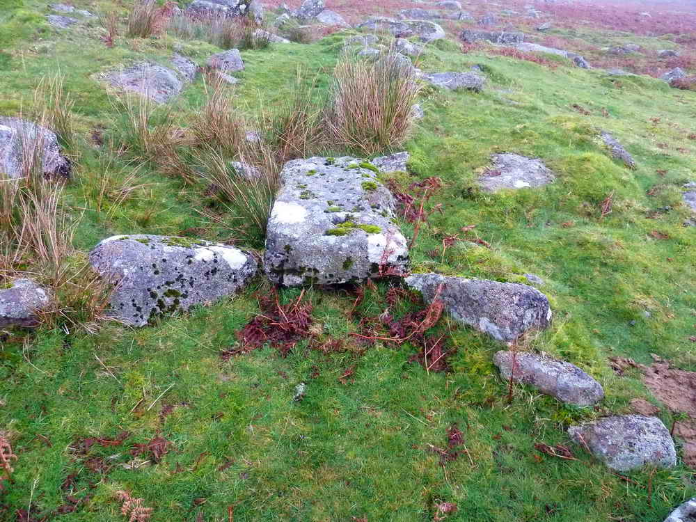

# Dartmoor Details

Dartmoor has a rich and unique dialect containing many unusual sometimes unique terms. We hope that over time this section will contain in-depth explanations of various terms and what they are.

## Rabbitting and Warrens

Terms:

- `Rabbits`, `Coneys` - The beasts themselves. Vorpmy (pronounced: vor-pmi) > A local Devonshire nickname for a rabbit. Derived from the dialect for "fourpenny" (vower-pmy), which was once the standard price for a rabbit caught on the moor and sold at market. Rabbits are not native to the UK and were introduced from the continent by the Romans are the first century AD. However, when the Romans left, rabbits died out in Britain and were re-introduced by the Normans a millenia later, although they didn't truly become wild as we know them today until the mid 1700s.
- `Warrens`, `Bury / Buries`, `Pillow Mound` - Artificial banks dug for rabbits to form colonies in, yet be easy to net and trap. By raising the soil into banks, typically 1 yard high and around 30 long, it made for attractive housing for them, and also kept their holes above the water table. Farms with large warrens nearby often take their name from them - see Ditsworthy Warren, Trowlesworthy Warren and Huntington Warren. The term "Pillow Mound" is used on Ordnance Survey maps and is thought to have been used when the cartographers didn't know what the mounds were for.
- `Warreners` - The man who was in charge of building and maintaining the warrens and also
- `Vermin Traps` - With rabbits come vermin, a loose term for anything the Warrener considers a predator of his crop. Foxes were controlled by hunting, aerial predators by trapping and netting, and smaller predators such as Stoats were controlled by vermin traps. These are still visible today, having been made out of cleverly arranged stones. As stoats generally follow walls and large stones, these were made to converge in a lidded, stone-lined box. When the stoat entered, it would trip a wooden door which would close behind it, trapping it until the warrener could dispatch it.

Rabbitting was commonplace on Dartmoor, especially during the mining heydays of the Eighteenth and Nineteenth centuries, although some warrens continued commercial operations until at least the First World war.

Feeding a large population of hungry miners was a logistical challenge, especially on moorland where arable crops did poorly. The solution was for artificial rabbit warrens to be dug close to mines to supply them with a cheap source of meat.

A few resident miners, notably mine captains for whom stone offices were dug, were known to have quite established vegetable gardens also.

* Huntington Warren

Clive Gunnel, in his book `My Dartmoor` 1977, writes;

> In 1809 John Michelmore had obtained a ninety-nine year lease on Huntingdon Warren from the Duchy, on undertaking to enclose six hundred acres to create a warren. The aftermath of his efforts, over a hundred years later, was to provide the clay workers of Red Lake with a source of red meat, to break the monotony of their diet.

> They caught rabbits by going out at night after they finished work and stretching nets across the open ground in front of the entrance to the burrows. At dawn, the rabbits, after their night’s search for food, were driven into the nets by the workers and their dogs. To ensure a constant supply of rabbits for his workers, Deeley ordered artificial ‘burys’, the old Dartmoor name for burrows, to be made. This was a matter of digging a long trench with alternating branches leading off from each side, the whole covered with turf, and soil thrown over the top. Into these ‘burys’ pairs of breeding rabbits were introduced, and, as was the nature of the beast, the supply always exceeded the demand.

## Micaceous Haemetite
