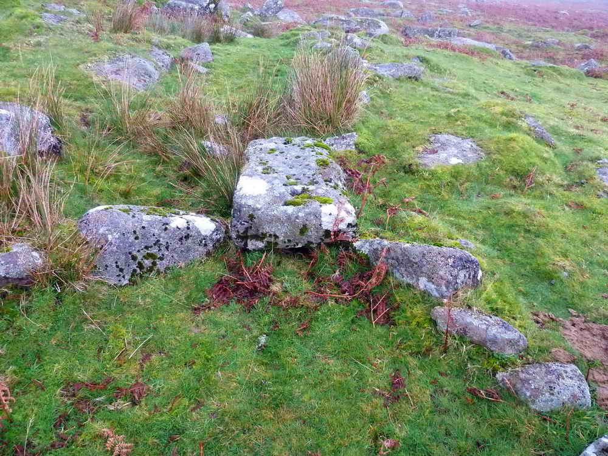

# Dartmoor Details

Dartmoor has a rich and unique dialect containing many unusual sometimes unique terms. We hope that over time this section will contain in-depth explanations of various terms and what they are.

## Historical Timeframes

### Early Prehistory

Prehistory describes all human history before written records - which in the UK is known to have begun in AD 43, when the Romans first invaded Britain. It's split into three distinct periods and timeframes;

#### Palaeolithic (up to c. 10,000 BC)

Little if anything remains on Dartmoor from this time which had a much colder Tundra-like climate, although human remains were recovered from Kents' Cavern in Torquay dating back to here.

#### Mesolithic (c. 10,000 - 4,000 BC)

The climate warms up quickly leading to the spread of forests over Dartmoor. Humans did leave some traces, such as stone tools and signs of flint knapping.

#### Neolithic (c. 4,000 – 2,500 BC)

Humans start to leave a hunter gatherer lifestyle and start to farm. From this point we see evidence of tree clearance over Dartmoor and a rich tapestry of ceremonial monuments such as Spinsters' Rock and the stone walled enclosures of Dewerstone and White Tor.

### Bronze Age

The Bronze age is defined at a time when we start to see copper and bronze being smelted, much improving the quality of the tools used by our ancestors.

#### Early Bronze Age (c. 2,500 BC – 1,700 BC)

A great deal of ceremonial building is undertaken on Dartmoor of which much remains. In 2011, the Early Bronze Age grave of a young woman was discovered on Whitehorse Hill including grave goods, which helped improve our understanding.

- [Whitehorse Hill prehistoric burial](https://www.dartmoor.gov.uk/wildlife-and-heritage/heritage/bronze-age/whitehorse-hill)

#### Middle Bronze Age (c.1,700 BC – 1,200 BC)

It seems that Dartmoor became quite densely populated and there was extensive farming undertaken as many stone walls were built to enclose Dartmoor into small fields, known as reaves.

#### Late Bronze Age (c.1,200 BC to 750BC)

For some reason, the population on Dartmoor (and globally) reduced during this time. Globally, especially in the Medittereanean, huge populations disappeared almost overnight, leading to entirely lost civilisations. Many reasons have been speculated for the reason or reasons of this collapse, but they are still disputed. Whatever the reasons, Dartmoor becomes very sparsely populated with the reaves and settlements largely abandoned.

- [Late Bronze Age collapse](https://en.wikipedia.org/wiki/Late_Bronze_Age_collapse)

### Iron Age (c.750 BC – AD 43)

This is a time of great construction, notably of many Iron Age Hill Forts across all of the UK, often of huge size. Dartmoor was no exception and many were built. The Teign Valley at Fingle bridge is particularly well populated with no fdwer than three forts within a mile of each other - Prestonbury Castle, Cranbrook Castle and Wooston Castle.

- [Dartmoor National Park Heritage](https://www.dartmoor.gov.uk/wildlife-and-heritage/heritage)

### Roman Period (AD 43 to 410)

We know the Romans invaded Britain in AD 43 and spread throughout the country - only stopping at Scotland. Some people repeat that the Romans "never went West of Exeter" but that's clearly not true as they formed forts at Okehampton, North Tawton and Ipplepen. However, their influence on Dartmoor appears to have been minimal, with little sign of them on the moor. Their famous road systems preferred to go around the granite batholith. Despite that, caches of roman artifacts have been found at Princetown (A cache of 4th century Roman coins) and Hunter's Tor near Lustleigh, where 2nd century coins and pottery shards were found) - but these may have been hidden later.

### Medieval

#### Early Medieval (AD 410 - AD1066)

This was a strongly religious time and many artifacts from this time feature crosses. Lydford, just outside the Western fringe of Dartmoor, was particularly important during this time, being the Mother Parish for the whole of Dartmoor. The Lich Way was formed, so that bodies from all over Dartmoor could be carried across the open moor to be buried at Lydford's St Petroc's Church. It was not until 1260 that a dispensation by the Bishop of Exeter allowed burials at St Pancras Church in Widecombe instead.

There was also a mint at Lydford, and silver coins forged there have been found as far away as Scandinavia.

Dartmoor's Stannary council was run from Lydford also, and justice was meted out at the Stannary Gaolw hose ruins remain and dominate this now sleepy village. Conditions there were notoriously bad in the day, as this poem immortalises;

```
I oft have heard of Lydford Law,
How in the morn they hang and draw,
And sit in judgement after.
-- 17th Century Poet, William Browne.
```

#### Late Medieval (AD1066 - 1500)

When the Normans invaded England, a huge number of castles were constructed, including on Dartmoor. Castles were built


#### Industrial


## Mining

Dartmoor has been very heavily mined for minerals since at least medieval times.

### Micaceous Haemetite


### Stannaries


## Farming on Dartmoor

### Medieval Field Strips

### Rabbitting and Warrens

Terms:

- `Rabbits`, `Coneys` - The beasts themselves. Vorpmy (pronounced: vor-pmi) > A local Devonshire nickname for a rabbit. Derived from the dialect for "fourpenny" (vower-pmy), which was once the standard price for a rabbit caught on the moor and sold at market. Rabbits are not native to the UK and were introduced from the continent by the Romans are the first century AD. However, when the Romans left, rabbits died out in Britain and were re-introduced by the Normans a millenia later, although they didn't truly become wild as we know them today until the mid 1700s.
- `Warrens`, `Bury / Buries`, `Pillow Mound` - Artificial banks dug for rabbits to form colonies in, yet be easy to net and trap. By raising the soil into banks, typically 1 yard high and around 30 long, it made for attractive housing for them, and also kept their holes above the water table. Farms with large warrens nearby often take their name from them - see Ditsworthy Warren, Trowlesworthy Warren and Huntington Warren. The term "Pillow Mound" is used on Ordnance Survey maps and is thought to have been used when the cartographers didn't know what the mounds were for.
- `Warreners` - The man who was in charge of building and maintaining the warrens and also
- `Vermin Traps` - With rabbits come vermin, a loose term for anything the Warrener considers a predator of his crop. Foxes were controlled by hunting, aerial predators by trapping and netting, and smaller predators such as Stoats were controlled by vermin traps. These are still visible today, having been made out of cleverly arranged stones. As stoats generally follow walls and large stones, these were made to converge in a lidded, stone-lined box. When the stoat entered, it would trip a wooden door which would close behind it, trapping it until the warrener could dispatch it.



Rabbitting was commonplace on Dartmoor, especially during the mining heydays of the Eighteenth and Nineteenth centuries, although some warrens continued commercial operations until at least the First World war.

Feeding a large population of hungry miners was a logistical challenge, especially on moorland where arable crops did poorly. The solution was for artificial rabbit warrens to be dug close to mines to supply them with a cheap source of meat.

A few resident miners, notably mine captains for whom stone offices were dug, were known to have quite established vegetable gardens also.


* Huntington Warren

Clive Gunnel, in his book `My Dartmoor` 1977, writes;

> In 1809 John Michelmore had obtained a ninety-nine year lease on Huntingdon Warren from the Duchy, on undertaking to enclose six hundred acres to create a warren. The aftermath of his efforts, over a hundred years later, was to provide the clay workers of Red Lake with a source of red meat, to break the monotony of their diet.

> They caught rabbits by going out at night after they finished work and stretching nets across the open ground in front of the entrance to the burrows. At dawn, the rabbits, after their night’s search for food, were driven into the nets by the workers and their dogs. To ensure a constant supply of rabbits for his workers, Deeley ordered artificial ‘burys’, the old Dartmoor name for burrows, to be made. This was a matter of digging a long trench with alternating branches leading off from each side, the whole covered with turf, and soil thrown over the top. Into these ‘burys’ pairs of breeding rabbits were introduced, and, as was the nature of the beast, the supply always exceeded the demand.


