{}

{}

## Introduction

This walks takes us up the Northwestern slopes to Sourton Tors, stopping to view the Iceworks on the way. After admiring the views from the Tor, we make a short detour to visit the Applecrusher before following the gradient around the Western face of the tor and back to the car park.

*Leave the car park and head Southwards upwards along the paths*

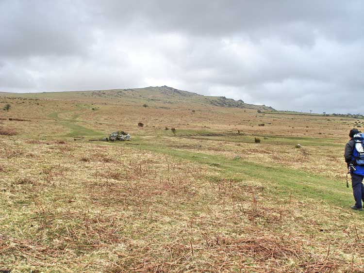

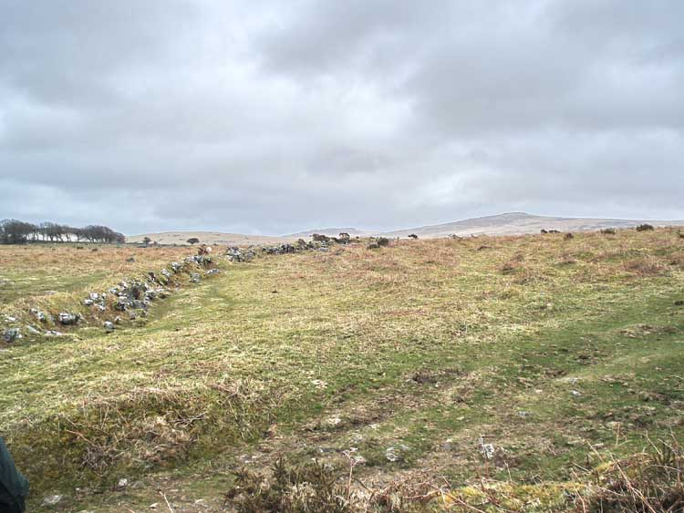

Dartmoor reaves are ancient long, straight lines of stone or earth that were built during the Bronze Age, primarily between 1500 and 1200 BC.

The exact purpose of the reaves remains somewhat debated, but they are believed to have served a variety of functions, such as Boundary Markers, Agricultural features to contain livestock or for ceremonial or ritual practices.

Dartmoor has the most extensive and well preserved systems of prehistoric field boundaries in Europe.

* [Wikipedia - Reave](https://en.wikipedia.org/wiki/Reave)

## Iceworks

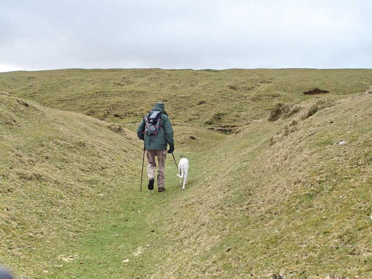

This system of earthworks and ruined buildings hints at one of the attempts to bend Dartmoor to man's will. It can be viewed as a Folly, for it was not successful.

These works date from 1875 when a Mr James Henderson leased the land from the Duchy of Cornwall for a period of 15 years and he was allowed to "form ponds, and collect, and store ice for a term of 21 years running from February 1875 at an annual rent of £10."  He spent several thousand pounds setting up this endeavour.

The ponds were not allowed to be deeper than three feet and must be securely fenced. It was an agreement that upon completion, that the land be returned to its natural state.

The plan was simple enough - to fill ponds with water and wait for winter to freeze them. Then ice would be cut and transported to Plymouth for sale, at up to £3 a ton.

Unfortunately, events worked against Mr Henderson. A series of unusually mild winters meant little or no ice was produced, and then a rival company set up in Plymouth that created ice all year around, and that dropped the price to just £1 a ton, with none of the transport costs associated with hauling it there. Although this spelled the ending for these Iceworks, the Plymouth Rival also went out of business.

The scheme collapsed and a meeting was called with the Duchy in 1886 to surrender the lease early. Mr Henderson had tried to sell the Iceworks as a going concern for a little as £100 - a huge loss on his investment - but there were no takers and it remained unsold. As you can see, the land was never returned to its natural state so remains as a monument to risky business plans.

* [Legendary Dartmoor - Iceworks](https://www.legendarydartmoor.co.uk/2016/03/31/ice_fact/)

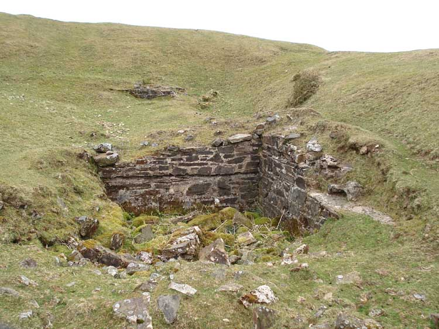

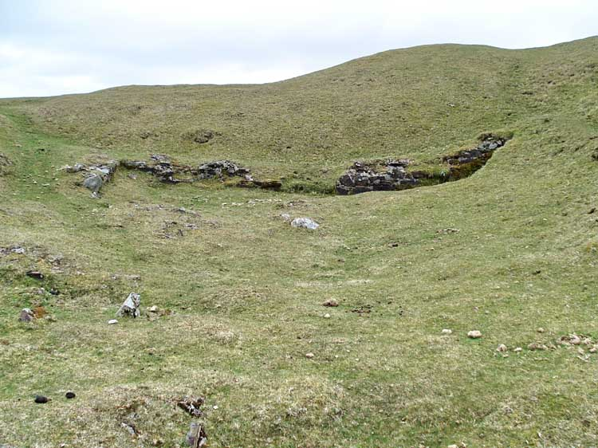

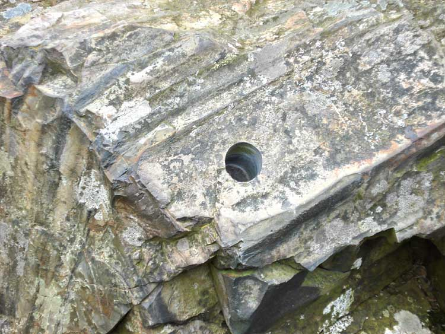

This hole appears to be a core sample, taken by unknown persons. It's not a drill mark, nor a tare and feather hole. Nor is it a rock worm, as suggested by some wags.

To a non-expert, this rock seems to be sedimentary, then changed by heat into a metamorphic rock. Perhaps it is unusual and that's why it was sampled?

* [DNPA Meldon Geology Case Study (PDF)](https://www.dartmoor.gov.uk/__data/assets/pdf_file/0020/72173/sheet_1a-b.pdf)

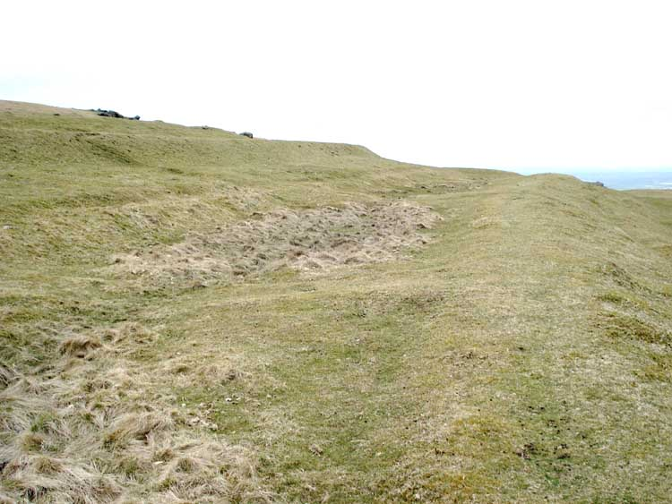

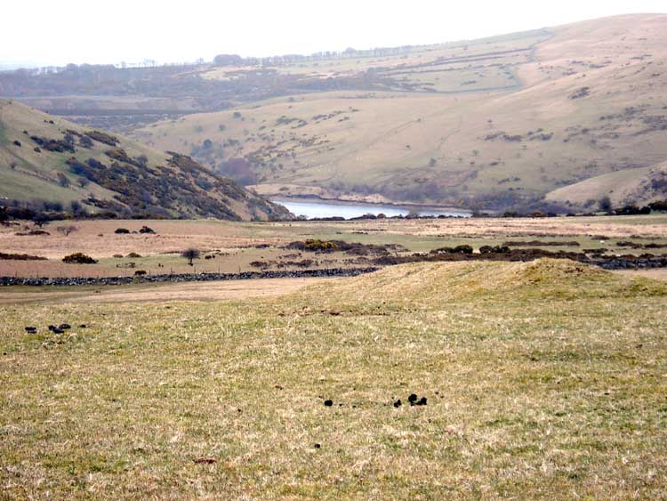

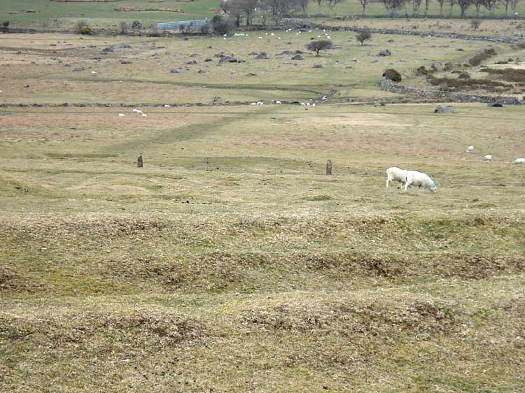

*When ready, walk upwards towards the tor*

## Sourton Tors

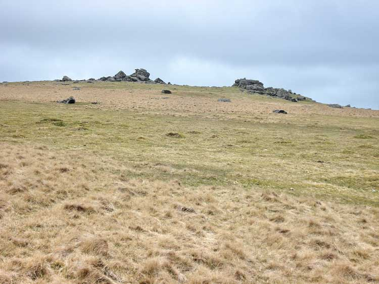

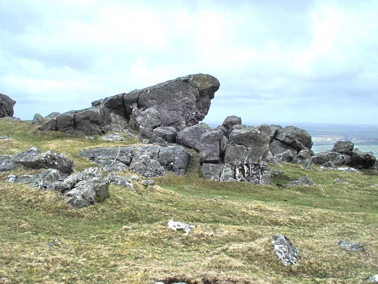

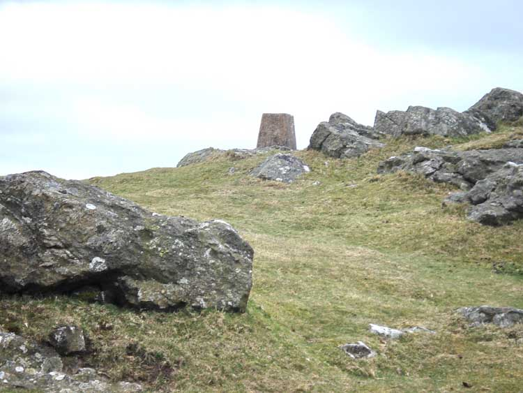

*When done admiring the views, head Southeast around 375m towards the junction of several paths at a small pond*

## Applecrusher

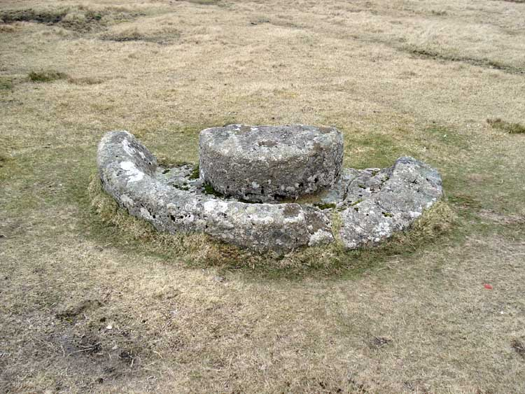

This style of crush had a horse, pony, donkey or ox walking around with a rigid wooden bar mounted to its harness. This was connected through the middle of a heavy, round stone or hardwood wheel that ran in the groove and onto the central pivot. As the wheel turned, apples would be thrown into the groove and mashed. There would be a run-off channel for the juice, which was collected to turn into Cider. As you can imagine, this created a lot of juice and would have needed several people to operate efficiently, giving an indication of scale and how important Cider was to Devonians.

This specific example was either broken when being carved, or during transport. Or it was intended to be made in two halves to make it easier to carry. It's not known where the other half is.

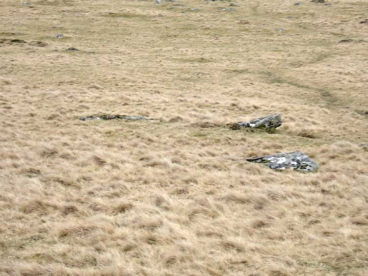

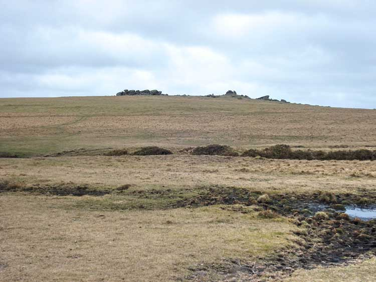

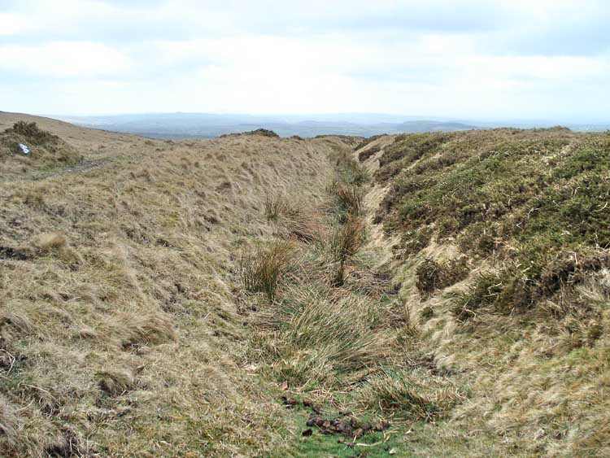

## Boundary Stone

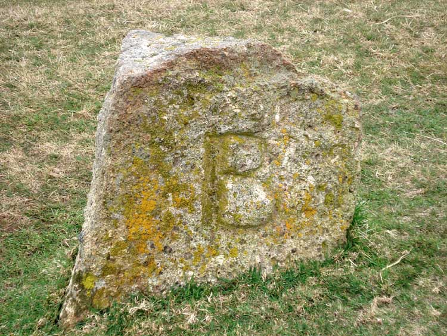

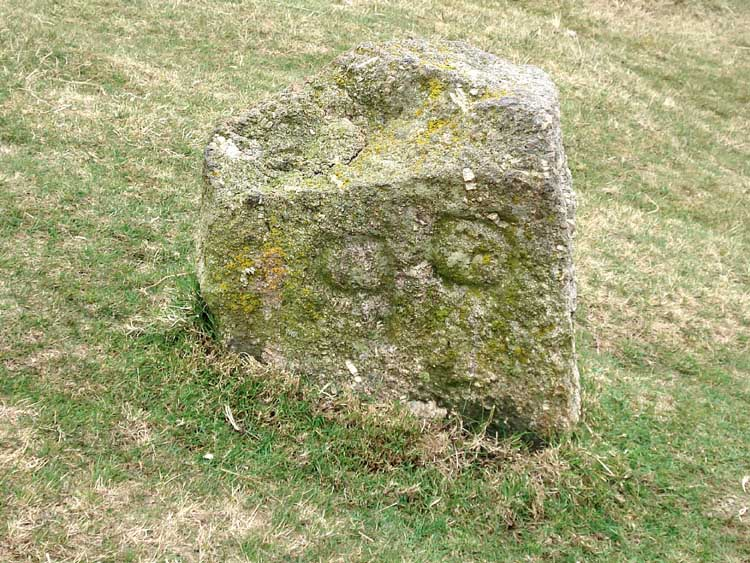

*We now head down the track to the Southwest, bearing right after a hundred meters or so, aiming just left of the Sourton Tors outcroppings*

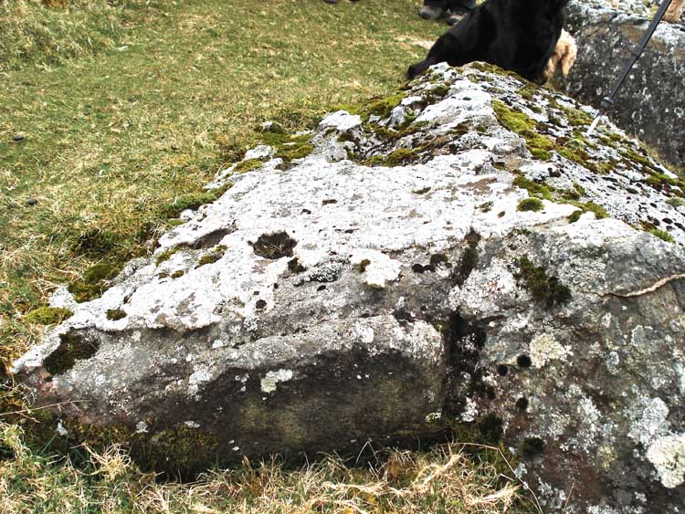

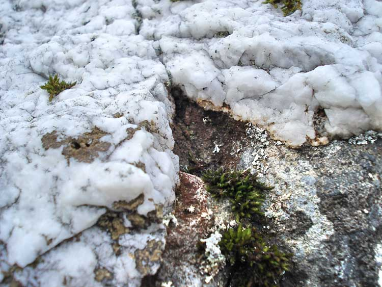

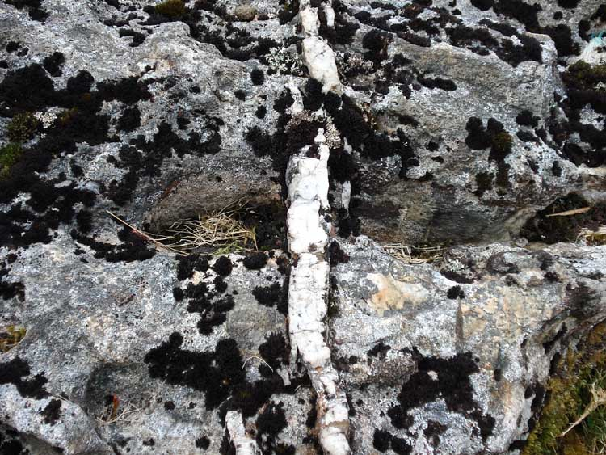

## American Influence

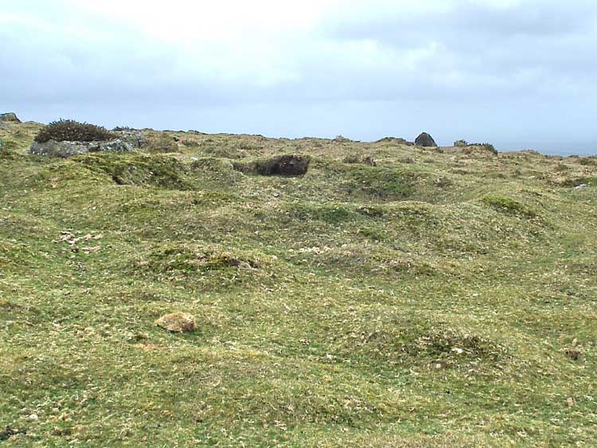

American Soldiers trained in this area when preparing for D-Day in 1945. Although hard to distinguish, the above feature was a former World War II Machine Gun Nest. Fortunately never needed on Dartmoor, but a sobering reminder of the many lives were lost across the Channel.

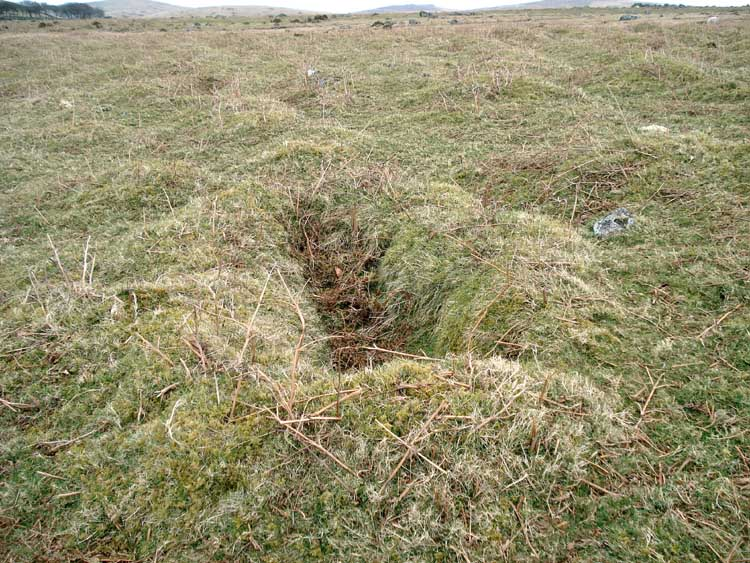

*Keep following the gradient below the Western side of Sourton Tors and then head back to the parking*

## Parking

Turn off at the main A386 Tavistock to Okehampton road, passing between the embankments of the old railway - now the Granite Way. Over a cattle grid and park alongside the single track road.

## References

* [Wikipedia - Reave](https://en.wikipedia.org/wiki/Reave)
* [Legendary Dartmoor - Iceworks](https://www.legendarydartmoor.co.uk/2016/03/31/ice_fact/)
* [DNPA Meldon Geology Case Study (PDF)](https://www.dartmoor.gov.uk/__data/assets/pdf_file/0020/72173/sheet_1a-b.pdf)

