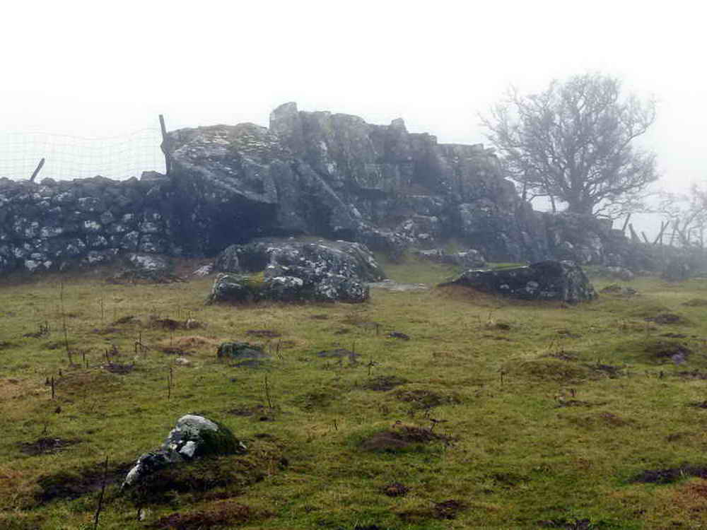

{}

{}

## Introduction
*A circular walk over open moor, farmland and quiet country lanes taking in several historic sites on West Dartmoor*

## Boulter's Tor

## Twist Farm

Shown as "Twist" on the OS Map, but also locally known as Twyste farm. 

Twist was mentioned in thge Domesday Book on 1086, and the owners had Venville rights, allowing them to take what they needed from the moor. Grazing, stone, peat - but not green oak or venison.

The farm was abandoned somewhere in the middle of the 1900s - the kitchen range and abandoned vehicles date from the 30's onwards. 

Twist was put up for sale in 1934 and likely fell into dereliction relatively soon afterwards, perhaps during the second world war which drained many young men from the country.

* [More information from Dartmoor Explorations](https://dartmoorexplorations.co.uk/twist-twyste-or-twyst-farm/)
* [Heritage Gateway Article](https://www.heritagegateway.org.uk/gateway/Results_Single.aspx?uid=MDV108041&resourceID=104)

*Note that some pictures come from Simon's visits in 2017 and 2019*

## Incomplete venville building

This unassuming pile of stones is perhaps the remains of a "cottage in a day" undertaking - wherein you could live on the land if you could "build and roof a house between the house of sunrise and sunset, and have smoke coming out of its chimney".

In this case, it's said that the building was interrupted by local residents who didn't want it there and failed the challenge.

## Clapper Bridge

## Devon United Mine and Shaft

The North mine was worked for copper until the 1850's. The central and South mines were worked for tin and arsenic until 1922. 

The South mine site went down to 50 fathoms (300 feet) and produced most of the tin. The central section produced mainly arsenic. 

[Mindat page for Devon United Mines](https://www.mindat.org/loc-235493.html)

## Six foot Thomson Turbine

It also drove an air compressor, the remains of which can be seen lying in the tail race below the turbine.

This company still appears to be in operation. [Thomson Governors](https://thomsongovernors.com/)

> “When you pass me, don’t forget those days gone by when my brave heart beat to the sound of a thousand men’s voices echoed in water”

## River Tavy

## Longtimber Tor

* [More information about St Peter's Church](http://www.petertavyparishcouncil.org/local-groups/st-peters-church/)

*This walk was reached by turning off the A386 just north of Tavistock, by a camping signpost, to Harford Bridge (bear left here), to Peter Tavy, driving straight on, passing the church on your left, taking the first road o n the right and climbing to a small quarry car park marked on the map by the yellow cross and the P symbol*
