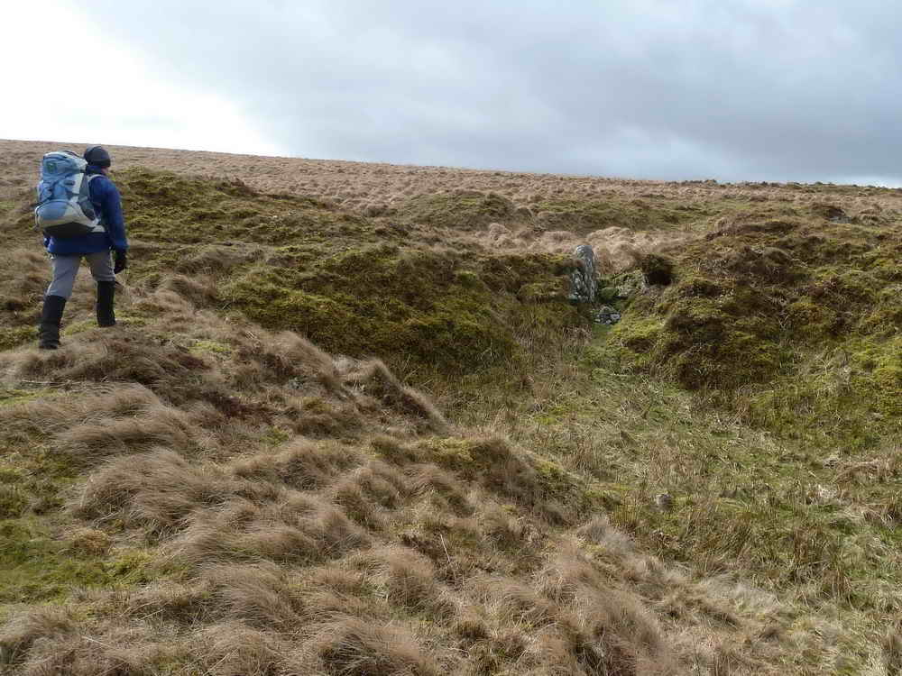

{}

{}

## Introduction

Down Ridge near to Hexworthy is a quiet area that doesn't get too many tourists even when other parts of the moor are busy. I've personally spent 8 hours walking a large loop around here without seeing a single person - a rare thing even on Dartmoor.

This is a walk that involves a fairly gentle slope upwards, following an old mining track and taking in some notable features. We pass a once imposing building which was used as target practice in the 1940s by the US forces training for D-Day, the wonderfully named Hooten Wheals mine close to the Henroost, both once profitable tin mines. There are also Bronze age remains nearby - all worth investigating.

A small detour is offered to explore Hooten Wheals.

## Parking

There is a smallish parking area close to the given coordinates. Please be considerate to traffic continuing along the road to Sherberton.

*Once ready to start, follow the road back the way you came from for about 600 meters, passing the first moor gateway until you come to the junction with the Hexworthy - Holne road. To your right is a gateway leading up an old track. Go through here onto the open moor*

This was the main track leading to several mines in this area, taking supplies and workers to, and ore and tiredness back towards the welcoming fire of The Forest Inn, Hexworthy.

To the East and Southwest - but not visible from the track, there are a lot of Bronze age remains of hut circles, and medieval field systems.

*After following the track for about 1.2km, you'll see a stone cross a short distance below it. This is Horse Ford Cross*

## Horse Ford Cross

* This cross is one of a number that marks the route of the Monks' Path, an ancient track that links Buckfast Abbey with those at Tavistock and Buckland
* This path takes a more Northerly route than the more commonly known Abbots' Way, and is also known as the Maltern Way or Jobbers' Path
* Horse Ford Cross has been lost and discovered. At one time it disappeared entirely and wasn't seen for many years when in 1884 a local labourer discovered it buried in heather and turf. It was subsequently repaired with the iron strap and re-erected at its current location, although it's much shorter than it was originally
* It stands 1.05m (3'5" high and 0.67m (2'2") across the arms
* There are many references to Horses across Dartmoor, giving reference to their importance in day to day life
* Horse Ford itself is directly below the Cross, providing a crossing of the O Brook.

*A short way along the track, next to it on the upper side is...*

## Mine Office

This was probably a fairly small building, positioned closely to the track so that incoming stores and workers could be closely monitored - and perhaps measuring tin that left the site. It's thought that as well as being the site office, the mine captain lived here, away from the main body of men.

*Further along the track you'll come across more ruins*

## The Barracks

Locally known as the Barracks, this once large building was also known as "The Dry", "The Shop" and "The Dorm". Also, more lately, and perhaps only by myself, "The Shooting Range"

* The Barracks were built in 1907 and were multi-use:
   * They were used as a Miner's dry - a place to dry out wet clothing and boots
   * Also a dormitory for miners to sleep. Commonly during this time, beds were multi-occupancy, with "shifts" taken, or "top and tail" sleeping arrangements when there wasn't enough room
   * There is also evidence of machinery being housed in this building, with large bases
   * It's known that there was a Blacksmith's shop either in or attached to this building - an essential part of any working mine
* The building measures approximately 14 by 6 meters and would have been two storeys high, made of local stone mortared and rendered with cement
* The Barracks was used as a target by American Troops stationed nearby during 1943/44, as preparation for the D-Day landings. A large number of bullet holes can still be seen in the render, and indeed, on some ancient crosses in the area. Artillery was also used to reduce it to the state it is today.

* [Heritage Gateway MDV6389 - Hooten Wheals / Hexworthy Tin Mine](https://www.heritagegateway.org.uk/gateway/Results_Single.aspx?uid=MDV6389&resourceID=104)

There is much evidence of various diggings in pursuit of the ore seams visible from this location in all directions. For example, the very straight track heading exactly due East just before the barracks leads to a now collapsed adit.

## O Brook Clapper Bridges

Flat rods were simply flat rods of iron that were connected to the water wheel. They converted the rotary motion of the wheel to a reciprocating back and forth action through the rods, which rested on low granite blocks placed at set distances, usually with well greased rollers. These rods were very effective at transferring power around the sites of mines and very little was lost even over long distances.

These gerts predate the more modern workings and were made by "The old men" of the 17th and 18th century, or even before. The cut is caused when streaming tin lodes by directing water down them to wash out the ore.

## Hooten Wheals

*At the Clapper bridges, you can take a short detour along the well defined path left to the Southeast to explore the working platforms and above them, the collapsed adits and shafts. Sadly I have lost my photos of these*

* Hooten Wheals was a highly industrialised area in the past, with a 45' (13.7m) water wheel providing power to 12 Cornish Stamps and 16 Californian Stamps to crush the ore bearing rock into smaller pieces. These stamps were positioned on the flat concrete stepped areas, using gravity to feed materials and water to help the process. This area was also roofed with corrugated iron, which was removed along with the stamps and other machiner when the mine closed.
* Stamps are fearsomely noisy things, just simply large chunks of iron being lifted and dropped back down repeatedly to break the stone. Combined with vibrating chutes to feed ore in and out, it would have been heard a long distance away
* Naming:
   * "Hooten" originates from Old English language and means "Heel or spur of land", referring to a ridge or piece of high ground. Indeed, contour lines do show that Skir Hill above the workings is a projection. An alternative theory is that Hooten can also mean an old farmstead, and perhaps one of the nearby farms once shared its name to the mine
   * "Wheal" is used throughout Devon and Cornwall to name mines. It originates from "hwel" or "huel", which is Cornish for "Work" or "place of work" or "workings"
* Also known as Hexworthy mine, it was active through the 19th and early 20th centuries. A licence to mine was first granted in 1845 with further licences issued in 1849 and 1854
* Around 50 men were full employed by 1891
* The mine closed in 1919, probably due to a shortage of labour as men were drafted to the First World War - a common reason for closure of many mines in England and Wales
* Pumping of the mines continued through to 1920 when a "Fearsome storm" destroyed the launder feeding water to the wheel. This also led to the collapse of the main shaft, perhaps by water entering from the broken launder combined with the lack of pumping causing the sides to soften

*Once done exploring Hooten Wheals, return here and follow the Northwest path alongside the Brook*

## Hensroost

* Hensroost is the name of an initially separate mine with a deep shaft called "Taylor's Shaft" at SX 651710 plus several other collapsed shafts
* As with Hooten Wheals, the object of the work was to recover and partially refine tin from it's ore, cassiterite, which is often found in seams amongst granite
* Towards the end of its life, Hensroost was consolidated with Hooten Wheals and both were worked together, with Hooten processing the ore

*Staying fairly close to the O Brook, follow it in a Northwesterly direction until you come to...*

## Skir Ford

The cross was part of the Monks' Path and remains a useful indicator to find this rather nondescript, but useful fording point.

About 1km upstream of the ford, there are more old tin workings and gerts from old streaming.

*To complete our walk, head North from Skir Ford across a pretty featureless area of moorland, aiming for the gap between the stone walls about 1km away. These will funnel you to a moorgate onto the road, close to the parking area*

We hope you enjoyed your walk.
