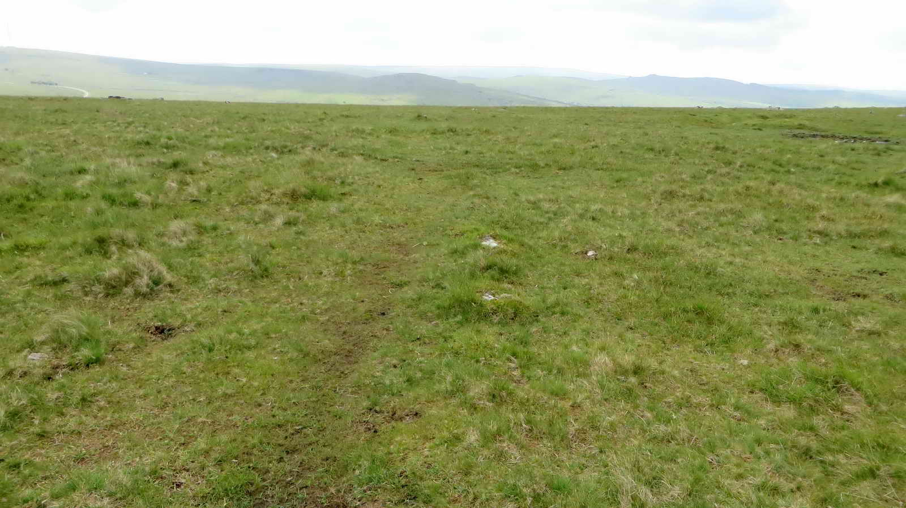
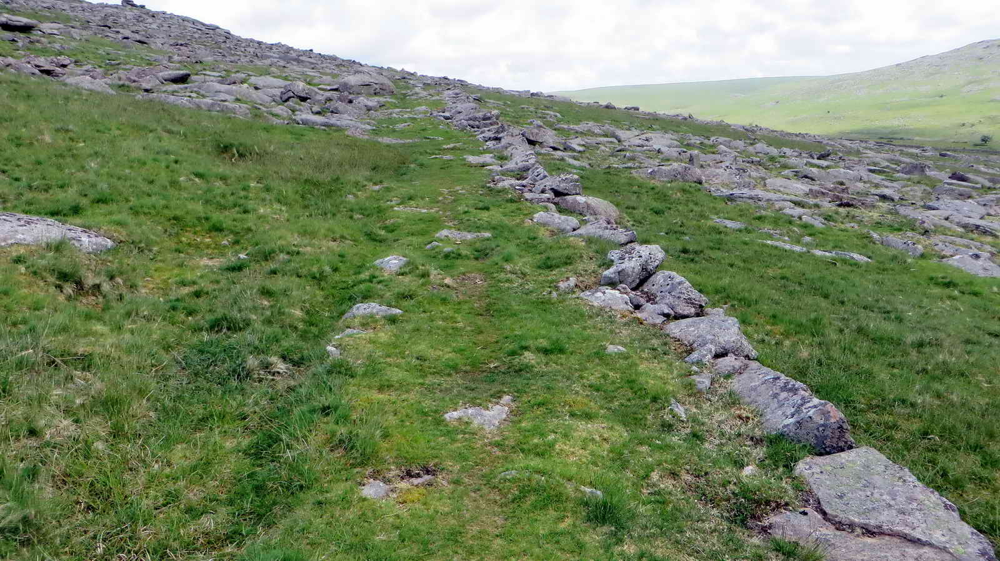

{}

{}

This circular walk takes in some great views, visits some attractive tors and points out some old quarrying history on the way down to Merrivale. 

*Park at the given coordinates and when ready, follow one of the paths due North away from the road*

*This plaque may have since been vandalised, so the original wording shown above as of 2010*

Who was Rees Jeffreys?  (1871-1954)

A British cyclist and campaigner for road improvements, who became responsible for British roads being classified as "A" or "B" roads. 

> "the greatest authority on roads in the United Kingdom and one of the greatest in the whole world."  

The Rees Jeffreys Road Fund is an organisation that seeks to encourage and promote better and safer roads. 
 
* [Wikipedia - Rees Jeffreys](https://en.wikipedia.org/wiki/William_Rees_Jeffreys)
* [The Rees Jeffreys Road Fund](https://reesjeffreys.co.uk/)

## Great Staple Tor

Rock Basins feature on many Dartmoor Tors. They are formed by the repeated freezing or water in surface irregularities where the expanding ice gradually prises out individual mineral grains.  

* [DNPA - Geology PDF](https://www.dartmoor.gov.uk/__data/assets/pdf_file/0019/72109/lab-geology.pdf)

*When ready, walk Northeast towards Middle Staple Tor*

## Middle Staple Tor

About halfway between Middle and Great Staple Tors, we cross the Quarryman's Path which is now a legal Bridlepath. There is little to show, but when these quarries were active, a large part of the workforce would walk up from Peter Tavy each morning.

## Great Staple Tor

## Roos Tor (About)

These markers are part of a set of eleven placed by the Duke of Bedford in 1890. The intention was to mark his boundary and remove any excuse from people taking stone that belonged to him.

* Source: Dave Brewer (2002), Dartmoor Boundary Stones, Halsgrove, p.251.

*As you leave Great Staple Tor to the Southeast, follow the granite track Southward*

## Sett Maker's Banker

A quarryman once stood at this point making Setts.

Setts are granite blocks that were much used for paving roads and paths, and can still be seen in many cities, for they last a very long time.

Rough cut setts blocks be brought here, having been cut from moorstone nearby. To cut down on transport, the bankers typically set up very close by to the raw material, and their workplaces - bankers - were rough and ready; somewhere to stand or kneel and work the stone at around waist level.

In exposed conditions, and this certainly qualifies, they would erect shelters to keep off the worst of the rain, snow and wind. These would have been made of oilskin tarpaulin with a stick framework, probably on three sides, backed to the wind.

The tools were iron chisels and a hammer, with the working stone set on a bed on firm earth and granite chips, which would absorb the blows.

It was a hard job. As well as the obvious difficulties of weather and repetitive, physical work; the sett-maker’s hearing will have suffered and worse, many will have suffered from silicosis from breathing granite dust and died early from lung problems.

Traditional stonemasons still work very similarly to this, but now have tungsten tipped chisels and, when working with granite, a full-face respirator system.

> When I worked for DNPA in the late 1980s, they often employed a traditional stonemason who would work just inside the entrance of the Works Depot in Bovey Tracey. He had a 45 gallon oil drum full of granite chips on which he’d place his work, which might be a perfectly spherical ball to sit atop a gatepost. He’d stand there all day, chipping away. Pausing every now and then to offer up a hardboard template to check his progress, or check diameter with a set of large calipers. He wore a full face respirator, with a battery pack and inlet on his belt at the back, similar to those used by industrial welders, which blew filtered air into the mask. – Simon

There are Bankers all around this area.     
 

## Duke's Folly

This noticeably man made structure is known as Duke's Folly, after William Duke who opened Merrivale Quarry in 1875. His grand plan was to build a railway across Long Ask to link with the Plymouth and Dartmoor Railway at Swell Tor Quarry, to provide an easy route out for his stone to Plymouth. 

His Folly here is a granite embankment made up of mostly waste rock from the main quarry, but is about as far as he got before the plan was abandoned.

## Merrivale Quarry

As mentioned, Merrivale Quarry was opened by William Duke 1875 and originally called "Tor Quarry" and it absorbed the existing sett-making operations carried out under the Staple Tors.

As well as cutting setts, Granite from the quarry was also used for Gravestones, agricultural rollers and the like. It also provided the facing for the New Scotland Yard building in London.

The quarry closed in 1997, spending its final years dressing imported stone from Norway.

* [Wikipedia: Merrivale](https://en.wikipedia.org/wiki/Merrivale,_Devon)

*Follow the tracks around the quarry down to the road and cross over when safe, walking a short distance downhill until you reach the leat*

## Grimstone & Sortridge Leat

This leat was built in the 1800s to carry water seven miles to the 13th Century Grimstone manor and to Sortridge Consuls Mine.

*Follow the leat along a short distance until the car park is due North, then head across the moor and road to finish our walk*

## Parking 

There is a decent sized parking area at the given coordinates. If this is full, there is a smaller area a little way west, or at the Dartmoor Inn nearby. 

## References

* [Wikipedia - Rees Jeffreys](https://en.wikipedia.org/wiki/William_Rees_Jeffreys)
* [The Rees Jeffreys Road Fund](https://reesjeffreys.co.uk/)
* [DNPA - Geology PDF](https://www.dartmoor.gov.uk/__data/assets/pdf_file/0019/72109/lab-geology.pdf)
