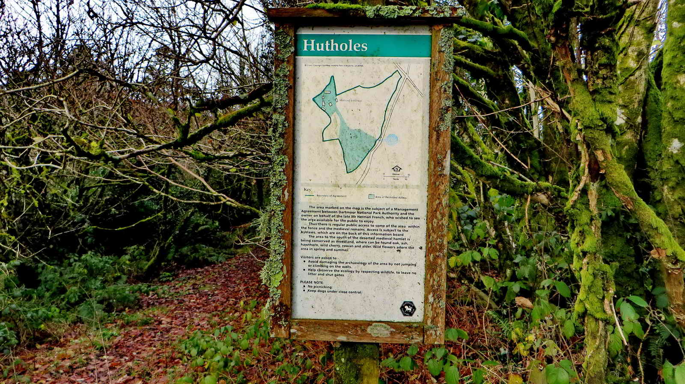

{}

{}

## Introduction

Hutholes is an interesting place and many have seen the strange name on the OS map and wondered about it. Its history is interesting and worth a visit.  There are often a very nice heard of Dartmoor ponies grazing around Wind Tor and Southern Hamel Down. (Please keep your distance and definitely do not feed)

## Two Crosses Stone

In the bank opposite the starting car park is this modern stone, dating from 2008. The former gatepost was donated by a Mr R Whale and was carved by the Dartmoor National Park Authority using their stonemason, Andy Cribbett. When completed, a ceremony was held on the 10th of July 2008 and the stone placed.

But why?

> This location is the point where the manors of Jordon, Blackslade, Dunstone and Widecombe town intersect. Always known as ‘Two Crosses in the Turf’ this location was always marked by two crosses cut into the turf, every year the village lengthsman would re-cut them to ensure of their visibility. <cite>-- [Legendary Dartmoor - Two Crosses](https://www.legendarydartmoor.co.uk/2016/03/31/two_crosses/)</cite>

*Follow the path behind the stone towards Wind Tor*

Left to right: Honeybag Tor (Elevation 445m/1459 feet). Chinkwell Tor (456m/1496 feet). Bell Tor (354m, 1161 feet)

## Wind Tor

> When I was about 12 years old in the mid 1980s, I stayed for a short time at the nearby Rowden Adventure Centre. We walked up here and we were shown the first Letterbox which was hidden under these rocks, which helped spark a lifelong interest in finding tupperware in crevices <cite>-- Simon</cite>

Legend says that this row of holes are the footprints left by a fox that the Devil transformed as he chased it across the moor...

Or drill holes for splitting the rock by tare and feathers, you decide.

*When you are ready, continue walking due South towards the wall corner below. Although the map mentions Hut Circles at this point, there is sadly little to be seen today. We then join the open moor road and follow it to the junction where we turn right towards Drywell*

## Drywell Cross

This was probably one a gate hanger stone, where the upright of the gate was cupped at the top to allow swinging before iron hinges were readily available.

This stone was once a waymarker to Widecombe Church and was restored in 1967 by Dartmoor Preservation Association.  The replacement shaft matches the cross head in that all limbs are octagonal. 

* [Dartmoor-Crosses - Drywells Cross](http://www.dartmoor-crosses.org.uk/drywells.htm)

*Turn right at the cross and head North toward Dockwell*

## Dockwell

Dockwell dates back to at least the Medieval period and has several traditional Dartmoor stone buildings.

*Shortly past Dockwell, you'll see a signpost pointing off the road to Hutholes. We follow that path, returning here afterwards*

## Hutholes

Hutholes was a settlement of six buildings dating back to the Saxon period. It was certainly occupied at the time of the Norman Conquest in 1066 and seized by the invading French.

Daily routine revolved around farming, growing crops, animal husbandry and household chores. 

Abandoned some time in the 14th century, it lay largely forgotten until 1963 when the local farmer, Mr Hermon French, talked about it to a Mrs Minter, who organised an archaeological dig, 

We use the house numbers as given on the board.

House 3, believed to be occupied up to the 12th century. This was probably original Depdona Manor house. The name was later changed to Dewdon and once this site was abandoned, was relocated half a mile away and renamed again, this time to Jordan. 

In the Domesday Book (1066 AD), Depdona was owned by a wealthy Englishman called Alric. By 1086 it had been relinquished to one of the conquerors, William de la Falaise <cite>-- (Butler, Vol. 1 page 142)</cite>

* [Legendary Dartmoor - Hutholes](https://www.legendarydartmoor.co.uk/2019/04/13/hutholes/)

*Once you have explored Hutholes, follow the path back to the road and turn left, then straight across the next crossroads*

## Parking 

There is roadside parking at the top of Wind Hill. If it's full, there is usually some spaces down the road to the Southwest. The nearest facilities will be in Widecombe.

## References

* [Dartmoor-Crosses - Drywells Cross](http://www.dartmoor-crosses.org.uk/drywells.htm)
* [Legendary Dartmoor - Hutholes](https://www.legendarydartmoor.co.uk/2019/04/13/hutholes/)
