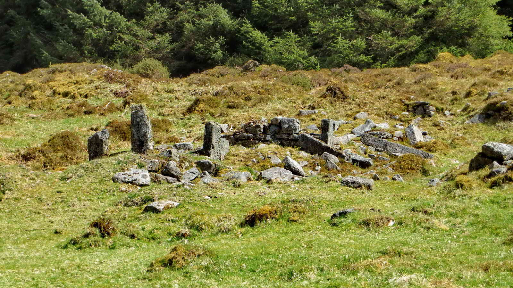

{}

{}

## Introduction

An impressive, but little known double stone row - one of several on Dartmoor. A medium walk through quiet woodland with some climbs on mostly firm forestry tracks. 

* The shed we park by was originally built for the forestry workers, but now is used mostly for storage.
* Fernworthy forest was first planted in 1921 by the Duchy of Cornwall. At that time there was a national shortage of timber following the First World War and much was needed quickly, leading to a nationwide conifer planting scheme.
* The forest comprises mostly of Sitka Spruce with some Douglas Fir and Japanese Larch. All are well suited to the Dartmoor conditions and provide a change of habitat for much wildlife. There are also pockets of deciduous woodland, notably around the reservoir.
* The Reservoir was built 1936-1942 by Torquay Water Authority and was the last granite dam built on Dartmoor at a cost of £246,000 - twice the original tender. It covers 76 acres and holds 380 million gallons. It's 63 feet deep and water is piped to Trenchford Reservoir.

*Start our walk by walking about 350m back along the road you entered by, and turning right into the Woodland through a gateway*

## Lowton Brook West Settlement

The Lowton Brook West Settlement was described by J. Butler (1991), Dartmoor Atlas of Antiquities  Vol. 2 - The North, 35.4 - Lowton Brook West,  page 157.

There are eleven huts in this area, with this one being the furthest north, and the largest at 9.1 metres diameter.  They date from the Bronze age, approximately 3300 BC to 1200 BC. The climate of Dartmoor was much milder then and many small settlements remain from human occupation of the time.

Each Hut Circle is the site of what was probably a fairly typical Bronze Age Roundhouse, with walls of stone and a thatched roof. A central firepit will have provided cooking and heat.

Most of the stone has been robbed by successive moor men, who used it for other buildings or walling, leaving the heavier base stones.

This gatepost was cut much later than the hut circles, likely in the medieval period or even later.

*Follow the track to the Southeast above Lowton brook, and take a sharp right up a steep hill*

*Turn Left here and follow the track up the spine of the ridge, beating right after about 300 meters*

## Assycombe Double Stone Row

* 125 meters long
* Faces North Westerly and oriented East Northeast to West Southwest.
* Restored in the 1890s
* There's a menhir at the top end and a blocking stone at the bottom. 
* Includes 133 medium and large sized stones. Originally there were 11 more stones, including a second blocking stone.
* J Butler notes that the row is very similar to the Hurston Ridge Double Stone Row, only 1km away.

The hut circles probably came long after the stone row was erected, and it's thought that the builders respected the row. Certainly, they did not steal its stones to build their huts, which would have been convenient.

The stone row is described by J. Butler (1991), Dartmoor Atlas of Antiquities  Vol. 2 - Asacombe Hill stone rows.  This double row is similar to its neighbour on Hurston Ridge, a kilometre to the east. It is possible that a third row was planned but never installed, because the rows do not align well with the centre of the cairn. 

*Follow the track down to Assycombe Farm*

## Assycombe Farm

Assycombe (Also Asacombe) Farm is the ruin of a deserted Medieval and Post-Medieval farmstead. There are two rectangular buildings with a field. 

* A shard of pottery recovered from this site has been positively dated to 13th-14th Century
* The Longhouse to the South is the oldest of the two buildings.
* [Heritage Gateway MDV6703 - Assycombe Farmstead](https://www.heritagegateway.org.uk/gateway/Results_Single.aspx?uid=MDV6703&resourceID=104)

## References

* [Old Ordnance Survey Map - Pre reservoir](http://maps.nls.uk/geo/explore/#zoom=17&lat=50.6282&lon=-3.8951&layers=171)
 
## Parking 

* When approaching Fernworthy, continue past the signed car park until you reach the marked position, by a large wooden storage shed. 
* Toilets are available at the signed car park, and sometimes a refreshment van in the Summer.
