{}

{}

## Introduction

Rabbits, burials, abandoned villages, mining history, proud standing stones and mysterious stone rows - and of course, outstanding views of rolling Western Dartmoor - this walk has it all and takes us through millenia of working history. And that's not mentioning the starkness of Ditsworthy Warren House!

Items of interest: Pillow mound, Ditsworthy Warren House, ferret kennel, slit window, dog kennels, Kennel Court, cists, Drizzlecombe stone rows, Giant's Basin cairn, terminal cairns, Drizzle, Lonstone Leat, Windstrew, longhouse.

* [Ordanance Survey has an interactive map of the historic sites along this walk](https://www.megalithic.co.uk/le_megalith_map_os.html#8/50.485902877625/-3.9955622611293)

## Setting off

We part at the end of the tarmac road, within sight of the Scouts Hut ahead, hiding in its blanket of fir trees. We walk off across the moor due south, past an old enclosure and several hand-dug mining holes. After 140m or so, we'll join the stone track heading southeast.

Follow this track along the valley and across the stream until we reach Ditsworthy Warren House

The long, low and softly-shouldered Pillow mounds are simply artificial rabbit warrens. These were dug by hand by the Warreners living nearby. Rabbits were introduced which dug into the soft soil and formed their warrens. It was a convenient way to encourage breeding in a place where the coneys could be caught by netting and quickly dispatched. The rabbits were skinned and the meat sold to feed the neighbouring miners. Here, most of them worked at the largest mine, Eylesbarrow Tin Mine.

## Ditsworthy Warren House

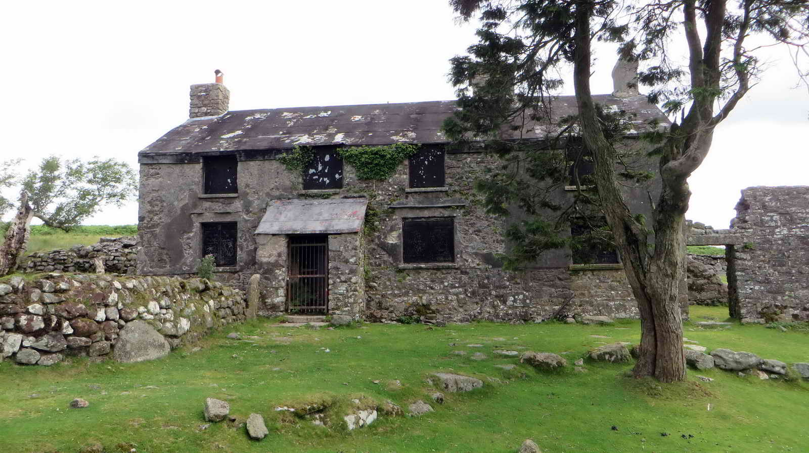

This was the rather grand house used by the warreners who worked much of the land nearby.

The house is sometimes hired out for filming purposes - two such are;

*  War Horse (2011)
*  All the Devils are Here (2025)

## Ferret Kennel

The warreners used ferrets in their work. If you closely inspect the garden walls surrounding the house, you will find this construction which is believed to have housed them.

Slit window in a piece of wall adjacent to the house suggesting that there might have been a longhouse here originally. The earliest record of a deed for the property dates from 1493 when pasture rights were granted to the occupant - this would be for farming. Warrening probably came later to support the nearby mines, probably around 1804.

## Dog Kennels

This was known as Kennel Court, or Dog Pit - one of three around the garden so that dogs could get away from the weather.

*Once the house and its surrounds are explored, take the track leading Eastwards above the house out onto Drizzlecombe*

## Drizzlecombe Stone Rows

This was clearly a hugely important site in Early Bronze Age history, and the remains here are one of the most rich archaeological sites on Dartmoor.

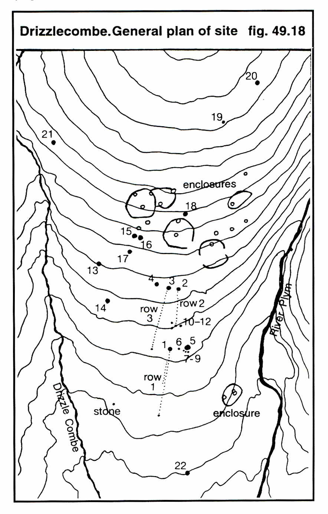

*Image © J Butler 1994. Reproduced by kind permission (ref. 29 Sept. 2012)*

## Cists

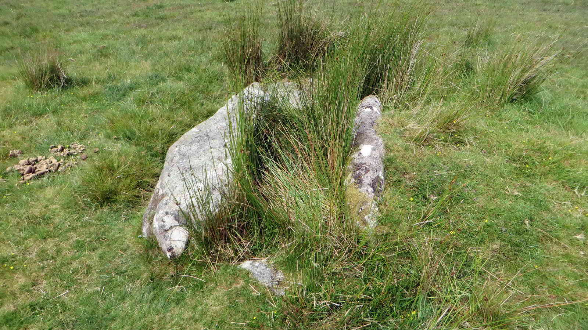

Several cists (small rectangular stone burial chambers) are found at the upper ends of the stone rows and nearby cairns:

Built of four side slabs with a cover stone on top, cists typically contained cremated remains, though few have survived intact.

Excavations (19th–20th century) revealed fragments of pottery urns, charcoal, and burned bone, typical of Bronze Age cremation burials.

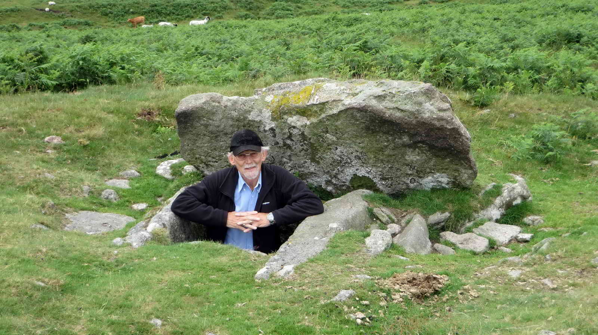

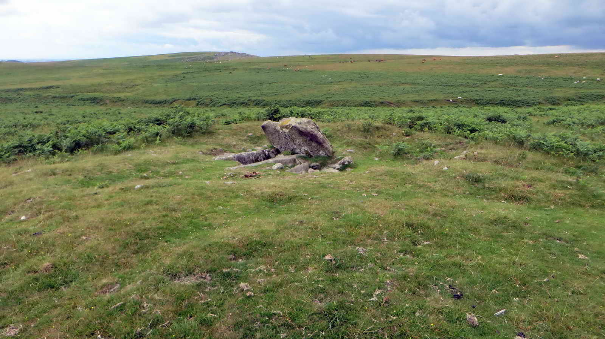

## Menhirs and Stone Rows

There are three main stone rows, all aligned roughly northeast–southwest, each terminating at a large upright menhir.

## Southern Stone Row - Row 1

This row is around 132m (430 ft) long. Its menhir is about 3.2 m (10 ft) high and the cairn at the upper end also contains a cist.

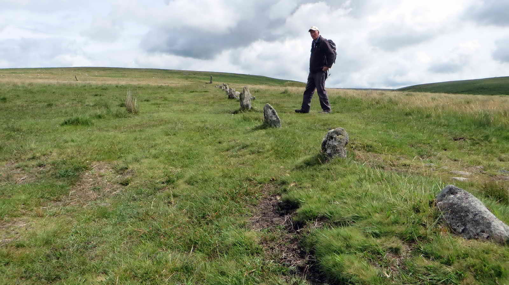

## Central Stone Row - Row 2

This is shorter at around 83m (270 ft). The stones are also shorter and more regularly spaced than the northern row, terminating with a cairn containing a cist.

## Northern Stone Row - Row 3

This row is around 149m (490 ft) in length

Ends with a tall menhir (~4.3 m / 14 ft high) — one of the tallest on Dartmoor - and associated with a small stone circle or cairn at the upper end.

## Stone Row Plan

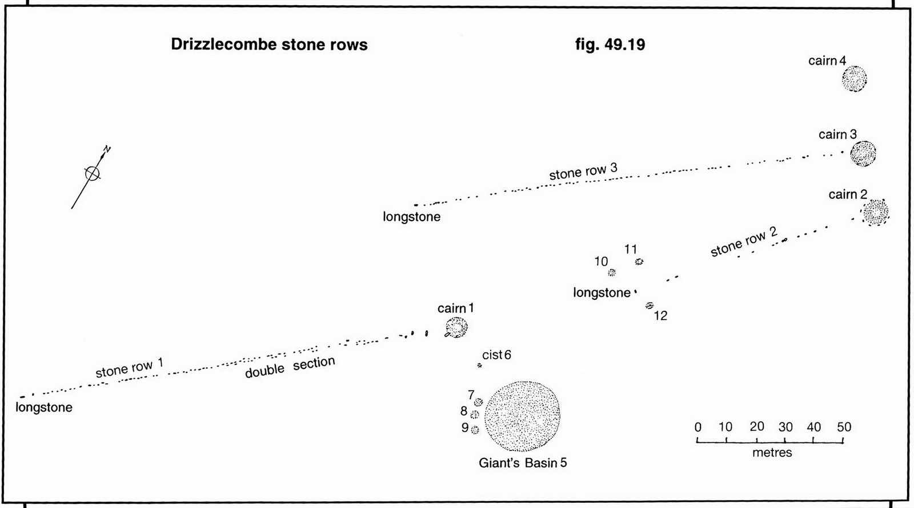

*Image © J Butler 1994. Reproduced by kind permission (ref. 29 Sept. 2012)*

*When you have explored the Cists, Cairns and Stone rows, follow the trail to the north where we cross the small stream that is the Drizzle which gives this area its name. We cross over at the head of the Longstone Leat*

## The Drizzle and Longstone Leat

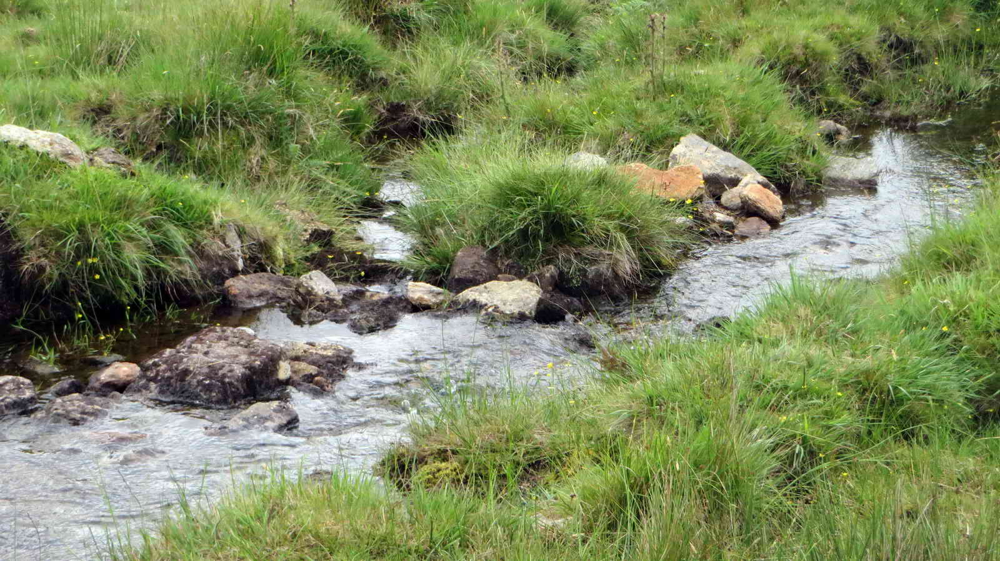

Longstone Leat gets its name from the tallest menhir we've just visited, and was created to supply water to Ditsworthy Warren House and other works.

*Once crossed, follow the leat downhill to the west*

## Whittenknowle Rocks

Whittenknowle Rocks is a large ancient Bronze Age settlement of 43 huts and 4.5 hectares. It also includes the remains of a much later medieval longhouse.

* [Heritage Gateway MDV3995 - Hut circle settlement at Whittenknowles Rocks](https://www.heritagegateway.org.uk/Gateway/Results_Single.aspx?uid=MDV3995&resourceID=104)
* [Megalithic Portal](https://www.megalithic.co.uk/article.php?sid=19400) has a lot of extra information about Whittenknowles Rocks .

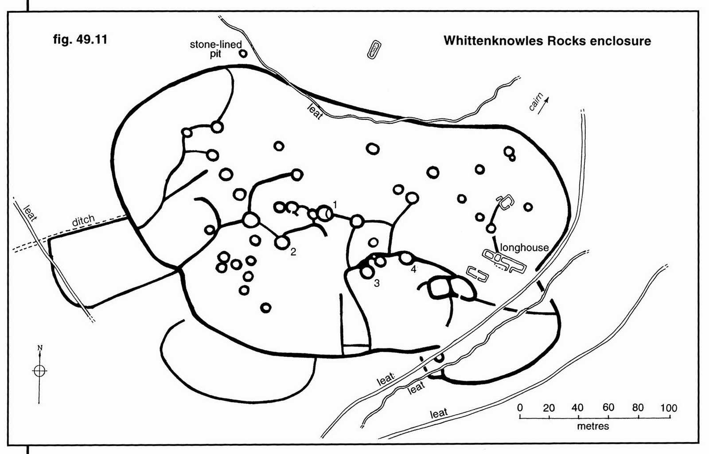

> Keith described this picture as "Windstrew, where threshed corn would be tossed in the wind to winnow away the chaff" but I don't think this fits the history. Happy to be corrected -- [Editor](mailto:feedback@dartmoorwalking.org)

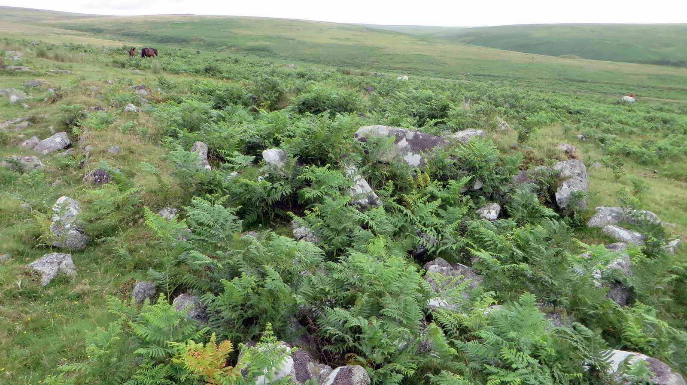

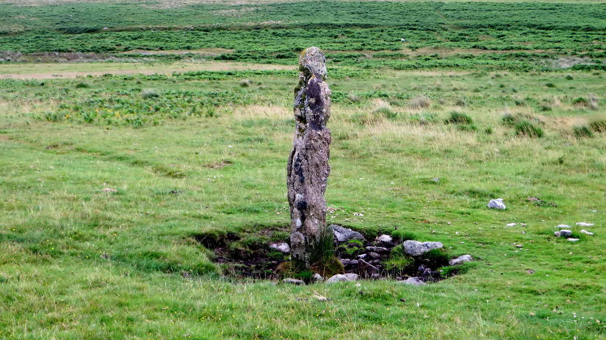

*When you've explored the Settlment, head Northwest along the contour until you join the large stone path and turn left, downhill back to the parking area*

## Parking

*Note that the parking coordinates are slightly offset to avoid other walks that start from the same point. Parking is a little further on and well signed*

The parking in this area can get quite full by late morning, especially at weekends as it's a popular setting-off point.

## References


