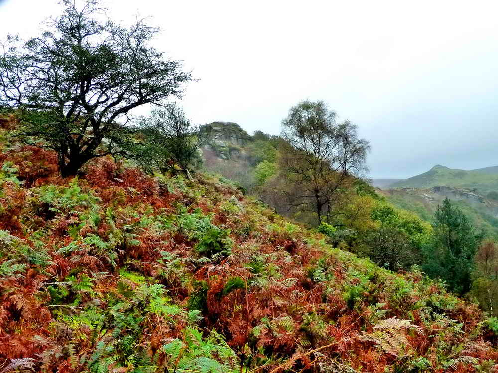

{}

{}

## Introduction

*Venford Reservoir has all-year parking. There are public toilets adjacent.  The approach was from the A38/Ashburton turn-off, passing the River Dart Country Park, crossing the Holne Bridge over the River Dart, through Holne and on to the Venford Reservoir, parking at the park over the dam. The roads to this car park are quite good with parking and toilets at the  P  symbol and yellow cross on the map.*

## The Woodland Path

## Sharp Tor View

## Bench Tor

## Return to the Dam

## Richard Dawson stone

