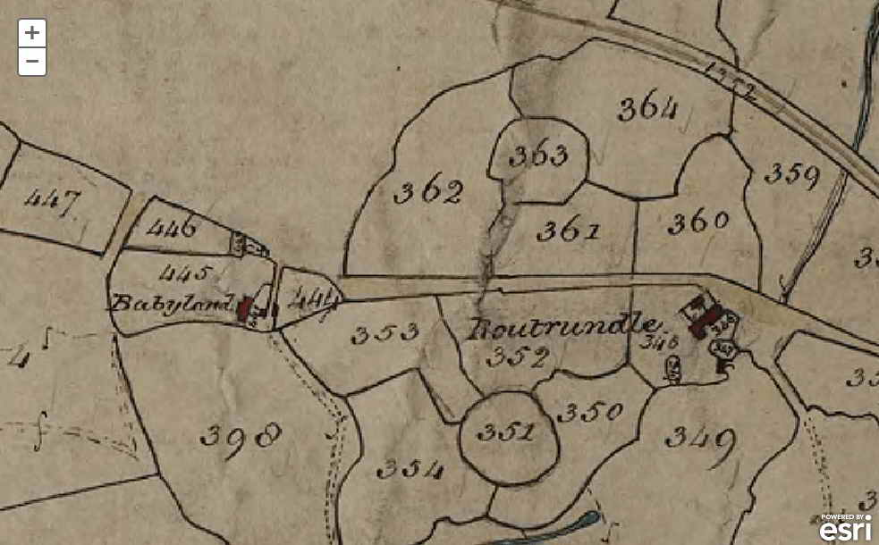

{}

{}

## Introduction

This is an interesting walk over open moorland taking in a wide scope of history, from Bronze age and medieval remains, to an abandoned Victorian railway, and disused granite quarries - all with excellent views over Dartmoor and West Devon into Cornwall. There's a small detour offered which takes in an abandoned Medieval Longhouse, its modern replacement and two ancient Pounds and hut circles.

## Sharpitor

Sharpitor is worth mentioning since it is owned since 1984 by Dartmoor Preservation Association and this ensures access will be preserved into the future. 

Also note the diagonal linear feature in this photo - this is part of the Walkhampton Common East Reave.

*When ready, walk along the path to the North towards the rocky line and hut circles as per the route on the map*

## Reaves and Hut Circles

**Reaves - land boundaries of heaped stones**

There are essentially four types of reaves:

1. Field boundaries to divide land into normally long strip-like fields for grazing or growing crops, akin to modern walls or hedges.
2. Terminal reaves that are uphill from field boundaries that marked lower divided areas from uphill open or "common" land
3. Reaves built usually along ridges to mark watersheds i.e. between river valleys
4. Long divisions over kilometres marking out territories akin to parishes. 

The Walkhampton Common Reave is 3170 meters long and mostly straight. It was built in the Bronze Age (Between 4000 BC and 1000 BC), and forms a division between the Walkham and Meavy valleys, thus identifying it as a Reave of type 3 in the above list - built to separate two watersheds.

* [Heritage Gateway MDV15038 - 	The Walkhampton Common Reave](https://www.heritagegateway.org.uk/Gateway/Results_Single.aspx?uid=MDV15038&resourceID=104)

*The figure above is reproduced from Andrew Fleming (1988) The Dartmoor Reaves - Investigating Prehistoric Land Divisions, BT Batsford Ltd, London, page 41*

*Continue walking uphill towards Leeden Tor*

## Leeden Tor

The modern mast of North Hessary Tor transmitting station can be seen in the background. This was built in 1955 to supply 405-line television to Devon and is 196 meters (643 feet) tall.

Today, it provides analogue FM radio covering a large area, including Devon, Cornwall, Somerset and South Wales. 

Additionally, it provides Digital DAB radio and DVB-T television - and is a useful landmark to identify where Princetown is.

* [North Hessary Tor transmitting station ](https://en.wikipedia.org/wiki/North_Hessary_Tor_transmitting_station)

## Great Western Reave

Heading Northwest from Leeden Tor, we very soon cross another reave. 

The Great Western Reave measures over 10 kilometres in length and is the longest known prehistoric land division boundary on Dartmoor. This record covers the most southerly section of the reave (two sections measuring a combined length of 2.58 kilometres). Along its length, the width of the reave varies between 2.5 metres and 4 metres, whilst its height varies between 0.2 metres and 0.7 metres - although it would have been higher when built. A second reave leads off at right angles at SX5577 7088 and there are hut circles and cairns associated with the reave. 

This very long reave is a territorial boundary something akin to a modern parish boundary (and type 4 from the list above)  It extends from near Sharpitor, near Dousland/Yelverton, to White Tor near Peter Tavy.

*Head North West about 450 meters, to...*

## Ingra Tor Cairn and Cist

> This cist is described by Jeremy Butler, 1994, Dartmoor Atlas of Antiquities  Vol. 3 - The South-West, 16: Ingra Tor cairn and cist (fig. 45.13),  page 51.

The cist is a few metres above the Routrundle leat, which is about 23 metres down the slope. The leat is marked by a downhill bank but is really quite non-photogenic and it is not easy to see the actual "trench" that was the water course in photographs, so it is not included here.

Stone pits are generally places where walling or building stone was easily won from the ground because of natural fissures or weathering. Sometimes they're mistaken for tinning holes where the old men would find small deposits of cassiterite - a rich source of tin ore. Those would usually have some spoil heaps nearby though, which aren't evident here, so stone pits seems likely. The only two certain things about these holes however, is that they are impossible to date, and that they were made by man.

## Ingra Tor and Quarry

*We aim for the Tor and pass to the left of it*

Ingra Tor Quarry, like the nearby Swell Tor, King's Tor and Foggintor Quarries, were run by the Johnson Brothers from 1820 to 1865 who paid a lease to the Duchy of Cornwall.

It was re-opened between 1936 and 1941 to cut kerbstones and granite setts for Devon County Council, and a platform was built on the railway called Ingra Tor Halt, just to the North of the Tor.

## Ingra Tor Halt

* This once held a small shelter from the elements, built partly inside a pound. 
* There was a short wooden platform to the single track railway. 
* At the time of opening in 1936, a single fare from here to Princetown was 11 1/2d First Class, or 7d Second Class. 
* The halt was built for quarry workers, but when the quarries closed, was used exclusively by walkers, most coming up from Plymouth. Walking from here to Princetown and then riding back home was a popular route before the railway closed on March 3, 1956.
* There was a famous sign here advising passengers to keep dogs on a lead due to the presence of adders. This sign is now kept at Buckfastleigh Station.

*(Above image hosted by the [Princetown Railway site](https://princetownrailway.co.uk/), which has a lot more interesting information about this railway)*

References
* Mike Brown Guide to Dartmoor - CD-ROM (2001)
* [Wikipedia - Ingra Tor Halt Railway Station](https://en.wikipedia.org/wiki/Ingra_Tor_Halt_railway_station)
* [Princetown Railway Website - Ingra Tor](https://princetownrailway.co.uk/ingra-tor/)

*When ready, walk a short distance to the little bridge to the West*

This bridge was built to provide safe passage for cattle and other livestock to cross the railway. It's worth noting that the railway was fenced with posts and wire to keep stock off the line, so creeps like this were essential to allow free grazing under commoners rights.

This curious set of holes shows that this block was once used for a tramway in one of the nearby quarries. These holes held an iron plate which held the iron rails above it. Wear from those rails can be seen above and below. No longer of use there, it was re-used in constructing this creep.

## Railway

*We continue walking Southerly along the railway for around 500 meters*

## Routrundle (Detour)

*If you want to explore some more history, leave the railway to the west just before the walls come up from Routrundle and walk towards "Homestead" on the map. Otherwise carry along the railway as per the marked route on the map*

This area of Dartmoor has been inhabited for at least four thousand years.

* The earliest remains are the large circular pounds and nicely viewable via the aerial view below. This, together with the hut circles nearby, formed an early settlement around 4000 to 1000 BC and provide evidence of animal husbandry.
* To the Northwest are the stone ruins of a Medieval Longhouse, Smithy and other buildings built between 1066 and 1539. 
* Routrundle is the "modern" farmhouse dating from a mere 1866, currently inhabited. Build after and probably to replace Babyland Longhouse. There are claims this house dates back to 1417, but it's possible that is confused with the Babyland property.
* Routrundle is no longer a working farm. It fell into disrepair and was left vacant after a Jim Fence left. 
* "Routrundle" is named after the Bronze Age "trundles" or pounds still so visible today.
* [Stags sales particulars (2018)](https://media.onthemarket.com/properties/3992108/doc_0_0.pdf) give a good view of the property, inside and out. It sold for £618,000 in 2018.
* (Not pictured) There is a benchmark on the southwest side of the lane on a large boulder. SX55274 71832

The collection of trees in the above photo marks a Bronze Age pound and collection of hut circles. These can be accessed from a Bridlepath off the railway a little further on, along with a Medieval Longhouse marked on the map as "homestead" a little way North of . This was called Babyland. This is a long-inhabited area of Dartmoor.

[Tithe maps](https://en.wikipedia.org/wiki/Tithe_map)  were produced to assess the tithe payable in cash to the parish church for the support of the church and its clergy. This tithe had been paid in kind until The Commutation Act was passed in 1836, when it was agreed that this should be converted to a monetary payment.

* [Heritage Gateway MDV14151 - Babyland Deserted Farmstead](https://www.heritagegateway.org.uk/Gateway/Results_Single.aspx?uid=MDV14151&resourceID=104)

### End Routrundle detour

*Whether you continued along the railway or explored through Routrundle and emerged from the bridlepath, leave the railway where the bridlepath joins it and head Southward over open moor to the car park to conclude our walk*

## Parking 

There are a couple of good roadside car parks at the posted locations.

## References
* Mike Brown Guide to Dartmoor - CD-ROM (2001)
* [Wikipedia - Ingra Tor Halt Railway Station](https://en.wikipedia.org/wiki/Ingra_Tor_Halt_railway_station)
* [Princetown Railway Website - Ingra Tor](https://princetownrailway.co.uk/ingra-tor/)
* [Tithe maps](https://en.wikipedia.org/wiki/Tithe_map)
* [Heritage Gateway MDV14151 - Babyland Deserted Farmstead](https://www.heritagegateway.org.uk/Gateway/Results_Single.aspx?uid=MDV14151&resourceID=104)

