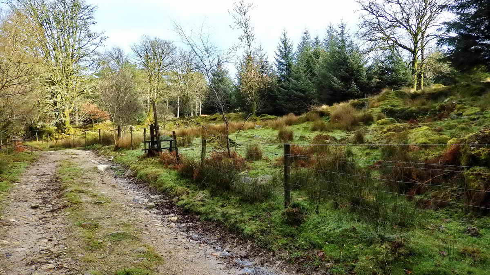

{}

{}

## Introduction

A short and interesting walk with many historic points of interest. 

Starting at the Norsworthy Bridge car part, we climb established tracks taking in many points of interest along the way. These include old tinner's stones, several artificial caves, a longhouse, a ruined tin mill, the Devonport leat, wheel pits and an abandoned tare and feathers still wedged in the rock.

## Norsworthy Bridge

## Ruined blowing house

## Devonport Leat

## Cross Gate Cairn & Cist

[Wikipedia Article about Dartmoor Treacle Mining](https://en.wikipedia.org/wiki/Treacle_mining)

This adit is found down the slope below Leathertor Farm. Look down the slope for the biggest tree stump near the river and the next stump downriver i.e. to rhe right. The mine entrance is hidden in the slope, between the two stumps.

## The Fougou (Cave)

Note the granite slabs forming the roof, making this a man-made cave (for tools) rather than the more usual potato cave. Potato caves are normally dug into growan ("rotted" granite). In this photograph, there is water in the fougou. The dimensions are 11-feet deep, 3-feet wide, 4-feet high, with the entrance being just 2-feet high (Hemery, High Dartmoor,  p.124).  There is a traditional potato cave just 50 metres away on the track below Leathertor Farm.  

[Heritage Gateway Article for this fougou](https://www.heritagegateway.org.uk/Gateway/Results_Single.aspx?uid=MDV3474&resourceID=104)

## Leathertor Farm

Leathertor Farm is first recorded in Bailiff's Accounts for the Manor of Dartmoor in 1362, regarding the renting of land at Leddertorre. Later, in 1511, more detailed reports were made. The last tenant was William Lillicrap who abandoned the farm in 1924. Some occupants were also tinners. 

Source: Paul Rendell (2007) Exploring Around Burrator, The Dartmoor Company, Okehampton, pages 20 and 55. The more modern buildings, above the track to the leat, were once West Leathertor

[Heritage Gateway Article for this farm](https://www.heritagegateway.org.uk/Gateway/Results_Single.aspx?uid=MDV102653&resourceID=104)

## Rain Gauge

This gauge dates from before 1892 and is shown on the [OS 1892-1914](https://maps.nls.uk/geo/explore/#zoom=18&lat=50.5106&lon=-4.0228&layers=168&b=1) and [1906 Ordnance Survey maps](https://maps.nls.uk/view/106005908)

[Rain Gauge entry on Waymarking.com](http://www.waymarking.com/waymarks/WM7B4M_Leather_Tor_Farm_Rain_Gauge_Near_Burrator_Dartmoor_Devon_UK)

One authority has described this feature as "two granite plinths which may once have been the supports for a cider press": Source: Mike Brown (2001) Guide to Dartmoor, Grid Square 5667 6982.  

I am inclined to disagree and suggest this is the base for a large, mounted sharpening stone, the bottom of which could run through water in the trough, making it a wet stone (not to be confused with whet, an old word that means to "sharpen").  

I have provided the horse-power for a similar stone - but with an iron strap frame and without the trough, when my father wanted to sharpen his axe - around 1956-1964!

## Potato Cave

[Heritage Gateway Article for this cave](https://www.heritagegateway.org.uk/Gateway/Results_Single.aspx?uid=MDV12733&resourceID=104)

## Leathertor Bridge

Walkhampton Parish Council decided on 20th June 1833 to build a bridge over Riddipit Stream (nowadays, the River Meavy) at this spot (this is the site of the Riddipit Steps stepping stones crossing place). 

At the next meeting the following month (25th July) it was resolved to accept a tender from George Worth and Wm. Mashford for £26.10s. This is a little more elaborate than most clapper bridges in that it has parapets.  

- Source: Eric Hemery, High Dartmoor, page 126. Apparently, this was the last clapper bridge to be built on Dartmoor (Johnies Meanderings, 20th August 2012). 

## Riddipit Farm

Hemery (p.127) notes alternative names are Ritthy Pit, Riddy Pit, Reedapit (1611), possibly to do with rushes, rishes or reeds. There were two houses here, shown on the 1840 tithe map - the remains of one longhouse are seen at the right edge of this photograph and the second one is seen across the clearing, down by the track. There are other ruined buildings, possibly barns, animal sheds or labourers' dwellings.

Riddipit Stream rises above the site and crosses the track in a granite conduit.

Crossing's Guide, p.100:  Riddy Pit, there are stones with hollows in them (i.e. mortar stones), now in the paving of the track, a little beyond this view up the track. Close by, is an old wall, in the nearby hedge is a stone with a cavity on each side. Another curious stone with a round top and a piece of iron leaded into it is probably the upper stone of a crushing mill: this was never found by Hemery.

First recorded 1564, abandoned by 1871 when the enclosures were incorporated into Leather Tor Farm. 

- Source: Paul Rendell (2007) Exploring Around Burrator, The Dartmoor Company, pages 31 and 57

[Heritage Gateway Article for Riddipit Farm](https://www.heritagegateway.org.uk/Gateway/Results_Single.aspx?uid=MDV12839&resourceID=104)

[Heritage Gateway Article for this Southern Farmbuilding](https://www.heritagegateway.org.uk/Gateway/Results_Single.aspx?uid=MDV66644&resourceID=104)

[Heritage Gateway Article for this Northern Farmbuilding](https://www.heritagegateway.org.uk/Gateway/Results_Single.aspx?uid=MDV66643&resourceID=104)

Described as a blowing house, but with no trace of a leat, launder bank or wheel pit, three necessary signs for a blowing house or tin mill, therefore probably a cart shed for the farm (Hemery p.128). 

However, the field behind this hedge is called "Mill Park" in the tithe apportionments (Plot 930). 

Also, the remains an old mortar stone is to be found here under the leaves and debris - but mortar stones are found widespread in the area.

[Heritage Gateway Article for this Stamping Mill](http://www.heritagegateway.org.uk/Gateway/Results_Single.aspx?uid=MDV5021&resourceID=104)

## Mortar Stone

## Big Potato Cave

RN Worth (1967) Worth's Dartmoor, David & Charles, page 417, describes it as a potato cave (always dug into growan) but Eric Hemery (1983) High Dartmoor, Robert Hale, London, page 129, argues that it shows signs of corbelling (as used in beehive huts, never seen in potato caves) and is in fact a cache (or vooga / fougou) for miners' tools from the Keaglesborough (Kekelles Burrowghe) Tin Mine.

[Heritage Gateway Article for this potato cave](http://www.heritagegateway.org.uk/Gateway/Results_Single.aspx?uid=MDV12841&resourceID=104)

## Keaglesborough Mine

The earliest reference to tinworking on this site is in a deed from 1538, where it is called Kekylsburgh. There is also a mention in a Walkhampton Manor court roll dated 1565 of Kekellas Burrowghe Mill.  There are other references in deeds etc.

Keaglesburrowe Sett,  "Keagles Burro also Lambards Park" (1748-65) and again (1811-20), another mention in 1820 uses "Lambers Parks Alies Kegales Borough" (= alias)  and later Keagles Burrow Mine.  Source: Mike Brown (2001) Guide to Dartmoor, CD-ROM, Dartmoor Press, Grid Square 573 701.

Tin mining started with men following alluvial deposits up streams and rivers and then digging into veins/lodes with pits and openworks (gerts or beams) into the hills. An Openwork in the nearby Newleycombe valley (Kingsett Gert) was first mentioned in 1505 (then, a long time in dispute), with a later date of 1639 (i.e. more than 140 years working). Ref. Phil Newman (1998), The Dartmoor Tin Industry - A Field Guide, Chercombe Press, Newton Abbot, p.8.

Early tin workings, while being a large industry in medieval times, finally ceased production by 1750 (Newman, Ibid, p.55).

In the late 1700s and 1800s, workings started going underground - with drainage effected by adits, horizontal tunnels driven into hillsides to let water run out of the workings e.g. Keaglesborough and Eylesborough. 

There are two "dressing floors" on this site, these being areas where mined rock is treated to concentrate the tin by crushing (under iron "stamps" falling againt mortar stones) to separate the tin-bearing rock from other rock of no value. The end of the leat that powered the waterwheel is probably the raised grassy area seen towards the top right in the photograph .....

This wheel was operating in 1801; length of wheelpit - 6.2 metres (20 feet) with a double-sided dressing floor, rectangular buddles. Source: Newman, Landscape, p.53 (see below for full reference).  

[Heritage Gateway MDV35575 - Keaglesborough Mine](http://www.heritagegateway.org.uk/Gateway/Results_Single.aspx?uid=MDV35575&resourceID=104)

Tinning was important on Dartmoor from about 1150 and throughout the Middle Ages.  
Stannary records show that in the busiest period, 1515-1538, the "average" output of white tin metal presented annually for coinage was about 500,000 lbs i.e. 223 tons. 
Thus, over this 24 years, this would have been 5,357 tons. If a mould stone produced ingots that weighed about 1 cwt then this means 107,143 ingots were produced. 
It is believed that not all tin was presented for coinage and taxation.  

*Source: Interpretation of data in: Tom Greeves (2017),The World of the Dartmoor Tinner: An Historical Context 12th to 20th Century.  In: Phil Newman (Ed), The Tinworking Landscape of Dartmoor in a European Context, 1-14. Dartmoor Tinworking Research Group*

## Tare and Feathers Stone

