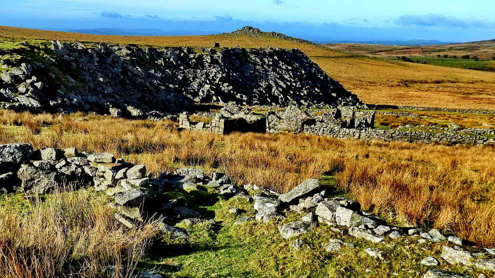
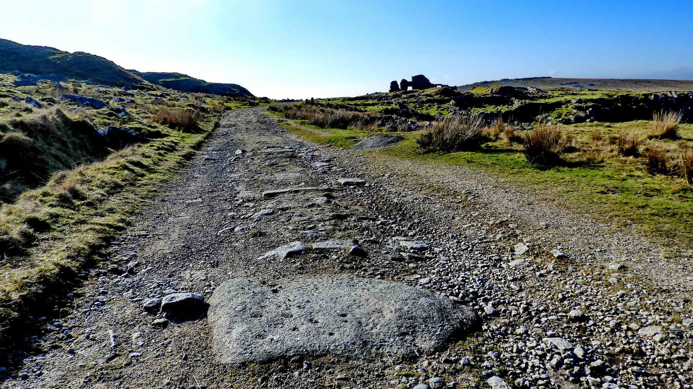

{}

{}
  
## Introduction

One of the most picturesque and popular Dartmoor destinations. The abandoned quarries have been retaken by nature despite having been worked as recently as 1966. The quarries once supported an entire village of based here at Foggintor, with a School, Chapel and 30 cottages. The landscape will have looked very differently here two hundred years ago at the height of its industry. Now only evocative ruins remain.

## The Mission Hall

Across the road from the parking area are the ruins of the old non-denominational Mission Hall, built in 1887 and demolished in 1965.

Due to problems at Foggintor school, the Mission Hall opened as a school on 17th August 1896 to house 41 pupils and soon that grew to 95 children. The school closed on 27th September 1912 and the children went to temporary schools at Merrivale and back to Foggintor Chapel until the new school opened at what is now known as Four Winds, on 19th April 1915. 

In the photograph above, Great Mis Tor is seen at top right.

* Dartmoor Explorations has [some photographs](https://dartmoorexplorations.co.uk/dartmoor-mission-hall-and-the-foggintor-quarry-school-wesleyan-chapel/) of how the mission hall looked

*We start our walk by following the track away from the road to the South*

## Red Cottages

This leat still supplies Yellowmeade and formerly ran on to supply Foggintor. It is probable that the cottages were supplied by a bullseye stone to regulate water use. 

The cottages stood  on the high ground on the left of the photograph (but to the right of the track) and were separated from their gardens by a back lane. The cottages were planned in 1846 and built by April 1849. They were probably demolished in 1953, the same year as Hill Cottages.

According to various Censuses, they were originally known as Mount Pleasant Cottages, then West View Cottages, and after that, Red Cottages. 

They were built with cob and by 1871 the weather got into them so badly they were "covered with corrugated iron" and painted with red lead, thus becoming known as Red Cottages - this appears in the 1871 Census. 

Kath Brewer writes in "The Railways, Quarries and Cottages of Foggintor" that in later years they were actually black, having been covered with pitch, again against the weather.

There were six cottages but with twelve dwellings - with "one up, one down". In the 1861 Census, there were thirteen families with 50 adults and 38 children at West View, as the cottages were known at that time.  

Large weighted iron bars were used to drill the granite to take the explosive charge. These drills, known as Jumpers, were tested here to ensure they were sharp enough.

## Yellowmeade

The "lumps and bumps" in the background are waste tips of Foggintor Quarry. 

Yellowmeade Farm itself was not established until 1860, the last farm to be founded in Walkhampton Parish. It was enclosed by George Cole whose family lived there until about 2015. 

Further on we'll see clear evidence of worked trackway blocks, proving this track was also once a horse-drawn railway.

## Sett Making

A quarryman once stood at this point making Setts. 

Setts are granite blocks that were much used for paving roads and paths, and can still be seen in many cities, for they last a very long time.

Rough cut setts blocks be brought here, such as cut from the Cake Stone above. To cut down on transport, the bankers typically set up very close by to the raw material, and their workplaces - bankers - were rough and ready; somewhere to stand and work the stone at around waist level. 

In exposed conditions, and this certainly qualifies, they would erect shelters to keep off the rain, snow and the worst of the wind. These would have been made of oilskin tarpaulin with a stick framework, probably on three sides, backed to the wind.

The tools were iron chisels and a hammer, with the working stone set on a bed on firm earth and granite chips, which would absorb the blows. 

It was a hard job. As well as the obvious difficulties of weather and repetitive, physical work; the sett-maker's hearing will have suffered and worse, many will have suffered from silicosis from working granite and died early from lung problems.

The stone here is the waste rock - where setts failed, often through cracks in the rock or where edges were trimmed off. 

Traditional stonemasons still work very similarly to this, but now have tungsten tipped chisels and, when working with granite, a full-face respirator system. 

> When I worked for DNPA in the late 1980s, they often employed a traditional stonemason who would work just inside the entrance of the Works Depot in Bovey Tracey. He had a 45 gallon oil drum full of granite chips on which he'd place his work, which might be a perfectly spherical ball to sit atop a gatepost. He'd stand there all day, chipping away. Pausing every now and then to offer up a hardboard template to check his progress, or check diameter with a set of large calipers. He wore a full face respirator, with a battery pack and inlet on his belt at the back, similar to those used by industrial welders, which blew filtered air into the mask. <cite>-- Simon</cite>

## Foggintor Quarry

The "bumps" on the left skyline are high-level waste tips while the enormous waste tip to the right is named "Big Tip". 

Royal Oak Quarry (later known as Foggintor) was worked from the early 19th century until the early 20th century, extracting granite that was taken away on the nearby railway line. This track was a horse-driven rail or tramway, so some deliveries will also have left this way to the road, as well as bringing supplies into the quarry and its accompanying village.

Remains on the site include ruins of numerous buildings, large spoil tips and tracks, including that leading to the nearby Swell Tor Quarry, was closely associated. Foggintor was known to have included up to 30 cottages, a large Manager's house, smithy, powder house, dressing sheds and stables. 

* The Quarry was first dug in 1820, then known as Royal Oak Quarry.
* Through the 1830s through 1840s, up to 600 men were employed by the local quarries, some living at Foggintor and most journeying in each day.
* In the 1861 Census, 267 people were registered as living at Foggintor. 
* As well as Foggintor, Hill Quarry and Royal Oak Quarry, this was also known as Foggator - probably a local dialect corruption.
* The Houses of Parliament and Nelson's Column were built from granite taken from this quarry.
* More locally, stone from here was used to build Tor Royal at Princetown, and likely some other Princetown buildings, although the Prison's stone was mostly dug from the nearer Herne Hole Quarry.
* Foggintor Quarry was owned at one time by the Johnson Brothers who also took the lease on Haytor Quarry, but closed it and then sold stone from Foggintor Quarry under Haytor's name.
* The quarry closed in 1966, putting 40 men out of work. One factor given was competition from cheaper sources abroad, and an increasing use of concrete instead of stone in architecture.
* The stones that form Big Tip are huge, especially on the lower levels. Approaching from the side you can see some must weigh many tons, and cracks in between are big enough to easily conceal an adult.

This looks like it might have once been a kistvaen or cist, but could also be a split or worked stone from the sett-makers or even a natural feature. 

The blocked up gateway above is in the angle at the right of this photo.

## Hill Farm

Hill Farm, also known as Eva's Farm. The family was at Foggintor on the 1881, 1891 and was still present until at least 1936.

## Methodist Chapel and School Ruins

These scant foundations were once a schoolhouse and a Wesleyan Chapel.

The quarry workers originally sent their children to the School at Princetown, which was then probably built in the Barracks. But when Dartmoor Prison was re-opened in 1850, a new building for the School was needed and was built here. At its peak in 1861, 183 pupils were known to regularly attend.

*Note that this is not the later "Foggintor School". That was also known as Four Winds and forms the large tree-lined car park half a mile south of our parking. We discuss that school [in our Merrivale Calendar walk](/p/the-merrivale-bronze-age-sun-calendar-and-foggintor-school/)*

Between 1880 and 1883, this building was also recorded as a Wesleyan Chapel, and later a Workshop and again as a private residence, so it clearly served multiple purposes.

By 1915 it was closed forever.

* [Heritage Gateway -Methodist chapel / school at Foggintor Quarry](https://www.heritagegateway.org.uk/Gateway/Results_Single.aspx?uid=MDV50704&resourceID=104)

## Hill Cottages

These are believed to have been built in the 1840s. The last resident left in 1951 and they were demolished two years later.

You can see where a branch railway line was laid out along Big Tip  to carry waste for tipping. The railway gauge was about 2-feet for easy man-handling. It is recorded that only 10% of quarried granite was used in building, the rest was waste. Looking at the size of these tips, it is easy to believe that disposing of waste rock was a large part of the works here.

Much of the research for this walk was taken from Kath Brewer's book, The Railways, Quarries and Cottages of Foggintor, Orchard Publications, Chudleigh, Newton Abbot, 1997.  The cottage about the arch was her home.

The purpose of the arch is unknown. There is a suggestion that a waterwheel was located here, but there seems to be no evidence to support that.

## Quarry Entrance

In the foreground of this picture are the remains of a crane base, at SX 56652 73658.

*For our walk, we circle the quarry clockwise by climbing to the left above the quarry entrance*

The 1840 Walkhampton Tithe Map shows Little King Tor and Great King Tor. It also shows the 1823 Plymouth & Dartmoor Railway, extended from King Tor quarries to Princetown by December 1826. It shows neither Foggin Tor nor the branch line to Foggintor Quarry. These were active well within Walkhampton Parish, although quarrying had nothing to do with tithing and therefore wasn't suitable for the purpose of the map.

*Follow the level ground back towards Big Tip*

## Return walk

*It's worth leaving the track after the field enclosures to walk below it, as per our route on the map, for some interesting historical items*

This hut is labelled "1" in the figure below. Cairn 1 is a ruined cisted cairn. The area around Yellowmeade was occupied in Bronze Age times.

## Parking

There is a fair layby at the start of the track to Yellowmeade and Foggintor - which is in fact an old sand quarry. Please don't block the track, it is in regular use. 

If that's full, there's usually some space opposite, and some more a short way towards Princetown by the old pump house.

## References

* John Hallett (1994), Around Princetowns Quarries: The Tyrwhitt Railway Trail from Princetown. Orchard Publications, Newton Abbot
* Kath Brewer (1998), The Railways, Quarries and Cottages of Foggintor. Orchard Publications, Newton Abbot
* Dave Brewer (1986). A Field Guide to the Boundary Markers on and around Dartmoor, Devon Books, Exeter
* Stephen Woods (1988), Dartmoor Stone, Devon Books, Exeter
* Mary Stanbrook (1991), Old Dartmoor Schools, Remembered, Quay Publications, Brixham
* Jeremy Butler, 1994, Dartmoor Atlas of Antiquities  Vol. 3 - The South-West,1: Yellowmeade
* [Devon & Dartmoor Historic Environment Record - MDV117446 Hill Cottages at Foggintor Quarry](http://www.heritagegateway.org.uk/Gateway/Results_Single.aspx?uid=MDV117446&resourceID=104)

