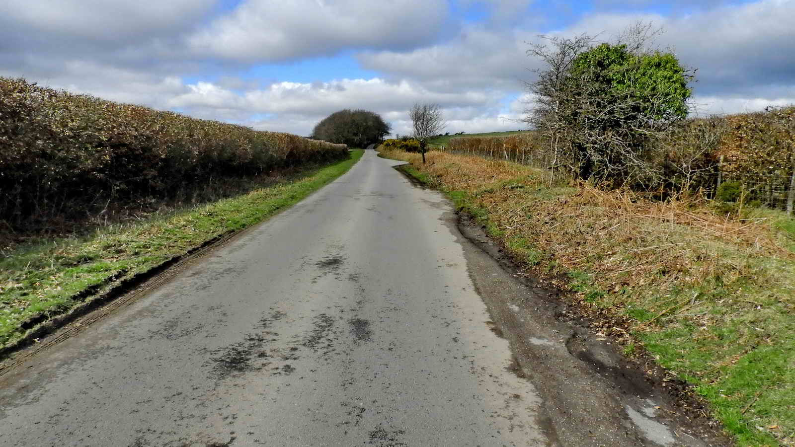

{}

{}

*A four mile walk of mostly level terrain including the famous Kitty Jay's Grave, Bowerman's Nose, Swallerton Gate, a Logan Stone, Ladder Stile and many more*

The tor is on Houndtor Down which, while it is unenclosed and freely open to the public, is owned by three families and is not common land. But then, all land on Dartmoor is owned by someone, whether it is Common Land or not. Hound Tor is clearly an "avenue tor", where the central portion has been eroded to leave a central avenue running between the remaining piles - other examples are Bellever Tor, Haytor, Rippon Tor and Pew Tor.  In fact, there are several avenues through Hound Tor.

The road through Swallerton Gate leads to Swine Down and, further on, to Kitty Jay's grave.  An old gate post can be seen on the left (see next photograph). Beyond, there is a cottage on the left, Swallerton Gate, formerly the Hound Tor Inn until 1840 and thought before that to have been the Green Dragon Inn. It was recorded as Swine Down Cottage in the 1851 Census (Source: Mike Brown, 7389 7915 and 737 796).  

It is well-situated on the road between Ashburton and Chagford - two busy market towns.  It would also have been used by the inhabitants of Widecombe and Ilsington on their way to market.  There is an old cross in the garden wall of the cottage.  Source: Dave Brewer (2002), Dartmoor Boundary Markers, Halsgrove, p. 115. 

There are records that Thor Heyerdahl wrote at least part of The Kon-Tiki Expedition in the cottage. 

This cross was going to be used in the hardcore for the floor of the extension but an intervention pointed out that is was a medieval cross head. The intervention came from a passing Harry Starkey, a well-known Dartmoor guide to whom there is a memorial locally on the back of the replaced Duke Stone on the Ilsington Manor boundary at SX 74605 77305, close to Becka Brook. 

This could be the cross formerly known as Swine Path Cross, at what is now known as Swallerton Gate, that is mentioned in a description of the boundary between Chagford and Ashburton Stannaries that dates from the last meeting of a Stannary Court in 1786 at Crockern Tor, using a "Presentiments of the Bounds of the several Stannary Courts of Devon" dated 1613 (Brewer, pp.269-273). 

*Addendum: FH (Harry) Starkey (1987) Dartmoor's Crosses and Some Ancient Tracks, Revised Edition, pages 155-156, records that the cross was found in a nearby hedge in 1939 and was described by EN Masson Phillips in Transactions of the Devonshire Association, Vol. LX11 (1940) page 267.*

## Kitty Jay

It is said that the local parishes of Manaton, Widecombe-in-the-Moor and North Bovey all refused to bury poor Kitty's body in consecrated ground because she had commited suicide.  In those times this was considered to be self-murder and therefore a mortal sin.  

It is also said that burial at crossroads was chosen possibly as a warning to others and also to confuse the spirit or ghost of the departed so that they might not easily find their way back to where they had lived and be of nuisance to the living.  

The Burial of Suicide Act 1823 did away with the requirement for crossroads burials. 

*Addendum: Devon & Dartmoor Historic Environment Record - MDV7489 Jay's Grave - one report in this record (by Beeson M, 2018) mentions Ann Jay, Kay, Betty Kay, an 1882 poem referring to Kay's Grave, and Betsy Kay. An eyewitness to the exhumation put her death to around 1780-1790.* 

**Who was Kitty Jay?** 

Her name has been recorded as Ann Jay (1851), Kay (an old woman, 1876), Betty Kay (1881), Kitty Jay (Crossing, Guide to Dartmoor, p.295, 1912), "J" (1914), Mary Jay (1934). She has also been recorded as "Jane" as in Jane's Grave.

The report by William Crossing says that on 25th January 1851, Mr. James Bryant of Hedge Barton had the grave opened after it was found by workers tidying the area. Bones were found that were confirmed by a visiting doctor to be those of a young woman. They were reburied in a wooden box and the stones were placed to form the grave as it is seen today. 

**Reprinting a Widecombe History Group item that was told by Beatrice Chase in the Western Morning News on 3rd March 1934:**

> A Workhouse apprentice hired out by the parish to Barracott Farm, Manaton. Hanged herself in a barn at Ford Farm. A parish register that recorded Apprentices 1804-1840 contained the name of Mary Jay among them, as well as the names of witnesses, overseer and assenting magistrate.  
> 
> The father of Mr Robert Nosworthy, born at Ford "exactly one hundred years ago" (written in 1934, therefore born 1834), always spoke of her as Mary Jay, as did his great aunt, a generation back. Original OS maps had it labelled as Jay's Grave but Mr John Kitson of Heatree had it changed to Jane's Grave.  His family agreed it should be reverted to Jay's Grave (1937-1961 1:25k Series). OS 25-inch 1885/1886. The adjacent single sheet map has Swallerton Gate marked as Swinedown Gate.

## Crippon Rock

Feldspar crystals indicate that the rock cooled slowly after it was formed. this example is probably plagioclase feldspar (ie of a family containing NaAlSi3O8 to CaAl2Si2O8  and usually white. The alternative would be an orthoclase feldspar (ie containing potassium KAlSi3O8 ) but those are usually pinkish in hur. In granite, quartz crystals are usually greyish and translucent. My thanks to John Viant for this information

## Logan Stone

## Medieval Longhouse ruins

The uphill left corner of the house is marked by the hawthorn tree with the rest of the house being in the right half of the photograph - it was difficult to photograph against the sun. The orientation is as it is in the diagram below: this is described by Jeremy Butler (1991), Dartmoor Atlas of Antiquities, Vol. 1 - The East, Map 21 - 5: Blissmoor longhouse (fig. 21.3), page 155

## Bowerman's Nose

The story of Bowerman is that many years ago he lived in the Manaton area and was a keen hunter. 

One day his hounds started a hare and he gave chase. He was so keen to catch the hare that he did not notice that the hounds had led him through a coven of witches, knocking over their cauldron. They were so incensed that they decided he must be punished. 

The next time he was out hunting, one of the witches transformed herself into a white hare - a highly prized trophy. She led him the merriest chase of his life until he was near exhaustion. Then she led him and his hounds back to this spot where the other witches were waiting. 

They turned him into a pillar of granite as punishment, right here, where he must gaze out for all eternity on his favourite hunting lands.

His hounds ran in fear for their lives but the witches turned on them as well, turning them to stone on a nearby hill - which is known today as "Hound Tor". 

## Hayne Down Rocks

## Moyle's Gate

## Swallerton Rocks

*This walk was reached by following the  "Widecombe" sign from the A38 just past Ashburton, heading towards Exeter, via Owlacombe Cross, Halshanger Cross, turn right at Cold East Cross, left at Hemsworthy Gate after passing Rippon Tor on the right. Then, right at Harefoot Cross and on to the car park by Hound Tor, signed by the  P  symbol and yellow cross on the map.*
