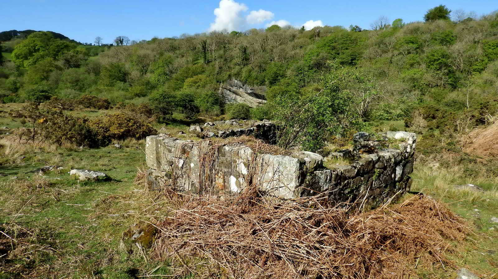
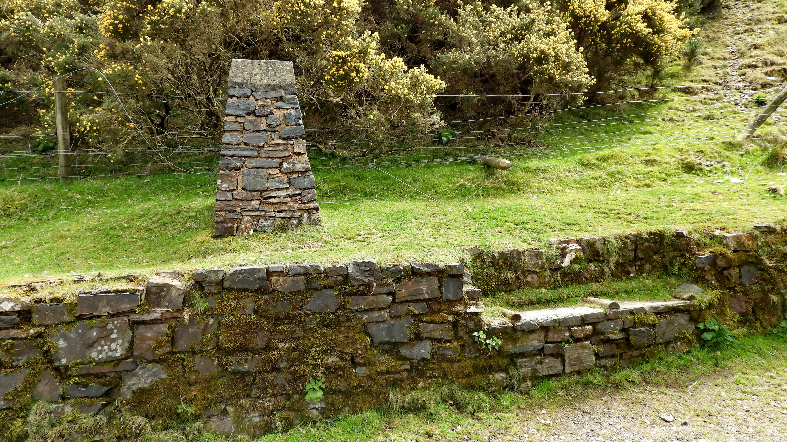

{}

{}

## Introduction

Although a short walk of less than 3 miles, this area contains a huge amount of variation in terms of nature, geology and industrial history. 

## Tramway

The bank is apparently a former tramway but there is no mention of it in the usual reference sources. 

## Tin Adit

The staining on the ground by metalliferous leaching indicates that there are metal ores in this vicinity. This particular mine was dug for Tin.

Adits are horizontal tunnels used in mining. Some are used for access in and out and some are used for draining upper levels of water. This one is only open for about 10 meters, and was worked in tandem with the shafts on the slope immediately above it. 

There would have been a spoil heap here when they were dug, but that has been removed by later activity.

* [Heritage Gateway MDV120318 - Adit west of the West Okement River at Meldon Quarry ](https://www.heritagegateway.org.uk/Gateway/Results_Single.aspx?uid=MDV120318&resourceID=104)
* [Heritage Gateway MDV120320 - Mine shafts west of the West Okement River at Meldon Quarry](https://www.heritagegateway.org.uk/Gateway/Results_Single.aspx?uid=MDV120320&resourceID=104)

## Wheelpits

This is one of two wheelpits found here and is the earliest, showing on the 1841 Tithe Map. A large waterwheel once ran here and was to drive a series of flat-rods back and forth motion which carried the power to the nearby quarry where it powered pumps to keep the water free of water, which at its end reached a depth of 130 feet.

There is a second wheelpit just upstream but it is known that both were not used together. They ceased operation by 1905.

The wheels were fed by a reservoir above and a wooden launder (a basic 3-sided chute to run water down) and were of "pitch back" design, where water was added to the top of the wheel so that it filled buckets and drove the wheel back towards the wooden launder that supplied water. It was found that one reservoir didn't supply enough water as the needs of the quarry grew and a second was added to increase flow.

* [Heritage Gateway	MDV20471 - Northern wheel pit at Meldon Quarry](https://www.heritagegateway.org.uk/Gateway/Results_Single.aspx?uid=MDV20471&resourceID=104)

This second wheelpit housed a water wheel some 18 foot in diameter. The walls are better preserved than the first but quite overgrown. Behind it, there is a depression which is a "bob-pit". This housed a large counter-weight which kept tension on the flat-rods as they worked to operate the quarry pumps.

## Meldon Viaduct

The Meldon Viaduct was built in 1874 by William Galbraith from wrought iron for the London and South Western Railway (LSWR) to connect Okehampton to Lydford and then on to Plymouth.

It was widened to double-track in 1879 by building a second viaduct alongside, this one of steel, and joining the two. This was in service until 1968 when it became yet another victim of the Beeching Cuts. Meldon Quarry continued to use it up until the 1980s for shunting its trains until the track was removed in 1990.

It's now used by [The Granite Way](https://en.wikipedia.org/wiki/The_Granite_Way) - a shared-use foot, cycle and bridlepath and is a scheduled monument.

* [Wikipedia - Meldon Viaduct](https://en.wikipedia.org/wiki/Meldon_Viaduct)

## Waste Dumps

These are some of the quarry's waste dumps, more properly named as "finger dumps" for their shape. 

In the late 1800s the "waste" was taken in trucks to a series of corrugated iron buildings at the northern end of the east side tramway. A transfer shed was used where the finished material was consigned to wagons operating on an incline leading to the London and South Western Rail sidings on the eastern edge of Meldon Viaduct. This incline becomes apparent as an earthwork partially obscuring the mouth of the early lime kiln. The crushed stone was used as ballast on railways and roads across the country and any unsuitable stone ended up here.

* [Heritage Gateway MDV120325 - Tramway routes at Meldon Limestone Quarry](https://www.heritagegateway.org.uk/Gateway/Results_Single.aspx?uid=MDV120325&resourceID=104)

## Meldon Pool

This old limestone quarry, now flooded. It was used to dig a special Carbonifereous period limestone, not found anywhere else on Dartmoor, and much prized for producing lime.

The pool is about 130 feet deep, and when worked was kept drained by pumps driven by the water wheels earlier on our walk. This makes it deeper than the viaduct is high, that being a mere 120 foot tall at its highest span.

A hundred years ago this site will have been very noisy and busy, with explosions and cranes operating, horse drawn carts rumbling around and men shouting. There will also have been rock crushers and stamps running within earshot, as well as steam trains going over the railway.

* [Heritage Gateway MDV4826 - Meldon Lime Works](https://www.heritagegateway.org.uk/Gateway/Results_Single.aspx?uid=MDV4826&resourceID=104)

The limestone quarry was smaller in 1841 with various buildings around it that disappeared as the quarry became larger. Beyond the buildings, an inclined plane can be seen extending northwards to take stone to the kiln.

## Weigh House

The Weigh House was ruined, but during 2019 was being rebuilt. 

* [Heritage Gateway MDV120246 - Weigh House and weighbridge south of the Meldon Viaduct](https://www.heritagegateway.org.uk/Gateway/Results_Single.aspx?uid=MDV120246&resourceID=104)

The carts of finished stone were weighed here before leaving for the railway. The design would have been similar to modern weighbridges and these metal grids formed the top layer of weighing scales that were read from within the weigh house. The quarry will have recorded its output using these figures, and from that set prices charged and paid.

* [Grace's Guide to British Industrial History - Barlett & Son](https://www.gracesguide.co.uk/Bartlett_and_Son)

## Lime Kiln

This lime kiln was built between 1880 and 1885. 

Lime was made in the kiln by setting alternating layers of limestone and charcoal made from coppiced hazel trees. Once the kiln was filled to the brim, the fire was lit and everything burned at a high temperature for three days, leaving behind quicklime, Calcium Oxide. 

Slaked lime can be made, carefully, from lime by adding water. This process is called hydration and as the reaction is exothermic, a huge amount of heat is produced and this can be extremely dangerous. Quicklime was so named from the old word "quick" which means "alive", as it acted like it was alive when water was added as it churned and boiled.

Once made, quick and slaked lime have many uses:

* **Agriculture**: Increases the PH level of fields by being spread in powder form, transforming acidic soils into sweeter and more productive ground.
* **Construction**: Lime Mortar has long been used for building, and is favoured even today for stone buildings instead of cement mortars, as it can move and even heal small cracks as it absorbs moisture. It's also used as limewash for painting, and lime render to cover and stabilise walls.
* **Manufacturing**: Lime is used for all sorts of things, including paper, steel, sugar, paint and other processes.
* **Medicine**: In the right conditions, lime is also a disinfectant, and is used in purification methods.

## Under the viaduct

The Railway was extended as a single track as far as Lydford in 1874 and this involved building the viaduct, spanning the river for 165 metres.

Through this gate and to the left is an early lime kiln.

To the right is a bank that supported a tramway to the gate for bringing out old waste from the finger dumps, and down ahead is the Turbine House. 

The possible crushing house feature (seen below) is just out of sight on the right in this image

This is the earlier kiln, built before an Okehampton Estate map of 1790 and originally serving a small nearby quarry. It became disused but was used again when the Meldon Pool quarry started up. 

This is earliest building in the valley to exploit the local geology. The view is partially blocked by an inclined tramway that took quarried stone up to the railway viaduct, which was built in 1874. 

* [Heritage Gateway MDV120326 - Site of crushing sheds at Meldon Limestone Quarry](https://www.heritagegateway.org.uk/Gateway/Results_Single.aspx?uid=MDV120326&resourceID=104)

This wall may be part of the crushing house where waste was brought from the finger dumps to be crushed and taken past the kiln by tramway up to sidings for use as ballast on the railways, but this is not certain as little is recorded about it.

## Turbine House

Water was piped from the Red-a-ven brook to a turbine housed in this building, generating power for the quarry. Spent water was then released into a short brick-lined channel on the West side of the building to return to the brook.

* [Devon & Dartmoor HER - MDV120311 - Turbine building at Meldon Quarries](http://www.heritagegateway.org.uk/Gateway/Results_Single.aspx?uid=MDV120311&resourceID=104)

*My guess from this base and similar designs is that this was a horizontal turbine with a [pelton wheel](https://en.wikipedia.org/wiki/Pelton_wheel) with one or more jets coming in from the side to power them. A central shaft would then have transferred power into a generator mounted directly above it <cite>--Simon</cite>*

Somewhere near to the turbine house there were once corrugated iron buildings that housed crushers. These worked previous spoil heaps, crushing limestone which was then loaded onto wagons on an incline that led to the railway sidings on the eastern edge of Meldon Viaduct. 

## Explosives Magazine

This stone ruin was once where explosives for the quarry were kept. Before each shift, the explosives handler would take only enough from here for that shift's operation. 

Such handlers were often selected from the most careful and thorough of the workers, and would avoid carrying any iron tools, or even removed iron hobnails from their boots to reduce the chance of sparks.

Although the walls are strong, explosives stores often had very weak roofs - typically made of stick and oilcloth. If there was an accident, then the force would be sent upwards instead of outwards and repairs to the building would therefore be relatively quick. 

This ground anchor looks very similar to those used through the 20th century to secure straining wires for telegraph and electricity poles. It was probably employed for a similar purpose here. 

## Mineshaft

There are mine shafts on the east bank of the river with two adits nearby, typical of tin mining. They exist as sub-circular hollows with rims of upcast soil on their downslope margins. They vary in diameter, most examples being in the area of 3 metres with one exceptional example of 6 metres.

* [Devon & Dartmoor HER - MDV120322 - Mine shafts east of Meldon Pool](https://www.heritagegateway.org.uk/Gateway/Results_Single.aspx?uid=MDV120322&resourceID=104)

This pit is part of a old tin-working gert running down towards the river. The gert ends at SX 56589 92163 where a spoil heap starts and ends closer to the river at SX 56562 92171, quite high above the surrounding ground.

## The Bottle Factory

These modern buildings are associated with more recent quarrying after 1921. The site remained open for a further fifty years until around 1970 and provided stone for road metalling.

Before these buildings, there was a failed glass bottle operation on this site.

From the late 19th century, investigations were being made concerning the production of granulite (a granular metamorphic rock) at Meldon. There seemed to be potential to establish both glass and china works at the site. 

There was little activity until 1920 when a syndicate from London decided to build a glass factory. Two furnaces were installed out of a planned 12, and about 500 men were required. However, by February 1921, the men had been laid off and new owners were being sought. 

No obvious features remain of a glass industry, but large amounts of broken glass fragments can be seen, mostly representing small medicine and cosmetic bottles.  <cite>-- (Western Morning News 29/03/1920</cite>

## South Quarry

Here we can see the darker aplite disappearing into the ground, with the less desired striped chirt, similar to that at Meldon Pool.

## Meldon Dam

* Meldon Dam was begun in 1970 and completed in 1974, making it the newest of Dartmoor's large dams.
* It is 55 meters (180 feet) high.
* It's 200 meters (660 feet) wide.
* The reservoir is stocked with Brown Trout for licenced angling.
* Uniquely, Meldon reservoir became the first water-supply body to produce electricity when a 500kW turbine generator was installed in 1987 to produce electricity to work the pumps and treatment works.

* [Wikipedia - Meldon Dam](https://en.wikipedia.org/wiki/Meldon_Reservoir)

At each end of the dam are these structures. They are used to check the dam's alignment and curvature to ensure there is no movement.

This spillway appears to be a combination of a straight chute and stepped spillway features. These are designed to reduce the kinetic energy of overflowing water and thereby reduce erosion damage. This system is essentially an uncontrolled system in that there are no mechanical gates or vanes to regulate the rate of overflow at the top of the dam.

Many of these plaques on Dartmoor's reservoirs were made of bronze and have been stolen in recent years for their scrap value. Hopefully this one does not appear to the thieves.

*Once across the dam, we are back at the car park and our walk is complete*

## Parking

Parking is at the Meldon Reservoir site, which is Pay and Display. It also has toilet facilities and an electric car charging point.

## References

* [Mintek Resources - Lime](https://mintekresources.com/what-is-hydrated-lime/)
* Peter Keane (2007), Exploring a Dartmoor Valley: The Meldon Beneath Our Feet
* Mike Brown (2001) Guide to Dartmoor, CD-ROM, Dartmoor Press

