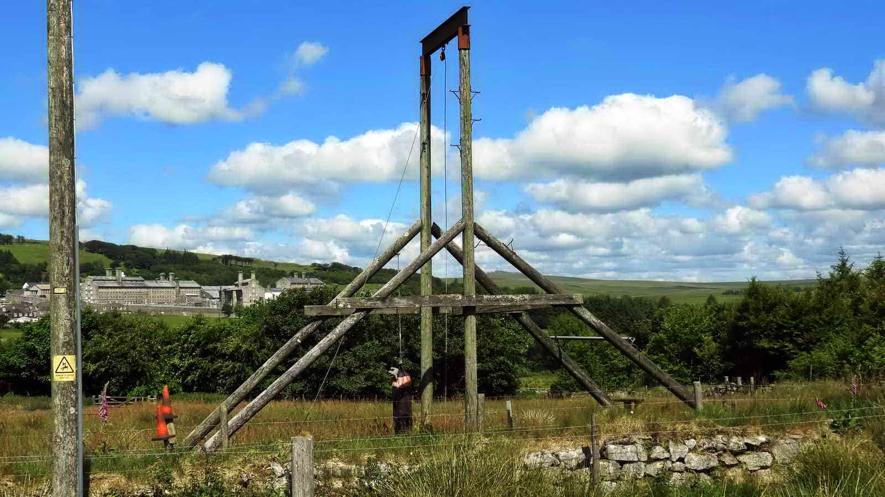

{}

## Map
{}

## Introduction

An interesting walk through part of the historic town of Princetown, then along a decent footpath past Devonport Leat and Bachelor's Hall in an area of mining. Then we walk along the Conchies Road and learn about this piece of World War One history before visiting an ancient burial cist.

There are a few short optional diversions to visit other cists along the way.

## Princetown

Prince's Town was built by Thomas Tyrwhitt (1762-1833) and named in honour of the Prince of Wales, to whom he was Private Secretary.  Thomas also built roads across Dartmoor and many other features. He was one of the Georgian Improvers who wanted to turn the "wastes" of Dartmoor into a thriving place to live and work.

Tyrwhitt was MP for Okehampton (1796-1802), Portarlington (1802-1806) and Plymouth (1806-1812).  He built Dartmoor Prison in 1809 for French prisoners taken in the Napoleonic wars and it was also used for Americans taken in the 1812 war.  He also built the Plymouth & Dartmoor Railway, which was originally a horse-dawn tramway that was later converted by the Great Western Railway to steam.

2024: The Duchy Hotel has been rented from the Duchy of Cornwall by Dartmoor National Park Authority since 1991 for a fixed rent of £100 as an information centre. In November this year it was announced that despite informing almost 50,000 visitors this year, it is to close in May 2025 due to a shortfall in funding. [Reference - ITV](https://www.itv.com/news/westcountry/2024-12-04/closure-of-dartmoor-visitor-centre-will-be-a-disaster-for-local-economy)

## Drinking Fountain

## Dartmoor Prison

Jonathan Stones tells me that he was told by 'Sonny' Williams (an old farm hand) that he helped one Val Forder (sometime tenant of Sunnyside when a Duchy Farm) to transport the said gate from its original working position at Dousland. It's second life here was as a 'cattle crush'.

## Aerial Ropeway

The ropeway bringing timber from from Brimpts Plantation, powered by an engine at Moorlands Farm, ended nearby but I am told nothing visible remains. Many will remember old photographs in the Plume of Feathers in James Langton's time showing the ropeway in action.

The ropeway was essentially an overhead cable supported by large wooden pylons that allowed relatively easy transport of wood from Brimpts, some four miles distant. Imagine something similar to a modern a ski lift, with logs suspended instead of skiiers.

## Devonport Leat

## Bachelors Hall

Forest of Dartmoor 1840 Tithe Map showing a mine at bottom left in Plot 119 marked "Mine", close to Bachelors Hall.

There is another structure in Plot 116, this being an un-named plot owned (also) by George Nicholson Esquire and leased to William Mitchell, as this appears to have a wheelpit and a stream as a water supply it can inferred that this is the smelting house (see following).

There are two lines drawn across the mine area. The left one (through "119", coloured blue) was the original Bachelors Mine Leat that became the prison foul (an open sewer) and extended away from the mine. The thinner line (through the "9" of "119") was its replacement, Blackabrook Leat.

[Heritage Gateway page on Bachelors Hall Tin Mine](https://www.heritagegateway.org.uk/Gateway/Results_Single.aspx?uid=MDV4735&resourceID=104)

Looking at our [map](#map) below, we've marked some points of interest here relating to the mine:

1. A series of small tin pits, possibly contemporary with the early open-cast working of the area.
2. Three shafts: Footway, Engine and Ann's shafts, running NNE-SSW along the main tin lode. All 3 are now collapsed and capped.
3. A whim, attached to Engine shaft about 11m in diameter within a bank 3.5m wide, 0.6m high with entrance in the WSW.
4. Shallow adit, one of 3 adits known to have been associated with the mine.
5. Two dressing floors with associated earthen platforms for buddles.
6. Two wheel pits associated with stamps and dressing floors.
7. The main wheelpit.
8. A pump-rod gulley from the main waterwheel up to Engine shaft.
9. The prison, or foul leat. Initially called the Bachelor's Hall Leat and only extending as far as the mine was once the only source of water. After being taken over for use by the prison, mainly for sewage disposal, it was extended south and discontinued from mine use. It is now defunct.
10. Blackbrook leat - its construction probably necessitated by the original leat being used for the prison. This is also defunct.
11. Small reservoirs associated with the treatment areas of the mine.
12. Areas of ridge and furrow cultivation, possibly contemporary with the mine.
13. The Devonport, or Dock, Leat skirting the east side of the mine.

[Heritage Gateway page on bachelors Hall](https://www.heritagegateway.org.uk/Gateway/Results_Single.aspx?uid=MDV113177&resourceID=104)

The building is generally accepted as the site of the corn mill and bakery (permission dated 1798 but built post-1809), later converted to a Naphtha Works; the ruin downstream is thought to be a smelting works.

Both documentary and map sources indicate the existence of other buildings at Bachelors Hall. Thomas Tyrwhitt built a late 18th century house here and a few years later he was granted a lease to build a corn mill; this suggests two separate buildings.

The tithe map and census returns both imply the existence of a farm at Bachelors Hall which if proved would have co-existed with mill cottages for the short duration of the Naphtha Works.

A second 19th century Duchy map shows Bachelors Hall as an L-shape building slightly larger than it is today.

A building depicted downstream is allegedly the smelting works, and two structures higher up the hillside to the west annotated `Brewery'.

The 1839 Tithe Map depicts a building here of L-shape with other buildings and the farm outbuildings more or less as they are today.

## Detour below Bachelors Hall

It's a short and interesting diversion to continue down through the Hall on the marked footpath, then return back up. A few pictures of this follow.

The track is the left section of the photograph. The building appears on the tithe map image at the top edge.

It may be that this is the original house built by Tyrwhitt in the late 1700s and the modern buildings are where there were cottages for mill, bakery or mine workers.

* *When you're ready, end the Detour by returning to the track*

## Smelting House

[Heritage Gateway Page for this Smelting House](https://www.heritagegateway.org.uk/Gateway/Results_Single.aspx?uid=MDV63089&resourceID=104)

A tin smelting house was in operation at 'Bachelors Hall' near Princetown from 1798-1807. It was erected by T Gray in 1795.

Smelting is the process in which ingots of metal are won from the crushed ore by the process of heating until the metal is liquid - in this case Tin. The furnace is heated by whatever fuel is available - probably wood or charcoal here.

In the late 1790's, John Swete described the smelting house as 'on the banks of a small stream which emptied into Blackabrook' having stamping mills.

Duchy of Cornwall records date from 1798-1804 that indicate 223 ingots were smelted in that period weighing 27.43 tonnes with a further 1.07 tonnes listed for 1807.

In sale particulars of 1828, the smelting house had been converted to a brewery.

The site of the brewery is shown on the sale plan as being beside the west bank of the stream where agricultural buildings now stand. The photograph above shows the presumed wheelpit for the stamping mill and combines blowing house.

Using these figures: 27.43 tonnes (metric) = 60,346 lbs (UK) = 270 lbs/ingot = 2.4 cwt. That is 121 kg or two small adults. Poor pack ponies.

## Modern history of forestry on Dartmoor

The building of nearby Tor Royal by Sir Thomas Tyrwhitt at Prince's Town was completed in 1798 and through the first decade of the 1800's there were experimental plantings of coniferous shelterbelts to protect it.

The Duchy of Cornwall established a plantation at Brimpts in 1862. Forestry grew after WW1 in an effort to replace the country's greatly depleted timber stock.

By 1930, plantations had been established at Fernworthy, Bellever, Brimpts, Bear Down, Soussons and Frenchbeer (Chagford) and in 1930 these areas were sold to the Forestry Commission (founded in 1919).

By 1938, the eastern slopes of Bellever Tor and Lakehead Hill were planted and the western slopes between 1940-1943. <cite>Source: The New Forests of Dartmoor (1964), London HMSO, Forestry Commission booklet No. 10, pages 6-10.</cite>

The tree of choice for planting on Dartmoor is the Sitka spruce, Picea sitchensis, chosen for its high productivity compared to e.g. Douglas fir, Norway spruce, European larch and other fast-growing conifers.   (text from the walk on 25 February 2018).

## Bull Park Farm

Bull Park farm was built by Sir Thomas Tyrwhitt for a cattle-herdsman some time before 1833. Its enclosures were used to segregate bulls from cows and calves when not required for breeding.

The last tenant farmer quit on Christmas Day, 1957, and the property then became a holiday cottage.

It is now a private home and the owners told me that the old shed was the bull shed and still has rings in the wall for tying the bulls.

## The Conchie Road

This starts the "Conchie Road".

During the First World War, all able-bodied men between the ages of 18 and 41 were required to fight for their country. *(Except for clergy, teachers and certain classes of industrial worker)*

[Parliament article about the Conscription Law](https://www.parliament.uk/about/living-heritage/transformingsociety/private-lives/yourcountry/overview/conscription/)

Of those men, any who refused to fight for moral or other rules were labelled "Conscientious objectors", or Conchies. They were not a well liked group of men, seen as cowards and abused and taunted by men and women alike.

As they would not fight or contribute to the war effort, they were treated as prisoners. Some were housed in Dartmoor Prison and as punishment for their "cowardice", they were given hard labour.

One particularly pointless form of this work was to build this road. It goes nowhere and serves no purpose.

The work will have been hard and brutal. Stones taken both locally and from the Dartmoor Prison Quarry would have been hit repeatedly by sledgehammers until they were small enough to be packed into a solid base to form the road, again by packing with hammers or heavy tamps, and heavy man-powered rollers.

As you can see, there is little protection from the wind and driving wind up here. In winter especially, this would have been a truly miserable task.

## Suggested detour

If you're enjoying the walk, you may like to extend it by a mile or so by walking cross-moor North to Blakey Tor and back.

This is marked on the map as a dotted red line and takes in a pretty, rarely visited tor and another two ancient burial cists.

*Dartmoor contains an unusally high occurence of cists, or burial cairns. These are stone tombs dating back to the Bronze age, some four thousand years ago. We know of several hundred of these, and more are still being found, having been buried by the peat*

* *End the suggested detour by returning to the Conchie Road as per the map*

## Crock of Gold

There's no definite record of why this cist was so called. People have speculated that a crock (jar) of gold was found here, perhaps buried with the body that was once here.

Or perhaps it was just wistful thinking, that grave robbers might find rich pickings? There are other Dartmoor similarly named - the Money Pit on Yar Tor is one such.

## Parking

Directions are provided for the main Princetown car park. This is pay and display, but off-peak you may find nearby on-road parking for free. Please do be considerate for the residents.

## Nearby

* The [Dartmoor Prison Museum](https://www.devonmuseums.net/Dartmoor-Prison-Museum/Devon-Museums/) is well worth a visit.
* The [Fox Tor Cafe](https://www.foxtorcafe.com/) has excellent food
* The [Old Police Station](https://theoldpolicestation.uk/) cafe also does good food, particularly fish and chips.

