{}

{}

## Introduction
The Ten Commandments stone is a piece of natural granite that has been cut and shaped and engraved to show the ten commandments, plus an eleventh!

This walk starts with a gentle uphill route along some nice granite walling with some good views to the North to the Tor where the stone is to be found. The return route takes in some relatively unknown Welstor Common Rifle Range, dating back to 1861 and pre-dates the much larger training range to the East.

*Leave the car park across the road to the Southwest*

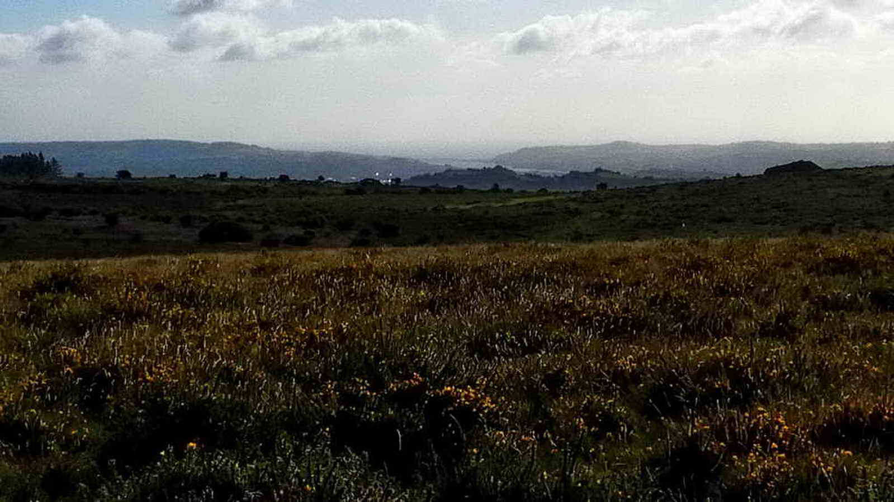

## Boundary Stones

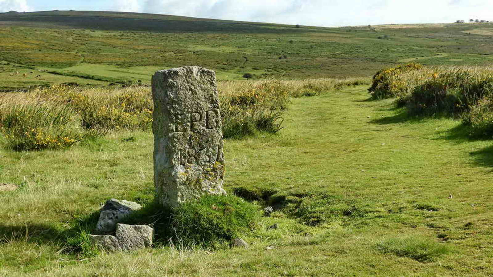

EPB stands for [Edmund Pollexfen Bastard](https://en.wikipedia.org/wiki/Edmund_Pollexfen_Bastard), Lord of the Manor of Buckland in the Moor. 

He is also mentioned on the [cross at Buckland Manor](http://www.dartmoor-crosses.org.uk/buckland_manor.htm) and several other nearby stones. These were erected to mark the boundary of Buckland Manor in 1837, a year before his death.

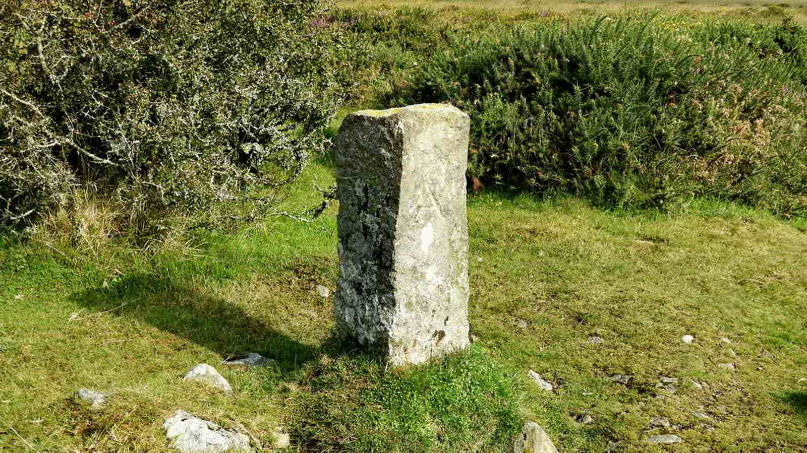

A = Ashburton,  B = Buckland. Also has EPB roughly carved on one side.

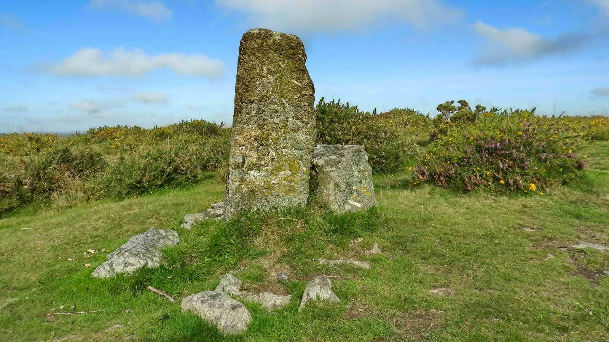

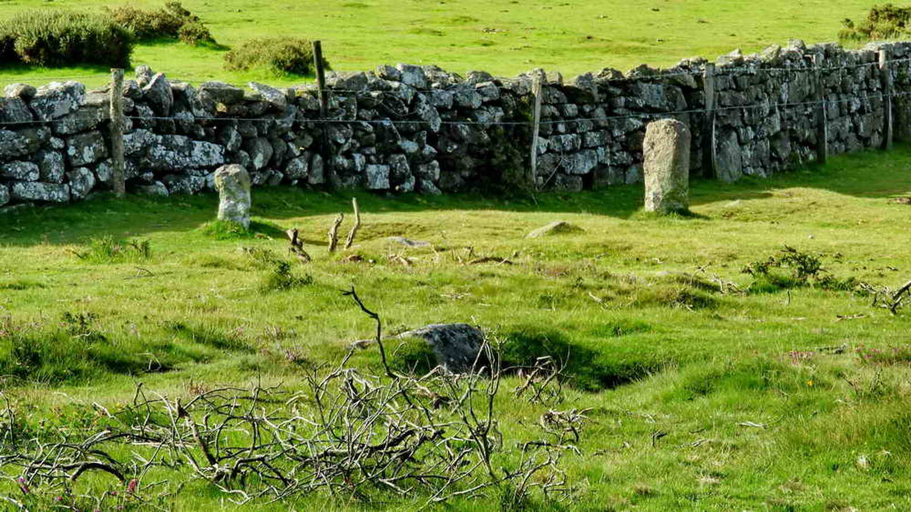

The old (left in this picture) and new boundary stones, marked A, B and EPB as above. 

The Welstor Newtake wall behind was built in 1771 to enclose open moorland for grazing. We keep it on our left all the way to Buckland Beacon.

Historically, on Dartmoor, "newtakes" were enclosures of common land for agricultural purposes, and also to exclude others from grazing it. This practice often led to conflict between commoners who held rights over the land, and the landowners who erected these walls.

## Devil's Hoofprint

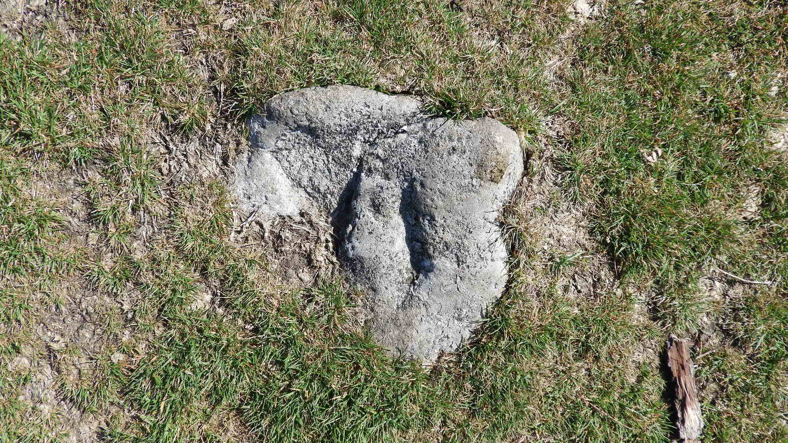

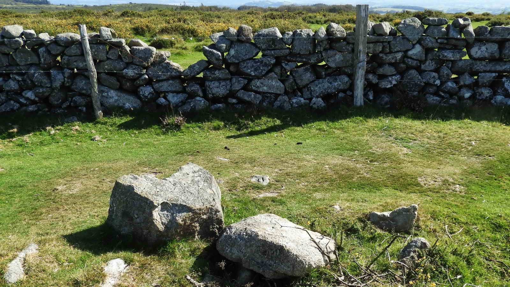

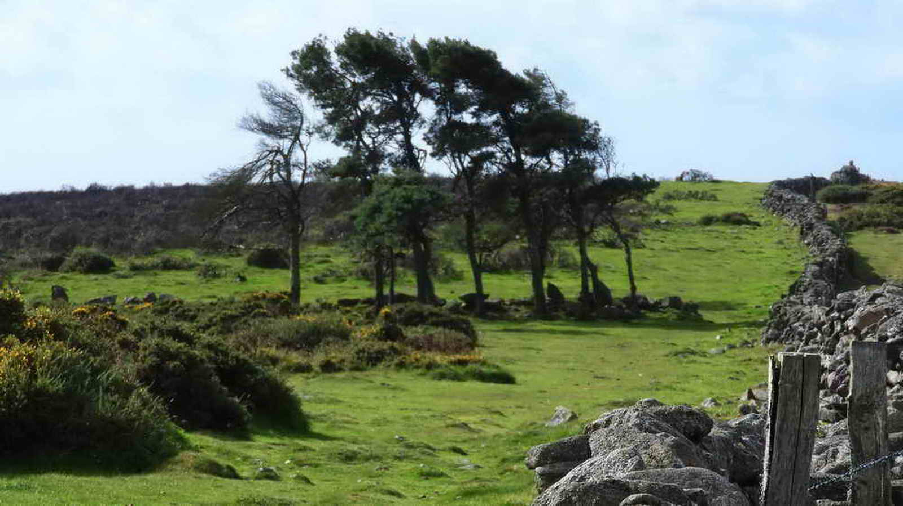

This interesting little copse looks like it may have been planted to shelter a house at some time, but no such remains are known.  In any regard, it is a nice place to rest on a summer's day.

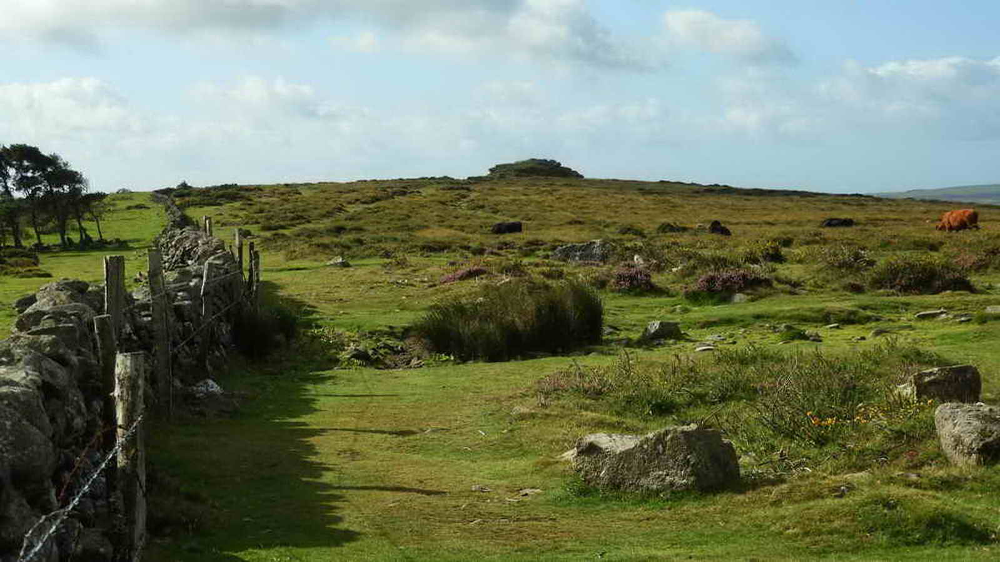

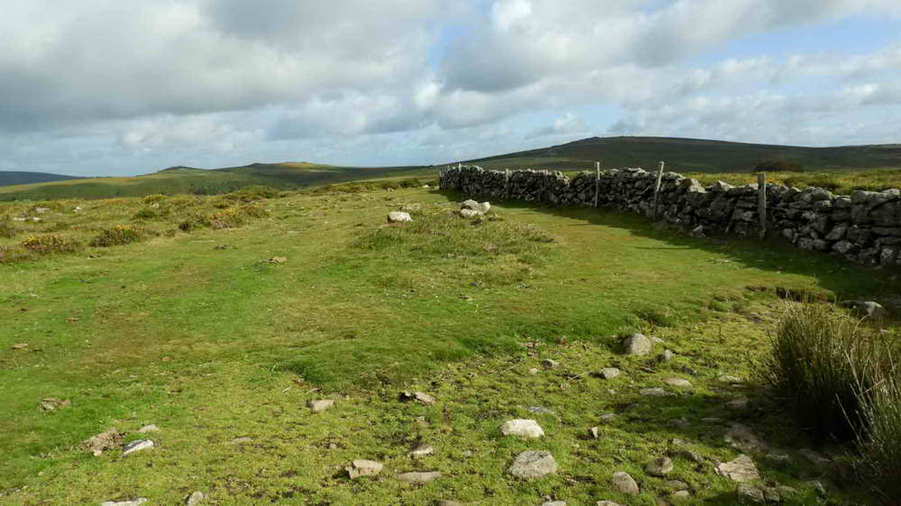

## Sheep creep

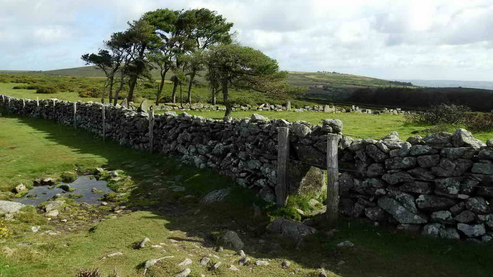

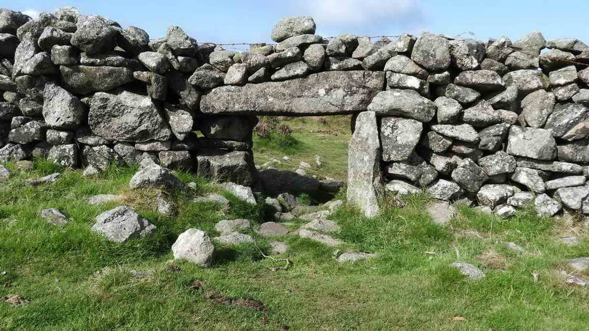

## The Ten Commandments Stones

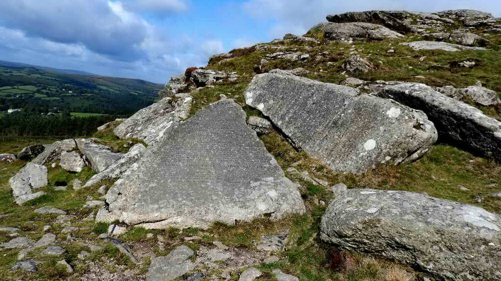

Reaching Buckland Beacon, we pass by on its left side and find the commandment stones laying open like the pages of a book.

The stones were commissioned by William Whitely of Wellstor, Lord of Buckland Manor, in 1928, in celebration of the rejection by Parliament of a proposed new Book of Common Prayer that was deemed "too popish" by many. 

There are two dates on the stones: 15th Dec 1927 and 14 June 1928, that are the dates on which the revised book was rejected. 

When it was realised that there would be room to spare, the third verse of the hymn "Oh God our help in ages past" was added to the second stone. 

There are 1,547 letters on the two stones and, due to weathering, the stones have needed to be recut several times, sometimes highlighted in black paint to aid legibility. This recutting is known to have happened in 1995, 2009, 2017 and most recently in 2020 as part of the "Moor than Meets the Eye" project.

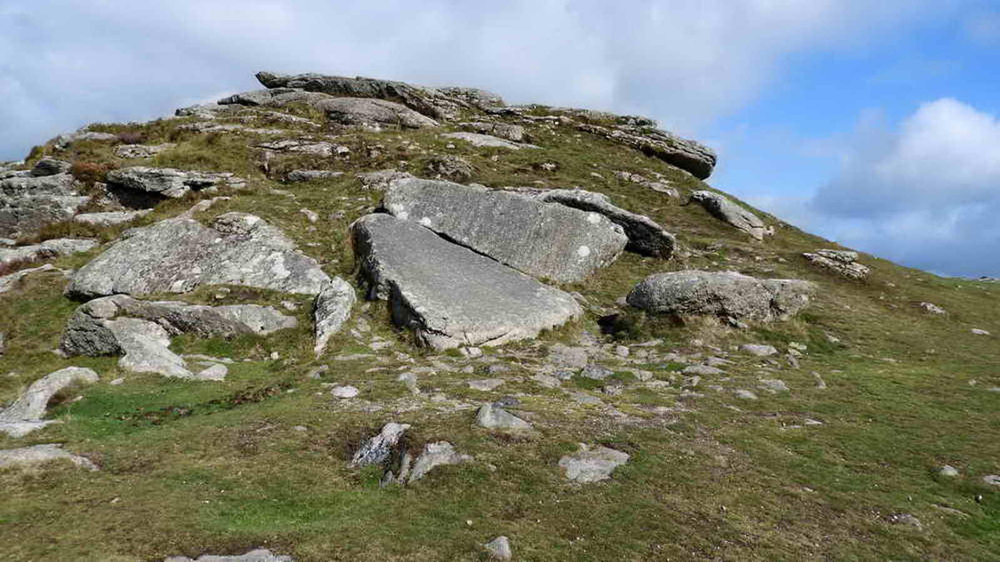

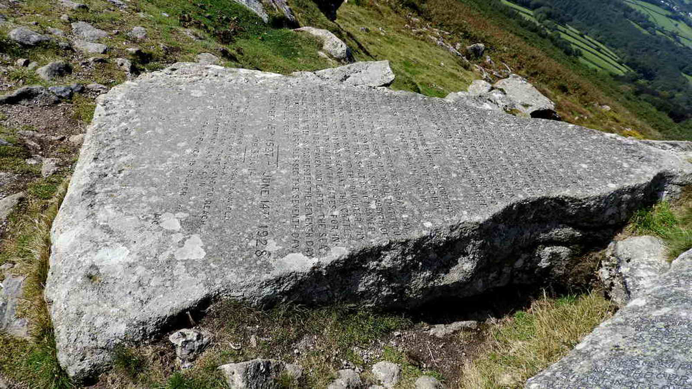

## Lefthand inscription

I AM 
Ex. 3 14 
THE LORD THY GOD 
I 
THOU SHALT HAVE NO OTHER 
GODS BUT ME 
II 
THOU SHALT NOT MAKE TO THYSELF 
ANY GRAVEN IMAGES NOR THE 
LIKENESS OF ANYTHING THAT IS IN 
IN HEAVEN ABOVE OR IN THE EARTH 
BELOW OR IN THE WATER UNDER THE 
EARTH. THOU SHALT NOT BOW DOWN TO 
THEM NOR WORSHIP THEM FOR I THE LORD 
THY GOD AM A JEALOUS GOD AND VISIT 
THE SINS OF THE FATHERS UPON THE CHILDREN 
UNTO THE THIRD AND FOURTH GENERATION 
OF THEM THAT HATE ME AND SHEW MERCY UNTO 
THOUSANDS IN THEM THAT LOVE ME AND KEEP 
MY COMMANDMENTS 
III 
THOU SHALT NOT TAKE THE NAME OF THE LORD THY 
GOD IN VAIN FOR THE LORD WILL NOT HOLD HIM 
GUILTY AS THAT TAKETH HIS NAME IN VAIN 
IV 
REMEMBER THAT THOU KEEP HOLY THE SABBATH DAY 
SIX DAYS SHALT THOU LABOUR AND DO ALL THAT THOU 
HAST TO DO BUT THE SEVENTH DAY IS THE SABBATH OF 
THE LORD THY GOD IN IT THOU SHALT DO NO MANNER 
OF WORK THOU AND THY SON AND SERVANT THY CATTLE 
AND THE STRANGER THAT IS WITHIN THY GATES FOR IN 
SIX DAYS THE LORD MADE HEAVEN AND EARTH THE SEA 
AND ALL THAT IN THEM AND RESTED THE SEVENTH DAY 
WHEREFORE THE LORD BLESSED THE SEVENTH DAY 
AND HALLOWED IT 

DECEMBER 15TH 1927            JUNE 14TH 1928 

JOB 33 v 14 
BUT THERE'S A POWER WHICH MAN CAN WIELD 
WHEN MORTAL AID IS VAIN 
THAT EYE THAT ARM THAT LOVE TO REACH 
THAT LISTENING EAR TO GAIN 
THAT POWER IS PRAYER 

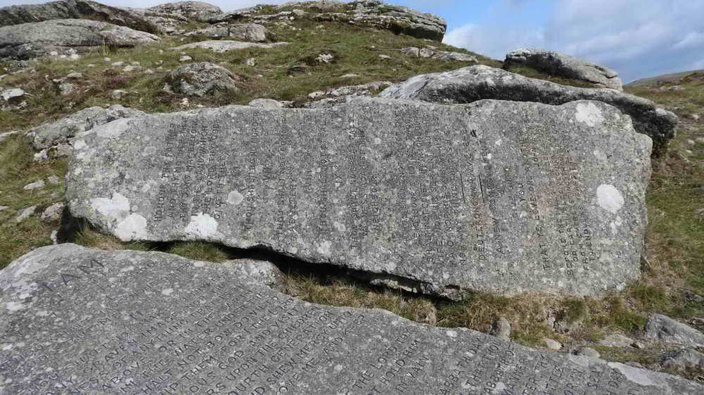

## Righthand inscription

V 
HONOUR THY FATHER 
AND THY MOTHER THAT 
THY DAYS MAY BE LONG 
IN THE LAND WHICH 
THE LORD THY GOD 
GIVETH THEE 
VI 
THOU SHALT DO NO MURDER 
VII 
THOU SHALT NOT COMMIT 
ADULTERY 
VIII 
THOU SHALT NOT STEAL 
IX 
THOU SHALT NOT BEAR FALSE 
WITNESS AGAINST THY 
NEIGHBOUR 
X 
THOU SHALT NOT COVET THY 
NEIGHBOUR'S HOUSE THOU 
SHALT NOT COVET THY NEIGHBOUR'S 
WIFE NOR HIS SERVANT NOR HIS 
MAID NOR HIS OX NOR HIS ASS 
                                     

DEUTERONOMY 4 vv 2  6  8 
                                     

A NEW COMMANDMENT 
I 
GIVE UNTO YOU 
THAT YOU LOVE ONE ANOTHER 
JOHN 13 v 34 

BEFORE THE HILLS IN ORDER STOOD 
OR EARTH RECEIVED HER FRAME 
FROM EVERLASTING THOU ART GOD 
TO ENDLESS YEARS THE SAME 

## The Jubilee Stone

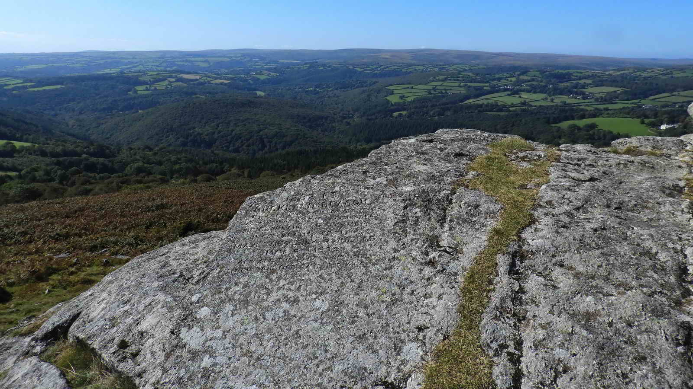

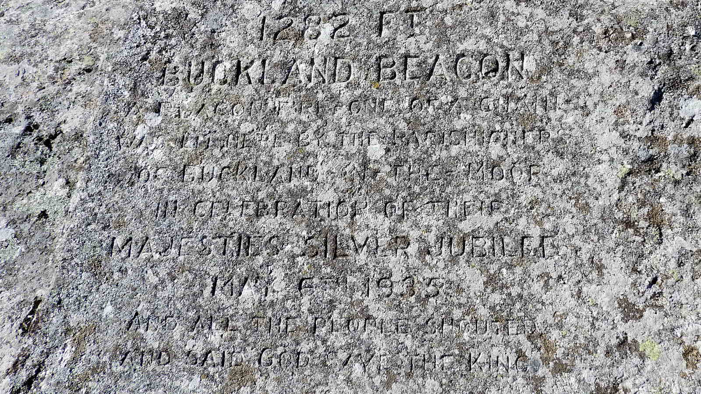

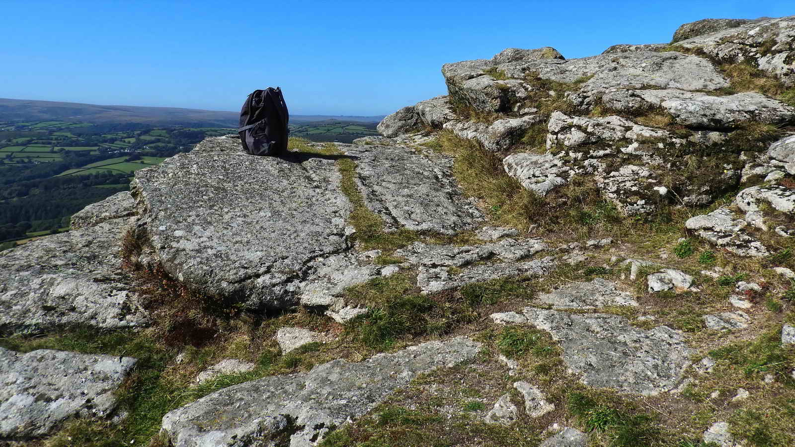

## Jubilee Stone inscription

1282 FT 
BUCKLAND BEACON 
A BEACON FIRE ONE OF A CHAIN 
WAS LIT HERE BY THE PARISHIONERS 
OF BUCKLAND-IN-THE-MOOR 
IN CELEBRATION OF THEIR 
MAJESTIES SILVER JUBILEE 
MAY 6TH 1935 
AND ALL THE PEOPLE SHOUTED 
AND SAID GOD SAVE THE KING 

## Views from the beacon

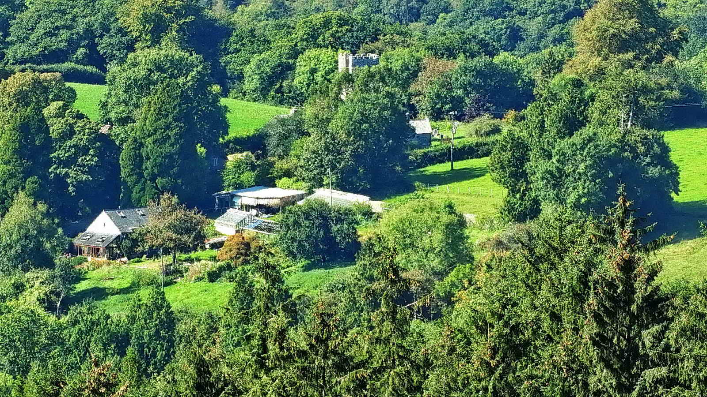

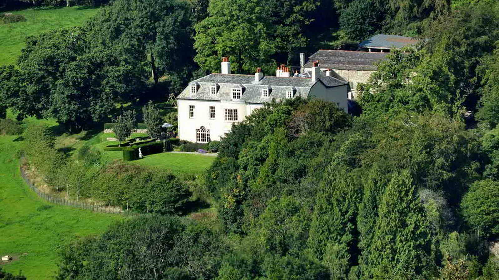

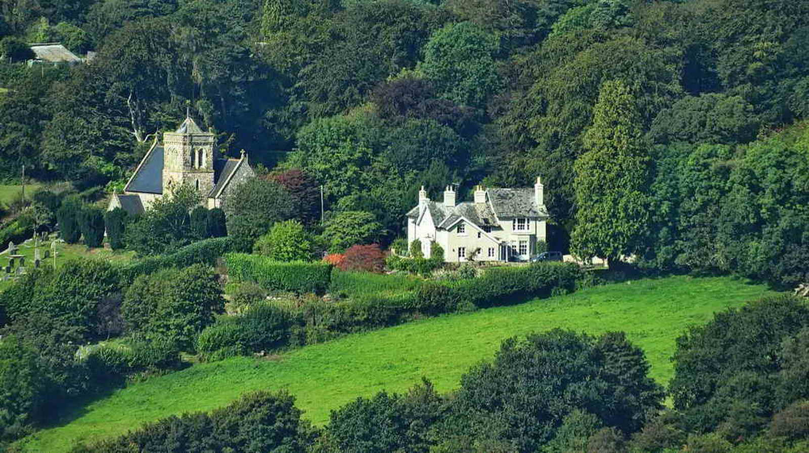

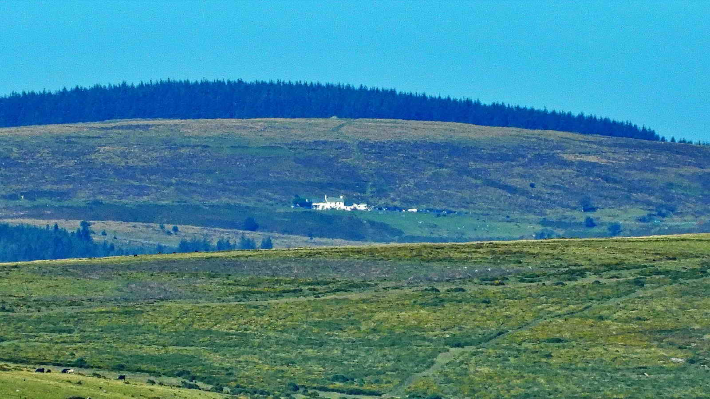

## The Grey Mare

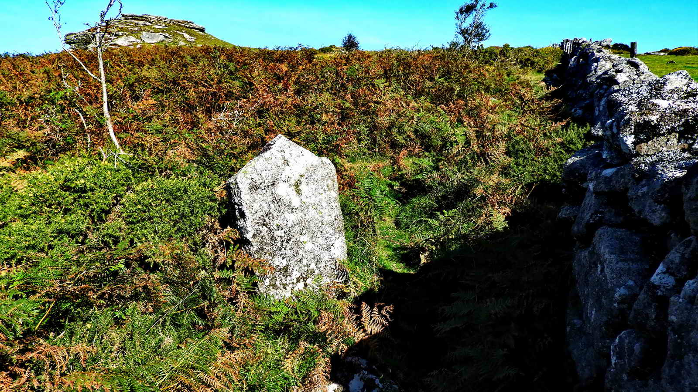

This stone has been known as the "Grey Mare" for at least 150 years and mentioned by William Crossing, but may even have been known by that name as far back as 1593 -- <cite>Crossing's Guide to Dartmoor. Also Mike Brown (2001) Guide to Dartmoor</cite>

## Welstor

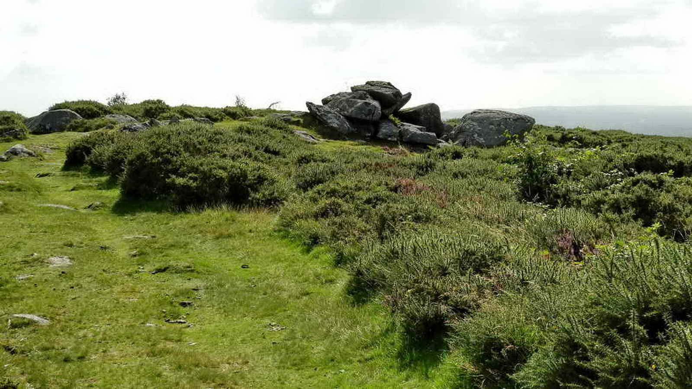

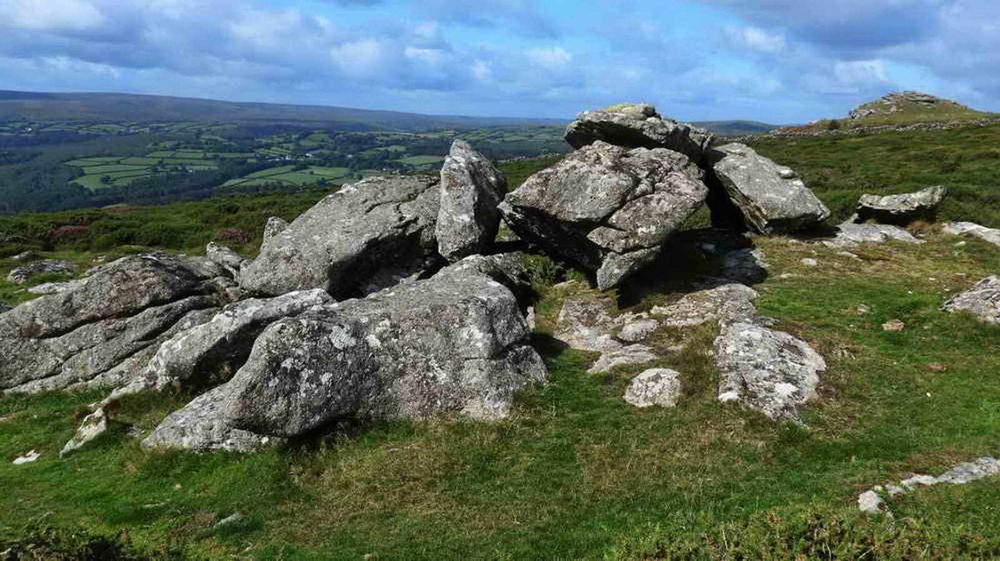

## Welstor Common Rifle Range

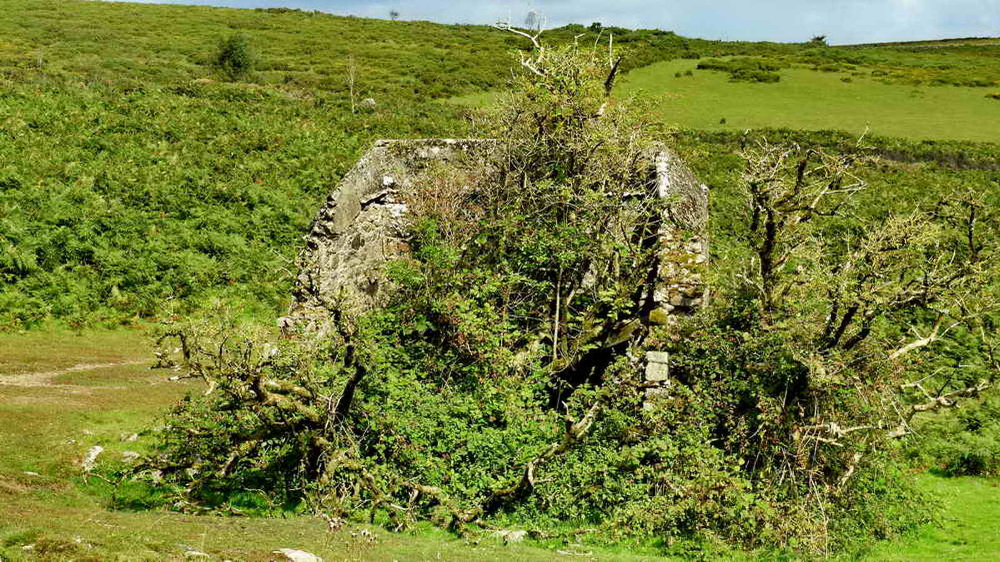

The building above is shown in [the 1886 OS map](https://maps.nls.uk/view/106005602) at the top right corner, titled, "Targets". 

The rest of the range is shown down the lower-right edge of [this 1886 OS map](https://maps.nls.uk/view/106005578) which clearly defines the 200, 300, 600 and 800 yard firing positions that would have fired upon this target. Note: These firing positions are not at all obvious and they were originally probably little more than low earth banks for the men to lie down to aim from.

One supposes that wooden or canvas targets were raised above it, with the stone structure providing shelter for the range operators.

[Devon & Dartmoor Heritage "Rifle Range on Welstor Common"](https://www.heritagegateway.org.uk/Gateway/Results_Single.aspx?uid=MDV114604&resourceID=104) includes: "A rifle range was established on Welstor Common in 1861 for use by the Ashburton Rifle Volunteers and represents the earliest recorded military training within the Rippon Tor PAL (Premier Archaeological Landscape). It continued in use until at least 1886 when depicted on the First Edition Ordnance Survey map, but by the time of the Second Edition (1905) it was absent, although William Crossing refers to it in his 1912 Guide to Dartmoor."

There is a World War 2 Rifle range nearby on Halshanger Common. (It is the massive brick structure you may already have seen on this walk a mile or so to the East)

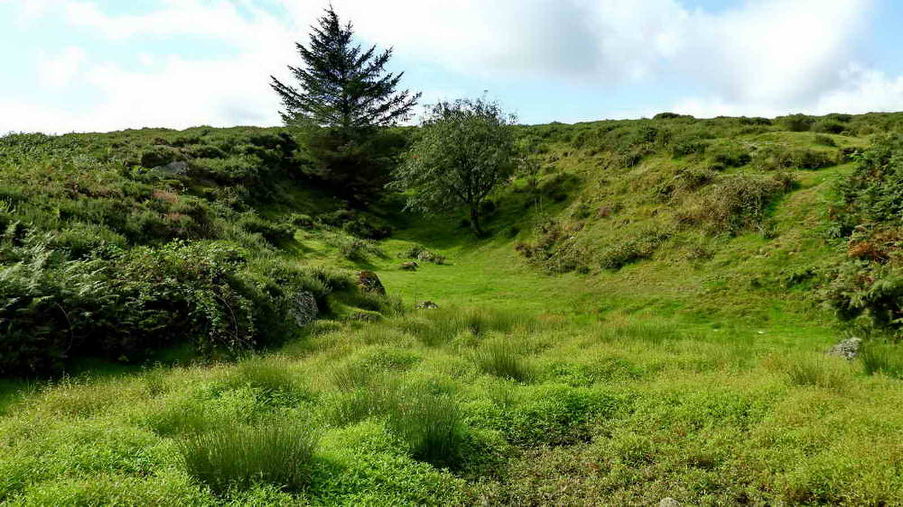 

* [Heritage Gateway page for this quarry](https://www.heritagegateway.org.uk/Gateway/Results_Single.aspx?uid=MDV25193&resourceID=104)

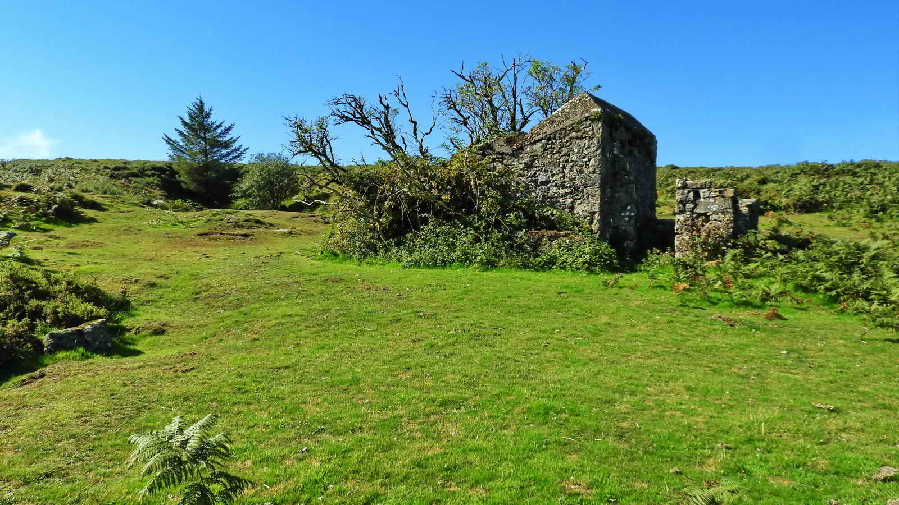

[Welstor Common rifle range page](https://www.geograph.org.uk/photo/4910454)  states:  The target storehouse/shelter with its massive stone wall facing the firing lines. This rifle range was created in 1861 for the use of the Ashburton Rifle Volunteers. It was in use until about 1900, the 1905 OS map does not record it. There is very little evidence on the ground with the exception of this structure which was near the west end of the stop butt. There is a partially collapsed corrugated iron roof inside. the small quarry to the southwest appears to post date the rifle range.

## Ashburton Golf Course

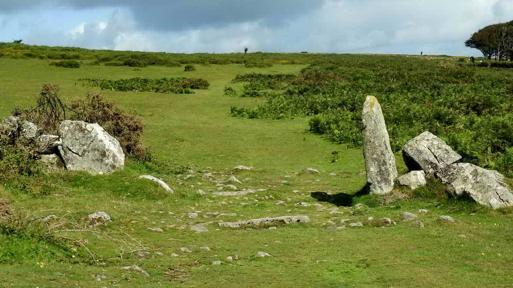

From 1910 to the mid 1920s, this was the home of the [Ashburton Golf Course](https://www.golfsmissinglinks.co.uk/index.php/england/south-west/devon/979-dev-ashburton-golf-club-devon) - although no sign of it remains.

> "On Wednesday 16th February 1910 Mr J T Barker presided at a meeting in the Market Hall to discuss and consider the proposed golf club for Ashburton. 
> The chairman stated that a committee had already been appointed to try and find a suitable location for the course and as a result a large portion of land on Welstor Common had been obtained. 
> It had been generously offered by Mr Parnell Tucker at a nominal rent, he was also willing to erect a clubhouse which could also be rented. 
> The area had been inspected by several experts and a professional all of them were strongly in favour of the location."

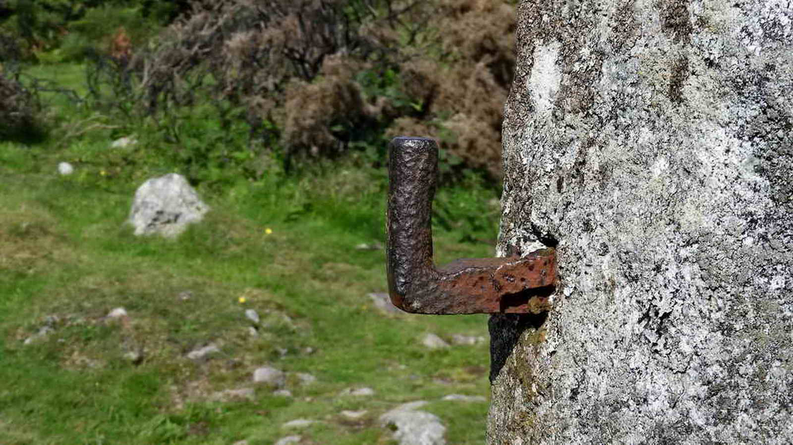

Note that the hanger is wedged in with iron feathers, showing it predates the more modern epoxy method of fixing which has been more generally used since the 1980s

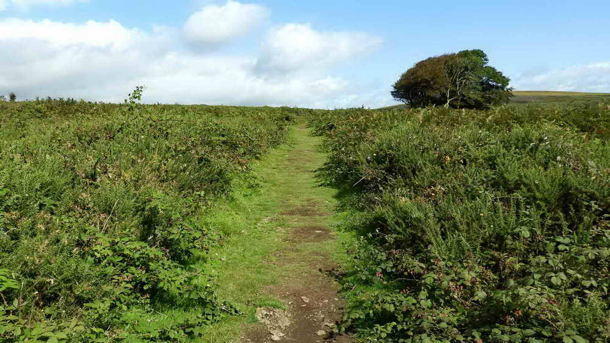

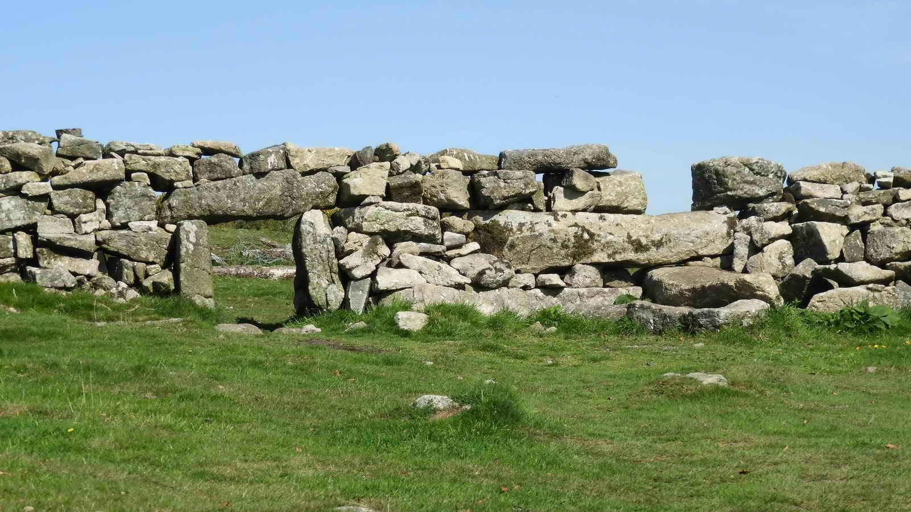

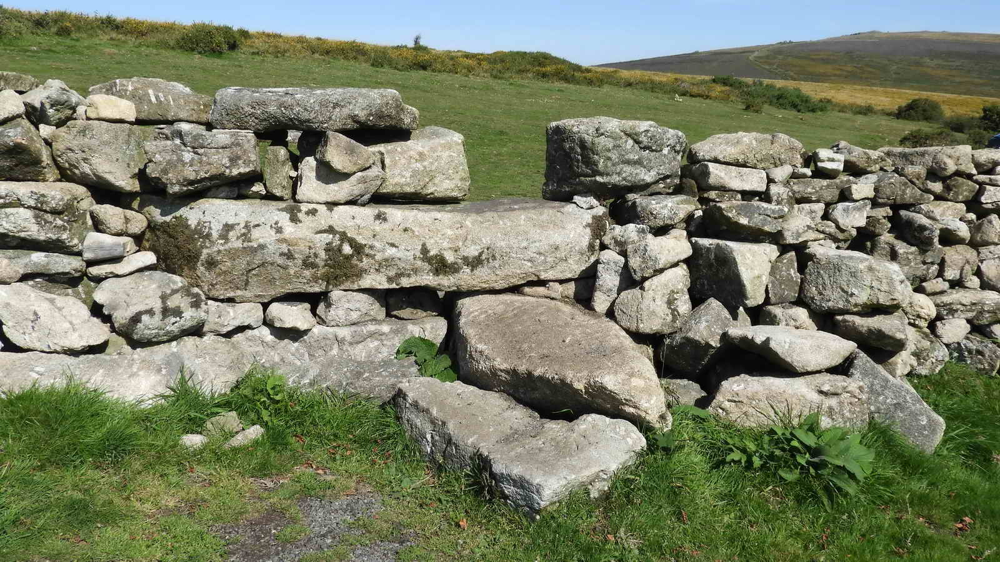

Parking is usually to be had at Cold East Cross - marked with a yellow cross on the map.
