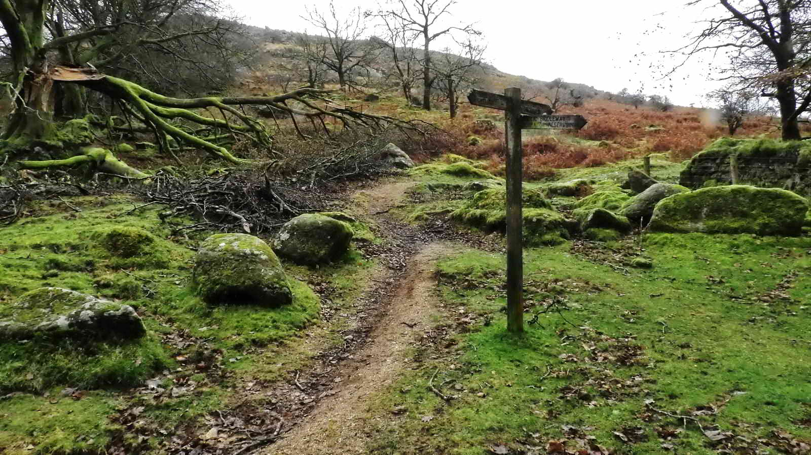
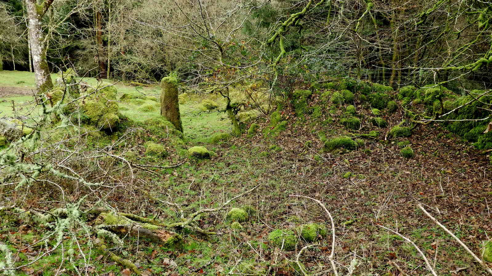

{}

{}

## Introduction

This is a walk of two distinct halves. To start with, we leave the car park and are immediately embraced by the rich woodland surrounding Burrator Reservoir. A short climb through the trees and the path opens out onto open moorland with the imposing gray shape of Sheeps Tor and its jumbled mass of granite within sight as we walk clockwise around it. We investigate several Bronze Age hut circles, other ancient relics such as gateways, waymarking stones, a vermin trap, a distant stone circle and enjoy some great views to Great Mis Tor, over Burrator Reservoir and wider vistas. 

No visit to Sheeps Tor would be complete without investigating Pixies' House - which has entranced generations of OS Map readers with its evocative name!

Alternatively, there is a shorter circular walk of around half a mile that is produced and signposted by Dartmoor National Park and skips the longer walk around Sheeps Tor.  This is part of DNP's "Miles without Stiles" project and is considered accessible, with good, flat paths and easy grades.

* [Burrator Arboretum - Dartmoor National Park](https://www.dartmoor.gov.uk/enjoy-dartmoor/outdoor-activities/accessible-dartmoor/miles-without-stiles-burrator-arboretum)

## Burrator Arboretum

* Burrator Arboretum is a Nature reserve with woodlands, meadows, ponds and footpaths which is designed to be accessible. 
* It was planted in the late 1980s after storms caused damage in the areas. *(The editor spent many years working in Forestry clearing up after these storms and remembers them well!)*
* Its purpose is to create a collection of native and non-native tree species, develop wetlands and ponds, increase biodiversity and provide easy access for visitors, especially those who might struggle with more rugged terrain. 
* It is maintained by South West Lakes Trust

This stile is followed quickly by a second beside a pair of locked gates as we leave the arboretum and emerge onto Yellowmead Down

**Tip!** The path used here is through the entry gate and turn right, next turn left, proceed, go straight across a cross-paths junction, proceed, turn right, proceed - almost coming back on yourself. Lastly - turn left and see the stile.

## Yellowmead Down

## Sheeps Tor

According to Eric Hemery (High Dartmoor - 1983) Sheeps Tor is really four tors:

1. The main Tor
2. The north shoulder Pile
3. Narrator Spur
4. Maiden Tor

Over the years, Sheeps Tor has been known as;

* Scitelstor 1244
* Skyteletor 1262
* Schytlestor 1375
* Scitestor 1408
* Shittestor 1474
* Shipstor 1607
* Shetelstor
* Shepstor, 
* Shitstor (Elford tablet, Widecombe) 1650
* Shippistor alias Shittistor 1691
* Sheepstor alias Shittestor 1695

Apparently, Schitestor and Shittor spellings have also been used (genuki.org.uk)

* Reference: [The Chronographical Description or Survey of the County of Devon. New edition 1811, Rees & Curtis, Plymouth](https://www.genuki.org.uk/big/eng/DEV/Sheepstor)

PCWW being the old Plymouth Corporation Water Works. There are many of these granite pillars which, together with seven undated cast iron posts and one inscribed tor (North Hessary), mark the catchment area of the Burrator Reservoir.

## Hut Circles

There are five hut circles shown on the 1:10,000 map but not on the higher scaled 1:25,000 map in this area, with two quite near this pillar. 

The huts are hard to find but should be at SX 56967 68250 (Hut 1), SX 56960 68188 (Hut 2), SX 56942 68180 (Hut 3), SX 56930 68160 (Hut 4) and SX 56900 68155 (Hut 5). Hut 2 is worth looking at, it is about 30 metres along a track from the PCWW pillar leading south. Hut 4 is also recognisable with a few stones remaining. The other huts have been badly "robbed" of their stones. It was difficult to take useful photographs, so they have been left out of this page.

More information and photographs of this restored stone circle can be found on our [Sheepstor Stone Circles](/p/sheepstor-stone-circles/) walk.

 

Note Cuckoo Rock at the bottom of the photograph, right of centre. 

## Sheeps Tor up close

> You will notice on the Ordnance Survey map that the words Feather Bed are printed on this area of Sheeps Tor. This refers not to a quaking bog as known elsewhere on Dartmoor, but to flat pavements of exposed granite on the summits. Similar features also line Joey's Lane, which you might have used to get to Sheepstor hamlet. <cite>-- John Earle (2002), [Walking on Dartmoor: National Park and surrounding areas](https://books.google.co.uk/books?id=p5zEUSTE8nwC&pg=PA107&lpg=PA107&dq=joey%27s+lane+dartmoor&source=bl&ots=7eNZgRDKFO&sig=ACfU3U0pyS47upiUCb3bkmAdQe5zLRotfA&hl=en&sa=X&ved=2ahUKEwjGmaLJyJfmAhXwQUEAHXXkAf8Q6AEwD3oECAoQAg#v=onepage&q=joey's%20lane%20dartmoor&f=false)  </cite>

## Vermin Trap

This feature is a little hard to make out, but consists of an X-arrangement of low walls which would guide stoats, weasels and similar predators into a centrally positioned trap mechanism. 

*To help you orient yourself, in the distance are the fir trees at the Scout Hut and, beyond, is Gutter Tor and, further away, is the pyramid shape of Hen Tor.*

> " On returning for our horses, we discovered near the top of the tor two stone ridges, almost covered with turf, that intersected each other at nearly right angles, and formed a cross. In the middle was a flat horizontal stone. Measuring from this central point, the ridge to the east was twelve paces, west six, north seven, and south eleven. We afterwards discovered a larger one below, at the south side of the tor. At first we conjectured they were sepulchral monuments ; and afterwards thought they might have been folds for sheep ; which at the same time was endeavouring to account for the name of the mountain. But after all, these conjectures are entitled to little attention ; as nothing can be accurately decided without more minute examination than we were then capable of giving." <cite>-- Mrs Bray. The Borders of the Tamar and Tavy, 2nd edition. Vols 1 and 2. 1836</cite>

This is the direction of the trap designed to catch vermin passing around the tor. There are artificial rabbit buries (i.e. warrens) and a Warrener's house on the south flank of Sheeps Tor. Rabbits were bred as meat for the local tinners. 

## Pixies House

*Also known as Pixies Cave or Piskies House*

The entrance is close to the largest rock, central in this boulder pile.

Pixies House is a very small cave that is a struggle for an adult to enter, but captured the imagination of the romantic Victorians and became a must-see destination in the late 1700s and 1800s, with a great many people coming to visit this small, natural cave.

Also, during the Civil War, Lord of the Manor of Longston, Mr John Elford, was thought to have hidden here to save his life from Cromwell's men. The local populace, unsympathetic to the revolution, kept his secret and supplied him with food and drink during his secret exile.

* [Legendary Dartmoor - Piskie Cave](https://www.legendarydartmoor.co.uk/2016/03/31/piskie_cave/)

*The editor also managed to fit into this cave once, despite being 6'2", and found a small and uncomfortable chamber. A few signs of recent human use were spotted (and removed) - burned down candle stubs and some rubbish. No pixies were witnessed <cite>-- Simon</cite>*

## Pillow Mounds

These artificial warrens were often arranged sloping downhill with a drainage ditch around to keep the rabbits dry. The rabbits would generally be caught by netting, where the men would creep up to the warren at dusk when the rabbits were out feeding and put long, low, fine-meshed nets out across the rabbit holes. Then someone would scare them from the other side and the startled rabbits, racing to the safety of their burrows, would be caught in the nets. 

Nearby are the ruined remains of the Warreners House. 

Below it are the remains of Chubstone Wood that was felled during WW1 to supply the front with timber. The Warren House shows no stone cutter marks, and dates perhaps from 1500-1600s (Hemery, p.160). 

The Sheeps Tor Tithe Maps of 1843 and 1882 shows this area as a "Pasture" then "Fir trees", which prove the house had been abandoned before 1843. 

## Sheepstor Church

A visit to this church is recommended as it has some unique history. The three [White Rajahs](https://en.wikipedia.org/wiki/White_Rajahs) of the Sarawak Kingdom are buried there.  

* [St Leonard's, Sheepstor. Website](https://www.westdartmoor.church/parish-churches/st-leonards-sheepstor/)
* [Sheepstor Church, Legendary Dartmoor](https://www.legendarydartmoor.co.uk/2016/03/31/sheepstor_church/)
* [Sheepstor Church, Wikipedia](https://en.wikipedia.org/wiki/Sheepstor#Sheepstor_Church)

## Joeys Lane

*We pass by the top of Joey's lane but don't go through and don't descend further towards Sheepstor Village*

## Corn Ditch Wall

A "corn ditch wall" is a particular style of stone wall found throughout South Western England. It's a normal vertical stone wall on one side, but the other side is either banked and sloping, or at a higher level. It's designed so that animals can jump down from one side, but not return from the other. The name comes from one purpose where animals were desired to be kept out of corn fields, but to allow any that did get in, a route of exit. 

In this case, Dartmoor was a Royal Hunting area (also known as a Forest, even though sparsely wooded) where deer were hunted. It was illegal for the commoners to interfere with deer - indeed, many were put to death through England for poaching when merely trying to feed their families - and this was a method developed by farmers to still protect their crops without harming the Royal animals.

## The Upside-Down Trough

*Follow the signpost down towards Burrator Reservoir*

## Narrator Farm

* NARRATOR - Earliest record - 1718. Last used in 1923. 
* Named after the Narrator outcrop of Sheeps Tor. 
* In 1718, John Elford of Longstone paid for repairs to "Harris", a yearly event. 
* In 1732, it was referred to as "Harris alias Narrator" - a name change. There are various records of payments and at least 19 tenants. One record has John Bayly as Lord of the Manor in 1850 and living at Narrow Tor. 
* By 1914, the tenant was paying rent to Plymouth Corporation. <cite>Source: Paul Rendell (2007), Exploring Around Burrator - A Dartmoor Reservoir</cite>

## The WIFF Stone

The story behind the stone and why it has been carved is lost to time.

The cross is included in the Dartmoor Crosses web site where it is suggested it was carved as a memorial, despite the lack of dates: [Narrator Farm Incised Cross](http://www.dartmoor-crosses.org.uk/Narrator.htm)

*Follow the path down the road, and turn right to return to the parking*

## Old Maps of the area    
* [25-inch Single Sheet 1882/1887](https://maps.nls.uk/view/106005929)
* [OS 25-inch whole country England and Wales, 1841-1952](https://maps.nls.uk/geo/explore/#zoom=16.0&lat=50.49600&lon=-4.02970&layers=168&b=1&o=100)

## Parking 

There is parking at the posted coordinates specifically for the Arboretum. If it is full, then Nosworthy Bridge parking is nearby. 

There are accessible toilets at Burrator Discovery Centre. What3Words: most.measuring.rocket, and more toilets at the Dam. 

## References


 