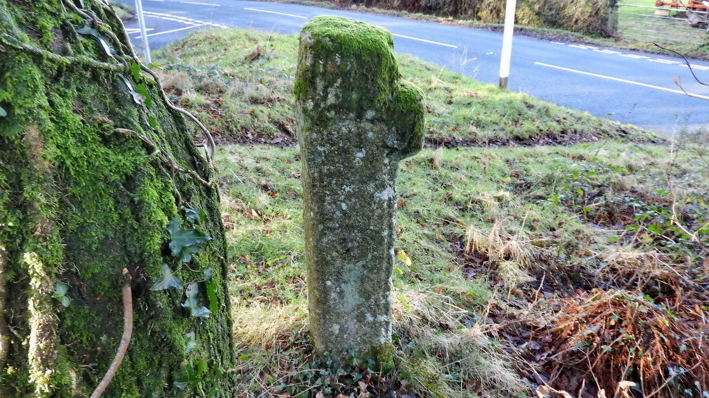

{}

{}

## Lowery Cross

Although not directly on our walk, if you came from the main road which is 300 meters to the Northeast of the suggested parking, then you likely drove past Lowery Cross and it's worthy of mention.

Once parked at the Lowery Cross car part, head off due West along a path.

## Dousland Reservoir

## 1823 Plymouth and Dartmoor Railway

This gateway marks where Sir Thomas Tyrwhitt's 1823 Plymouth & Dartmoor Railway (horse-drawn) left the Down on its way North to Princetown and its quarries.

## Yennadon Quarry

Hornfelsed means the Tavy slate was altered by heat from the adjacent intrusion of molten granite that formed the bulk of Dartmoor. The bedrock was laid down as sedimant in open seas about 359 to 383 million years ago. 

[Yennadon Stone](http://www.yennadonstone.com/index.html) is the last active stone quarry still working on moorland Dartmoor, out of scores that once existed.

## Iron Mine

>  "In 1836 Ralph Lopes leased the area to George Stone Baron to 'dig work mine and search for Iron, Iron Ore, Iron Stone and all other Ores' on what was then called Great Yennadon Common, the rent being 1s 8d in the on the gross value according to the price on the day of all such ores metals and minerals which shall be ... digged raised and gotten out of from or in the said premises"

There was no lease following this, so it must be concluded the venture was unsuccessful. In 1846, another license was issued to other adventurers!

## WW2 Searchlight Battery

This searchlight was operational from 9 Feb. 1944. It would help protect Plymouth, Burrator Reservoir and RAF Harrowbeer at Yelverton. 

All that remains now are the outlines of a row of four huts, of which only one has anything obvious.

## Clapper Bridge

## Steam Railway

The first railway, the 1823 horse-drawn PDR of Sir Thomas Tyrwhitt has already been mentioned. 

The second railway was the 1883 [Princetown Railway](https://en.wikipedia.org/wiki/Princetown_Railway0 (using steam locomotives) that replaced it, runnning from Yelverton to Princetown. 

This one connected with the 1859 [South Devon and Tavistock Railway Company (SD&TR) Plymouth-Tavistock line](https://en.wikipedia.org/wiki/South_Devon_and_Tavistock_Railway). It was adopted by the GWR from 1st January 1922 and closed March 3rd, 1956.  

The horse-drawn tramway consisted of short wagons that could be pulled in quite a tight turn. The line enters this image at the far right, from the gateway seen above, swings around a hairpin bend (kindly marked by the sheep) and doubles back towards the camera at the left, from where it goes through the first gate above up to Iron Mine Lane and on to Princetown via the west side of the Down. 

The steam railway could not turn a tight bend like this and was built running into this image at the bottom left and on into the distance towards the reservoir where it ran around the flank of the Down above the dam to Burrator & Sheepstor Halt and then on to Princetown, travelling up the east side of the Down. 

## Cattle Creep

These "creeps" (simply small tunnels) were installed at intervals along the railway to enable livestock to cross underneath the railway which would have been fenced along its route to keep livestock from entering the tracks.

## Bronze Age Hut Circle

## Bench with a view

>  "One of the boundary stones which marked the sett has in fact survived, the existence of which had been overlooked by previous Dartmoor explorers and writers until I discovered it some years ago. A rough-hewn short pillar standing against the eastern enclosure wall 20 yards north of the wall corner, in exactly the position in which the last stone on the northern boundary was indicated on the 1836 map (see above)" 
> 
> --  <cite>Mike Brown (2001) Guide to Dartmoor, CD-ROM, Dartmoor Press, Grid Square 5489 6833</cite> 

## Crossing Keeper's Cottage

[Link to OS map showing the keeper's cottage, from 1892-1914](https://maps.nls.uk/geo/explore/#zoom=18.0&lat=50.50490&lon=-4.04570&layers=168&b=1&o=100)

## Lowery Cross "Godcake"

This grass triangle is no burial place - it is a triangular piece of land that was left so that a horse and cart could negotiate a fork in the road where three lanes meet; or maybe it built up from these cart and wagon turnings over the centuries: this is called a godcake. 

The so-called "[Coventry Godcakes](https://en.wikipedia.org/wiki/Coventry_Godcake)" take their name from these triangle shapes and are not particular to any one county or city as they are found everywhere. 

*This walk was reached from the B3212 road from Dousland to Princetown by turning right at the first road encountered after leaving Dousland. This is a crossroads where the left turn goes downhill to Welltown. Parking is at the yellow cross and the  P  symbol indicated on the map*
