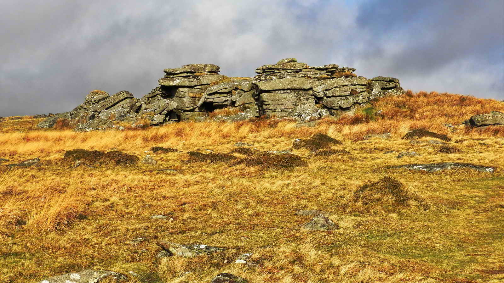

{}

{}

## Introduction

This walk takes us up along a ridge taking in several tors, including one that was very important for the old Tin Mining Stannary laws. Then it drops into the West Dart River, exploring some Bronze Age Hut Circles and then back past Wistman's Wood and down the valley back to the start.

**Please note: In accordance with [Dartmoor National Park's guidance](https://www.dartmoor.gov.uk/enjoy-dartmoor/places/wistmans-wood), please do not enter Wistman's Wood itself, or disturb it in any way.**
Sadly, due to huge numbers of visitors over recent years, significant damage has been caused even by those simply walking through it as well as those removing moss, branches or littering.

*If you just want to visit Wistman's Wood, you can follow the path up from the given parking coordinates. This shortens the walk to about a mile each way and is a pleasant easy walk, although not accessible to wheelchairs. [Jump to Wistman's Wood](#wistmans-wood)*

## Parking Quarry


Before we leave our parking space, take a moment to look at the sides of the quarry.

This place is known as "Two Bridges Tor" as there is a distinct granite formation at the back which helps show how Tors on Dartmoor were formed, even when the Tor is underground. Rain water, being slightly acidic, soaks into the ground and rots the rock, primarily at cracks and weaknesses to form horizontal and vertical joints. Over a long period of time, the harder rock is left behind as the rest is changed into growan (Decomposed granite) and sand.

We see this here as this quarry was dug to provide sand and gravel for road building.

Once exposed to the atmosphere, then weathering continues the early work of underground decay with with, rain and the freeze/thaw action of the winter to further attack the rock.

- Source: Ken Ringwood, Dartmoor's Tor and Rocks

There seems to be a well repeated rumour that I've heard from several people who are insistent that Dartmoor's Tors were once volcanos. Sadly, this is completely untrue!


*When ready, walk North through the gate and immediately leave it, turning uphill to your right, striking out across open moor to the North East towards a gateway in the wall about 350m away*


*Once through the gate, turn right and head to Crockern Tor*

## Crockern Tor and the Stannary Parliament


- Crockern Tor. SX 61560 75778. Elevation 400 meters (1312 feet)


This imposing rock was chosen as the meeting place of Great Court of Devon Tinners dating from around at least 1300AD and possibly as far back as 1100. The court would meet here and establish tin laws, mete out punishments for breaches, pay taxes and distribute earnings.

There was also an impressive Chair made of slabs of granite with a tall back and overhang placed here by a granite table for court proceedings. The chair was moved to Dunnabridge Pound by a Mr Leaman using "12 yoke of oxen" - a team of 24 beasts - and it can be seen there today, just a few miles away.


Parliament Rock itself has a natural shelf which was used as a "Court Cryer's Chair" - presumably to shout for order and repeat the findings of the court to the wider audience.

- "Stannary" comes from the latin name for tin, Stannum. It also gives it its periodic definition, 'Sn'
- Before the fourth century, "Tin" was used to describe any alloy of silver and lead, rather than the metal Tin.


- Between 1100 and 1650 AD, some 26,000 tons of smelted, white tin were extracted from Dartmoor.
- The most productive year was 1524 AD, when 252 tons of white tin were produced.
- The Stannary Court had considerable power and influence and controlled the metal mining industry of Dartmoor.


- The four main Tin Towns of the area were Ashburton, Chagford, Plympton and Tavistock. This site was likely chosen due to its central position between them.
- There is an oval area below the Court which may have housed an audience of 80-100 people.

References:
- The Great Courts of Devon Tinners, 1510 and 1710, Dartmoor Tinworking Research Group, Exeter. (Book)
- Eric Hemery: High Dartmoor, Land and People (Book)


The flagpole on Beardown Tors to the Northwest marks the start of the Merrivale Firing Range. Don't cross into it if the red flag is flying, for live firing may be underway!

*Once ready, walk Northwards toward Littaford Tor*


## Littaford Tors



Down to the West and North of this tor is a very long rabbit bury (marked on the OS maps as "pillow mound") that is part of Wistman's Warren and is 108 metres long. There are over 30 mounds comprising the warre in this area, some barely noticable in the tussocky grass.

Sadly, these mounds they don't photograph well, and just appear as lumpy brown areas.

## Pillow Mounds

- Pillow Mounds are man made rabbit warrens dating from at least the medieval period.
- Their name comes from the pillow shape of the mounds.
- They were used to breed rabbits (Also known as Conies) for meat and fur. Rabbit was a mainstay of the local tin miners and was sometimes the only meat they would regularly eat.
- Rabbit farming like this was done throughout Britain, and you can find many references to "Warren" in place names that persist today.

- [Heritage Gateway MDV14156 - Rabbit Warren](https://www.heritagegateway.org.uk/Gateway/Results_Single.aspx?uid=MDV14156&resourceID=104)


*Walk down the hill to the West to Wistman's Wood and, skirting the trees, continue North to the Buller Stone*

## Buller Stone

The Buller Stone is a distinctive triangle shaped rock some seven or eight feet tall at the Eastern edge of Wistman's Wood, and has an inscription carved upon it dating from 1868.


The inscription reads:

```{linenos=false}
BY PERMISSION OF
H.R.H. THE PRINCE OF WALES
WENTWORTH BULLER
ON SEPT. 16TH 1868 CUT DOWN A TREE NEAR THIS SPOT
IT MEASURED 9 IN IN DIAMETER
AND APPEARED TO BE ABOUT
163 YEARS OLD
```


*You can continue walking up the valley for about 400m to a small copse as marked on our map. Just above this are the meager stone ruins of Warren House, where the rabbit breeder responsible for the creation and upkeep of these pillow mounds and their contents*

You will probably have seen some of the many hut circles on this walk. There are known to be well over one hundred of them in the vicinity of Wistman's Wood, so this was clearly a very busy place four thousand or so years ago.

## Wistman's Wood


*More skilled photographers have done some beautiful photography of Wistman's Wood. Sadly we are not so adept. All photos from within the Woods were taken before the DNP request not to enter them.*

- Wistman's Wood is a temperate rainforest, a nature reserve and a Site of Special Scientific Interest (SSSI)
- The wood is home to the incredibly rare Horsehair lichen (Bryoria smithii) which is found at only two sites in Britain.


> Altogether a remarkable place, said by early antiquaries to be the home of the druids, supposing Wistman to be a corruption of “wise man”. But, quite aside from the reality that there is no evidence whatsoever to associate these white-bearded priests with Dartmoor, this supposed derivation of the name is incorrect. There are two more plausible explanations for the name, either that it is derived from Welshman’s Wood, “Welsh” or “Wealas” being the Saxon word for “foreigners”, or that it comes from the Devon word “wisht” meaning “haunted”. --<cite>Mike Brown (2001), Guide to Dartmoor</cite>

- The Trees are mostly Pendunculate (or English) Oak *Quercus Robur* and known to be hundreds of years old, and some Rowan *Sorbus Aucuparia* mixed in.
- Shaped by the climate, weather and ground conditions almost unique to this location, they have naturally grown dwarfed.


- Few of the trees grow to more than 4.5 meters tall, with none more than 7m.
- Pendunculate Oak in other locations can reach 40 meters in height.


- The name of Wistman's Wood may derive from the dialect word "wisht", meaning "eerie/uncanny" or "pixie-led/haunted".


- The legendary Wild Hunt in Devon, whose hellhounds are known as Yeth (Heath) or Wisht Hounds in the Devonshire dialect, is particularly associated with Wistman's Wood.
- Sir Arthur Conan Doyle was inspired by the Wild Hunt to write The Hound of the Baskervilles.


- [Wikipedia - Wistman's Wood](https://en.wikipedia.org/wiki/Wistman%27s_Wood)
- [Dartmoor National Park - Wistman's Wood](https://www.dartmoor.gov.uk/enjoy-dartmoor/places/wistmans-wood)

## Path back to Parking


## Two Bridges

Close to the parking is the area known as Two Bridges.


The pub changed its name to Two Bridges Hotel some time prior to 1849, so pre-dates the modern road bridge.

Saracen's Head Inn: a booklet to mark its 225-year history records that "By 1772 the Turnpike bridge had been constructed across the Dart at Two Bridges and by 1794 Francis Buller had constructed the inn near the site. The inn bore the name of **The Saracen's Head**, a familiar name for pubs at the time but likely also connected to the fact that the Buller family crest was a Saracen's head 'affronte, couped, proper'".  Source: Alex Mettler (2015, rev.edn. 2018), Air Like Champagne: A short history of the Two Bridges Hotel, Dartmoor. Published by Two Bridges Hotel..

The name "Two Bridges Hotel" seems to first appear after a change of landlord in May 1849 in an advertisement in the Western Morning News.  In 1885, the name The Saracen's Head Inn appeared in an advetisement to let including "that well known Inn House 'The Saracen's Head' ..... with buildings, stables, sheds and appurtenanes etc'". The Two Bridges Inn was destroyed by fire in late May 1866, as reported in the Exeter Flying Post.  The old name continued to be used for some time.

Wentworth Buller, who cut the tree in 1868, was no doubt related to Sir Francis Buller, who had built the inn by 1794, some 74 years earlier? [A web page about The Bullers of Bovey Tracy](https://boveytraceyhistory.org.uk/people/buller/) mentions Capt. Thomas Wentworth Buller (1792-1852); Wentworth William Buller (1834-1883). There is [a Wikipedia entry for Sir Francis Buller](https://en.wikipedia.org/wiki/Sir_Francis_Buller,_1st_Baronet#Moorland_improver) that includes "He also built an inn, named the Saracen's Head after the Buller family's crest, at Two Bridges, on a site now occupied by the Two Bridges Hotel."  This was citing: William Crossing (1902), A Hundred Years on Dartmoor, 5th edn, The Western Morning News Co. Ltd, Plymouth, p.53. [Wentworth William Buller](https://www.gracesguide.co.uk/Bovey_Tracey_Pottery_Co) was much involved with the [Bovey Tracy Pottery Company](https://www.gracesguide.co.uk/Bovey_Tracey_Pottery_Co)


## Parking

There is some limited parking at a small quarry close by the Two Bridges Hotel. It does get full at busy times, and there is some other parking on the roadside towards Postbridge.

## References

- Ken Ringwood, Dartmoor's Tor and Rocks
- Geology Explained: Dartmoor and the Tamar Valley, David & Charles, Newton Abbot
- The Great Courts of Devon Tinners, 1510 and 1710, Dartmoor Tinworking Research Group, Exeter. (Book)
- Eric Hemery: High Dartmoor, Land and People (Book)
- [Heritage Gateway MDV14156 - Rabbit Warren](https://www.heritagegateway.org.uk/Gateway/Results_Single.aspx?uid=MDV14156&resourceID=104)
- [Wikipedia - Wistman's Wood](https://en.wikipedia.org/wiki/Wistman%27s_Wood)
- [The Bullers of Bovey Tracy](https://boveytraceyhistory.org.uk/people/buller/)
- [Bovey Tracy Pottery Company](https://www.gracesguide.co.uk/Bovey_Tracey_Pottery_Co)

- [Dartmoor National Park - Wistman's Wood](https://www.dartmoor.gov.uk/enjoy-dartmoor/places/wistmans-wood)
