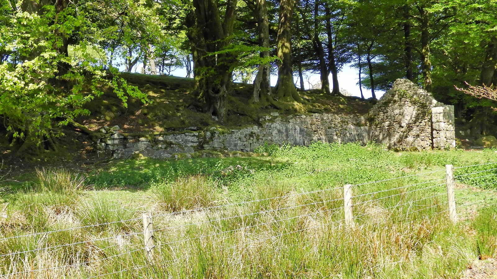
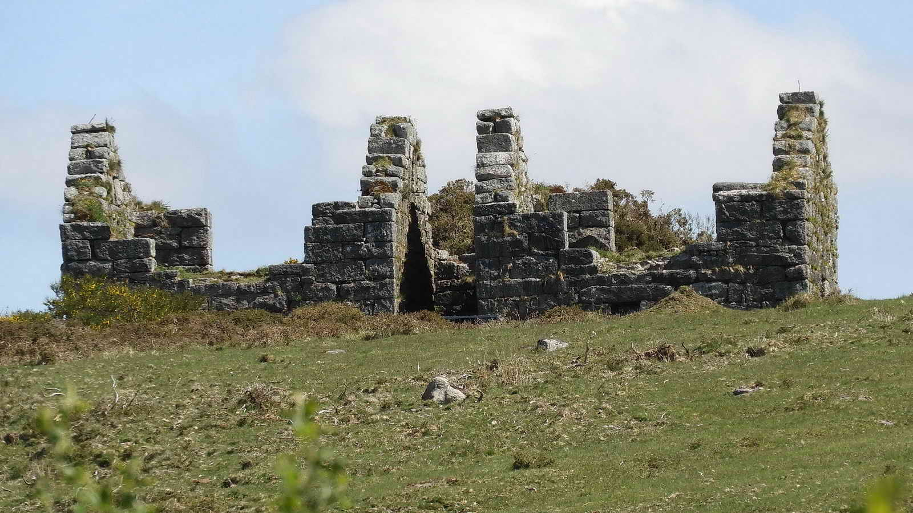

{}

{}

*We've used numbers in the photographs which correspond to the map to help with identification*

## Higher Cherry Brook Bridge

## The Hairy Hands

This road is famously recorded as having a pair of ghostly hands that take control of the steering wheel or handlebar or cars or motorbikes, forcing them off the road.

* More information about The Hairy Hands Legend
    * [The Hairy Hands - Legendary Dartmoor Article](https://www.legendarydartmoor.co.uk/2016/03/25/hairy_hands/)
    * [The Hairy Hands - a British Film Institution film from 1965 by David Mudd](https://player.bfi.org.uk/free/film/watch-the-hairy-hands-of-postbridge-1965-online)
    * *Note from Simon: My mother once drove this road alone at night in the 1980s and swears she saw a coffin lying in her path. She swerved and avoided it, but didn't dare return to investigate. I know of no other reports of coffins on this road but the incident was very close to the ancient Lich Way of which she wasn't aware at the time.*

## About the Lich Way

* Dartmoor's Lich Way is a 17 mile path across Dartmoor from beyond Bellever through to Lydford.
* We join it on our way to the Powdermills for only a short distance, but it's a very interesting piece of Ancient Dartmoor history.
* Prior to 1260, residents of the farms and villages in this area of Dartmoor belonged to the Parish of Lydford. This meant that as well as travelling off the moor to attend services, they were expected to bury their dead in the consecrated ground of Lydford, then a major and powerful town. Coffins were carried by ox or pony cart, strapped directly onto pack ponies, or carried by men.
* The route bears many memories of its purpose. There is a Coffin Wood, and many suitable large flat rocks along the route are identified as "Coffin Stones" where the heavy burden was laid so the carriers could rest.
* Lich or Lych? Both methods of spelling are in wide usage, both on Dartmoor and elsewhere. The word is thought to be derived from the German "leich" or Dutch "lijk" for "Corpse", so perhaps Lich is the more correct.
* For more information about the Lich way, please see the [excellent article on Legendary Dartmoor](https://www.legendarydartmoor.co.uk/2016/03/17/lych_way/)

## Arch Tor

Arch Tor: The top stone is a large logan stone, with rock basins and an inscription that reads "PC" that has been suggested to refer to Powdermills Cottages. We'll take a closer look on the walk back.

## About Gunpowder

Gunpowder is a mixture of three components of varying proportions depending on intended use.

[More info - Wikipedia](https://en.wikipedia.org/wiki/Gunpowder#Composition_and_characteristics)

However, the production of gunpowder is complicated and is unsurprisingly dangerous.

The Powdermills site is also complicated. Everything (except for the water) entered the site at the Southern entrance. Various stages in production occurred going up through the site to the three incorporation mills at the north end and then coming back down through the site until final storage in a main magazine ready for shipment to buyers.

Gunpowder, black powder or rock powder (local name) used for quarrying and mine blasting, is still used in fireworks.

The composition is 75% saltpetre, 15% charcoal and 10% sulphur (aka brimstone or burning stone).

Dynamite, more powerful, was patented in May 1867 by Alfred Nobel. Its success as a superior explosive led to eventual closure of the mills in 1897.

The ingredients, saltpetre (mostly from  India), sulphur (mostly from the Vesuvius and Stromboli regions of Italy) and the charcoal (made from local wood, especially alder or alder buckthorn), were ground separately in a grinding mill house. These were then blended in the required proportions in large barrels tumbled by waterwheels. This incorporated them  into a single compound using a combination of mixing, crushing and churning. This was a hazardous process that was governed by strict regulations and regular inspections. Only wooden and copper tools were allowed , so as to prevent sparks causing explosions.  The men had to wear leather aprons and sof-soled shoes, no hobnail boots. There is a story that one man, Silas Sleep, who took his breakfast and dinner to eat at work, always ate them both together, in case he was 'blowed up' and sent to meet his maker before lunch time.

"Incorporation" was the first stage of production, in one of the three incorporation mills ("wheelhouses") at the top of the site, it resulted in a form of "cake". It was probably at this stage that the powders were dampened with water to reduce "dust"  and prevent accidental explosions. This also helped the very soluble salpetre to mix into the porous charcoal. The resulting damp paste or "mill cake" was shaped into "corns".

This was "ripe charge" that could be stored for a short period. It was then pressed down in e.g. a 2-ft square box to "press cake" about an inch thick. Originally this was a hand-powered process, like a cider press, but later a water wheel was used to drive the presses.

The next stage was "corning" when slabs of cake were broken up with wooden mallets into a granular form. Later, water-powered machines were used. This involved rollers and then sieving through different sized meshes. The powder was then tumbled in rotating barrels or cylinders. These were covered with gauze to collect any small dust-sized particles. This was another water-wheel powered process.

The next stage was "glazing", where the grains were tumbled again, with graphite or black lead to give each grain of powder a waterproof coating. This made the powder suitabe for use in damp mines and quarrying.

The last stage was "drying", sometimes in the open air. Usually, this was done in heated "Gloom stoves". These were heated by an iron furnace with the powder laid on trays stacked around it. Later, steam stoves were used to heat pipes near the trays. The process used a flue to take away any sparks and fumes to a chimney - and this is seen at the south, bottom end of the site.

The final product was packed in large oak barrels that were covered with leather to prevent spillage and from stray sparks entering.

The gunpowder quality was tested periodically using the proving mortar that lies beside the road going into the Powdermills site. The strength was determined by firing a 68 lb iron ball over a distance that was then measured.

Besides the actual gunpowder makers or millers, the Powdermills employed coopers, blacksmiths, carpenters, wagoneers, carters, wheelwrights, stable staff and labourers.

## The Powdermills History

**George Frean**, a Plymouth Alderman, founded the Plymouth & Dartmoor Gunpowder Company and opened Powdermills in 1844; it closed in 1897. It had employed about 100 men.

George Frean later teamed up with James Peek, one of three brothers importing tea - wanted a biscuit business for "tea and biscuits" - wrote to George Frean, "miller and ships biscuit maker", who had married a niece of theirs, to manage [Peak Freans](https://en.wikipedia.org/wiki/Peek_Freans)

The whole complex was powered by water which was brought in by three leats. Initially, one leat came from the east bank of the Cherry Brook to a rectangular reservoir north of the three isolated incorporating mills. The water then returned to the Cherry Brook. The second leat came from the west side of the Cherry Brook to a circular reservoir behind the buildings. Water was taken for four years without Duchy permission. Permission was quickly granted because the Prince Consort, Prince Albert, had encouraged the venture. Later, water was also leated from the East Dart River to the north end reservoir. The water was then leated to water wheels used for grinding and powering other machinery.

The leat through the site is described in the book Industrial Archaeology of Dartmoor as now being dry and "two points at which it crosses the Cherry Brook, which flows between the buildings, can be seen. At one of these points, after feeding half the wheelhouses, the leat passes under the Cherry Brook through a wooden launder, which is still in place, in hard and excellent condition in spite of its years of saturation. Further downstream the leat's channel back under the brook is of stone, big enough for a man to enter. The water had to be conveyed some way before being allowed to discharge, in order to prevent pollution of the Cherry Brook".

Waterwheels were used in the three massively-built incorporating mills (1,2,3 on the [map](map.jpg)), glazing mill (4), pressing house (5) and two in the incorporating/composition mill and cartridge pressing house/corning/dusting house and glazing mill complex (6,7), and the final preparation rooms (8), making eight altogether. There is also a ninth, disused wheelpit at the final preparation rooms with later lean-tos in it.

Separate from the powder works to the south, along the road in, is the row of 19th century buildings that included cottages, a manager's house, school, cooperage and a small Methodist chapel. Today, there is a pottery, offices and farm buildings. South of the cottages beside the road is the proving mortar and nearby is a wheel-binding stone, used for fixing hot iron rims to cart and wagon wheels.

[Link to Heritage Gateway for one of the many Monuments on this site - see "Associated Monuments"](https://www.heritagegateway.org.uk/Gateway/Results_Single.aspx?uid=MDV43175&resourceID=104)

## The Powdermills Site

The site - starting below at South Chimney after entering at the top of the site.

There can be confusion identifying buildings when referring to the 2019 book and the 1990 survey listed above. The book starts at the south end of the site (page 98) with "Building 1" and the archaeogical survey starts from the north. The survey numbers are in (brackets).

There is no known map saying what each building was used for, so there is conjecture based on the gunpowder-making processes and  the requirements for them to be carried out.

## Around the South Chimney

If ready-made charcoal was brought in, then the South Chimney could have been for processing saltpetre, dissolving it and recrystallising it to make it more pure.

Three phases of development and extension have been identified and it is likely that the function of the buildings changed over time. A flue and chimney indicate heat was involved. The flue to the chimney is about 1 metre deep and 1 metre wide. Its eastern portion is now open and rubble-filled, but the western portion is still capped. It enters the base of the chimney which is set on a plinth. The chimney is about 10.5 metres high.

South Chimney with the 17 (18) Saltpetre / Charcoal Works behind. Across the track is the 2 (17) Cartridge Press House / Watch House / Store and up the slope behind that is the 1 (16) Watch House / Checking House. At the left edge are the roofs of the Powdermills Cottages, Pottery / Cafe, and offices.

## Leaving the chimney

Immediately ahead is 3 (15) a Mixing House / Store behind the gate and tree, and to the right is 4 (14), a double structure that had two water wheels. The left section is believed to be a Cartridge Press House / Preparation Room and the right section is believed to be the Corning / Dusting House and Glazing Mill.

Possibly a saltpetre crystallising house.

Long rectangular single-storey building located at the southern end of the site and aligned north to south.. Two, possibly three, phases have been identified. Water was culverted through the building under the floor. Its north wall was probably the dwarf wall which now subdivides it from the extension to the north. Dwarf walls in one interior consist of one long spine wall and two side walls. Another dwarf wall runs east to west across the structure from the northernmost door to the east wall. These appear to form a raised floor with water, air or heat circulating beneath. A small, square, stone-lined feature to the west of the south-west corner may be a well, or possibly a pit in which staves were soaked. The building is described in the book as the Watch House, where materials in and out of the site were monitored. It might also have been used as a store.

Hidden behind is 3 (15) Mixing House / Store and to the right is 4 (14), a double structure that had two water wheels. The left section is believed to be a Cartridge Press House / Preparation Room and the right section is believed to be the Corning / Dusting House and Glazing Mill.

Small, rectangular, single-storey shed, in line with the track over the brook to the South Chimney. Aligned north to south. South gable end mostly survives. The west wall stands to full height; the east wall survives only as footings. No doors or windows are present in the three standing walls. There is plaster rendering on the interior. Small stone-lined channel runs east to west down the outside of, and parallel to, the south wall.

Incorporating/composition mill (south), possible cartridge press house (south of N building) and possible corning/dusting house/glazing mill. Consists of two pairs of structures on either side of two wheelpits. The tailrace of the southern wheepit discharges back to the Cherrybrook. The wheel between the southern mill was powered by a continuation of the leat powering buildings to the north. The wheelpit tailrace discharged via a channel into Cherry Brook. The culvert has an arched roof of granite blocks overlain by slabs.

Long, rectangular gable-ended(?) building aligned north-south with an east-west wheelpit to the south.  The wall of the wheelpit is visible only in the west. The position of the sluice is identifiable. The tailrace is not visible. This where a waterwheel powered a press to squeeze moisture out of the gunpowder.

Small building, aligned north to south just south of the glazing mill (below). There is a large rectangular stone table, 20-25 centimetres thick, on a masonry base.The table top is smooth. On this, the slabs of pressed gunpowder were broken down.

Long rectangular building, aligned north / south. The structure contains supports for a raised floor, or to support machinery such as glazing barrels. The internal supports may alternatively have been to provide under-floor ventilation. There is a wheelpit at the south end of the building. This where "broken" pieces of gunpowder from the Breaking House were sieved and large pieces were returned to the Breaking House and fine powder was returned to the Press House.

There is a Circular Reservoir on the hill above between this building and the preceding building.

Possibly where "corns" i.e. sieved gunpowder was stored. This facing the track coming down the hill from the three incorporation mills - note the fingerboard signpost.

It is probable that these buildings were used for dusting, glazing, sieving and packing the gunpowder prior to carting it it off-site. Horses may have been stabled here as well as barrels and other materials being stored here. There are two mills powered by a waterwheel.

'Gloom' or steam stone used for drying gunpowder. A portion of the west wall of "Unit D" (in the survey) remains, in the centre of which is a flue leading to the chimney 5-6 metres to the south-west. Two wheel cogs lie at the east end of the building, but may not be in situ.

Similar in plan to 'Buildings 1 and 2', consisting of two units flanking a central wheelpit. The wheelpit is largely filled with rubble. The wheel was powered by water from the tailrace of the wheelpit of 'Building 2'. The three incorporating mill houses ("wheelhouses") were of massive construction with many granite blocks being 6-feet long and the was about 6-feet thick, to withstand inadvertent explosions. The roofs were very flimsy, of wood and tar, to blow off without damaging the main structure. They could be replaced easily.

Tar drips indicate that either it was not gable ended, or the gable ends were constructed of timber of lesser width than the walls below. Water outflow continues west in the form of a leat, towards 'Building 3'.

**Background: 5 (1) Incorporating Mill:** Consists of a pair of gable-ended structures flanking a large central wheelpit. Both of massive granite blocks with walls about 2 metres thick at their bases.

Tar dribbles indicate original roofing was of tarred tarpaulin or wood. This was probably to allow any accidental explosion to go upwards and leave the walls standing, a technique still used by artisinal powder makers in India and China today.

The wheelpit is aligned north-east to south-west and runs the whole width of the units. Wheel axle appears to have projected into their ground floors. Powered by a launder to the north-east which flowed out through a culvert to the south-west. This is roofed for 3.5 - 4 metres, then becomes an open channel which runs downhill to feed the reservoir belonging to 'Building 2'.

The raised bank at the left brought the leat that fed a launder to the waterwheel.

## Arch Tor

An "extra" to the walk: exit the site via the gate at the top right corner, past the Incorporation Mills, and walk out straight to Arch Tor. The whole top stone "logs" i.e. rocks, as a logan stone.

## Extra bits

This proving mortar is just off the road, on the left, on the last bend when driving in approaching the Pottery, cafe and mill cottages.

It fired a (probably) 68 lb ball to test the powder. The distance travelled by the ball was a measure of the strength of the powder and undoubtedly a good sales tactic for potential buyers.

*This walk was reached from a small roadside layby marked by the yellow cross below the "Lich Way Plaque" label on the map. Normally, for a group, it would be reached from the main car park in Postbridge or the car park in the forest just across the road from it. There is also a car park at Higher Cherry Brook Bridge,  marked with the P symbol and yellow cross on the map*

*Please note that there is no parking available at the Powdermills Pottery and shop except when visiting them*

