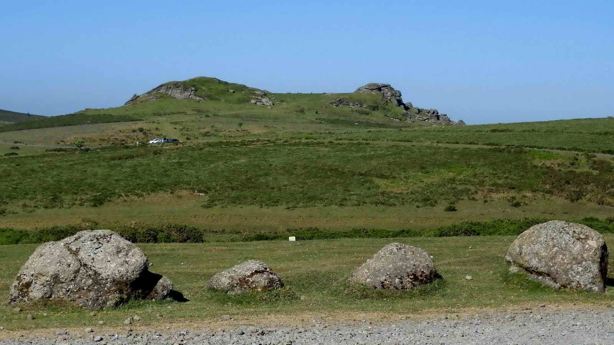
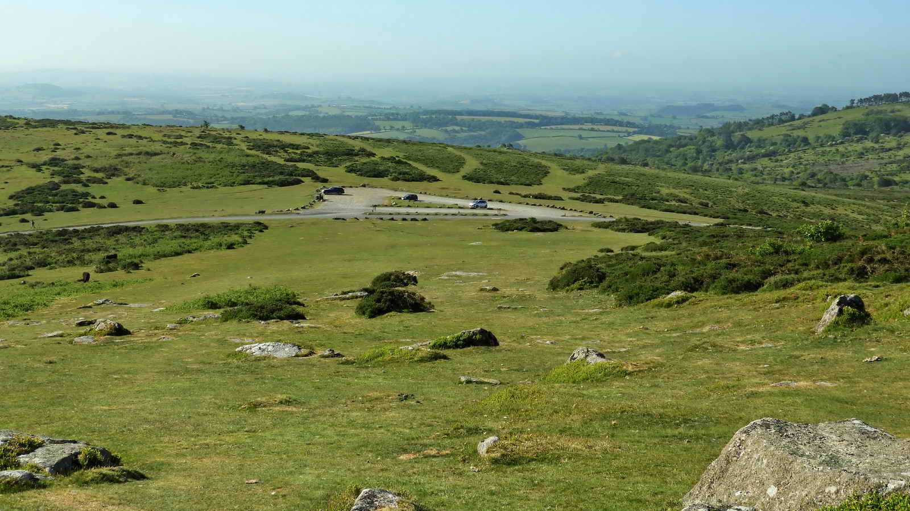
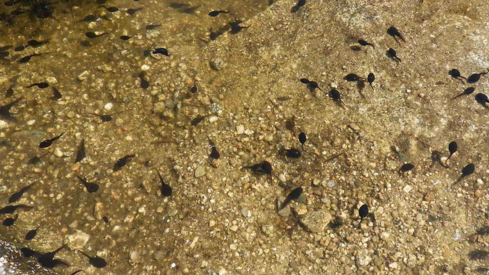

{}

{}

## Introduction

A walk including some hills through Haytor and historic quarries from previous centuries. Points of interest include abandoned machinery, the Haytor Granite Tramway (The Templer Way), an abandoned partially-carved apple crusher and ruined buildings including a 'beehive' quarryman's hut. 

*We start from the Upper Haytor car park, marked on the map as the lower P and white/green cross. Walk upwards towards the imposing Haytor*



## Haytor


**Haytor** The name is a cartographer's corruption of the local name of High Tor, pronounced in the Dartmoor dialect as "Hey Tor". 

These are granite intrusions that are seen from a long way off, even from The English Channel, and are hence, the "high tor". 

With rock piles separated by an area of grass, it is also called an "avenue tor". Other Avenue Tors are Bellever Tor, Hound Tor, Great Staple (or, originally, Steeple) Tor, Rippon Tor, and Pew Tor. 

Rock climbers and abseilers use Haytor often.


On special occasions, a bonfire is sometimes set on the exposed flat rocks of Low Man by the local community in agreement with the local Authority and Landowner. These celebration fires, which have likely occured for millenia, can be seen for a huge distance.

On the very top of Low Man is a hole drilled by the Victorians to hold a flagpole. 

The Victorians also carved steps into Haytor and erected a wrought-iron handrail to help them climb the rock with more ease. The steps, somewhat weathered, still exist, but only stubs of the ironwork remain. Stairs and a similar handrail still exist at Blackingstone Rock. 




The adventurous may wish to climb Haytor. You will find the steps up the shallower grade, with a small leap across to the main rock. 

This is not an easy climb and advised only for the fit and agile with suitable footwear, and to be avoided by all in icy or windy weather for obvious reasons.

*For our walk, we turn right in front of Haytor and head Northeast for about 500m*


## Haytor Quarry


At the fence, follow it down to the right until you come into a small gate where you may enter the quarry.


This crane would have been used to lift blocks of rough-cut granite out of the quarry below, and also on and off wheeled trams for transport down the Haytor Granite Tramway for loading onto barges at Stover, and then by boat to Teignmouth for transport internationally. 

Notably, granite from this quarry was used in many fine London buildings including Nelson's Column and London Bridge.

* [DNPA infosheet on Granite Quarry and the Haytor Granite Tramway - including sketch of how this crane would once looked](https://www.dartmoor.gov.uk/__data/assets/pdf_file/0015/72132/lab-granpost.pdf)

{}


The crane was still functional in 1946 and a photograph taken in 1964 shows it still standing.

* [Heritage Gateway page MDV43350 - Machinery at Haytor Quarries](https://www.heritagegateway.org.uk/Gateway/Results_Single.aspx?uid=MDV43350&resourceID=104)


The lilies, and the goldfish and occasional koi you may see, were introduced well after the closing of the quarries.




Swimming is not advised!

As well as hidden hazards underwater, there are a great many leeches in these ponds! If you study the water edges you may see them wriggling. 


> In 1986, as part of a Youth Training Scheme (YTS), I was part of a group of youths who carried water barrels, rope and pallets up to these quarries. We were tasked, as part of a confidence-building course run by Torbay Council, to build a raft and cross this pit. 
> These rings came in very useful in securing our pulling ropes  -- <cite>Simon</cite>


## Quarry Waste tips


*We walk through the gate and meander down to the right below the heaps*

The flat top is where iron rails once rested to run the trucks out from the quarry to tip waste rock. 

This functional design is found worldwide wherever quarries and mines needs spoil disposing of. A much larger example can be found at Foggintor Quarry.


## Haytor Granite Tramway


The gauge of the track is 4 foot 3 inches (1295mm) with the rails being shaped granite blocks. 

Note that because there were no flanges, the inner part of the rails is of differing heights and hasn't been as carefully worked - because it only existed to steer the wheels back onto the lower, flatter, part.


This Haytor Tramway wagon is kept at the DNPA Head Office at Parke, Bovey Tracey.

The wagons were connected together in 'trains' of 12 or so, drawn by a team of 18 or 19 horses in single file. 

The horses were placed behind the train going down when they provided much needed braking, and in front of the train when pulling the empty wagons back to the quarries.

```{linenos=false}
"Nineteen stout horses it was known,
From Holwell Quarry drew the stone,
And mounted on twelve-wheeled car
'Twas safely brought from Holwell Tor"
-- Thomas Taverner 
```


At junctions the wheels were guided by 'point tongues', pivoted on the granite-block rails. 

This could be described as an early form of a railway "switchplate". Authorities differ on whether the point tongues were oak or iron.


This is Holwell Junction on the tramway, looking back the way we've come. 

The left branch leads to Haytor Quarry whilst straight ahead leads to Holwell Quarry, Rubble Heap Quarry, Harrow Barrow Quarry and Haytor West Quarry.

We'll return here shortly, but for now, continue downhill for a hundred meters.


A set of "going nowhere" points at SX 75795 77772. Some of these branches are not shown on the old 1886 map (surveyed in 1885).

It can only be assumed these were cut for a future line or quarry that was never constructed, for they clearly hold no purpose. 

For now, turn around and return to Holwell Junction, and carry straight on to the West.

## Rubble Heap Junction


Rubble Heap Junction: straight on leads to Rubble Heap Quarry, Harrow Barrow and West Quarries. Right turns down to Holwell Quarry.  

Bear right here to Holwell Quarry. 

*Note: If you'd like a shorter walk, you can continue ahead and skip the Holwell Quarry visit*

<hr>

## Holwell Quarry


This carving was the base for an apple mill used for cider making. 

One can imagine the frustration of the carver when it broke. It's not known whether it broke in the carving, or was damaged in transport. 


There are five separate quarries on Haytor Down: Haytor (Main) Quarry, Holwell Quarry, Rubble Heap Quarry, Harrow Barrow (Emsworthy East Quarry) and Western Quarry (Emsworthy West Quarry). 

"Emsworthy" names are sometimes used because of the proximity of Emsworthy (Hemsworthy) Rocks, between Haytor and Saddle Tor.


## Beehive


This can be found a short way below the tramway near to its end. 

The hut is known locally as "The Beehive" due to its conical shape, and was possibly used as an explosives store, or a shelter during blasting.


*We now return back up the track to [Rubble Heap Junction](#rubble-heap-junction) and turn right* 

<hr>

Continuing along the tramway to the Southwest for around 300 meters until you find;

## Rubble Heap Quarry


*From here, we return to the quarry entrance and walk towards Haytor across open moorland*


*To finish the walk, descend down to the Higher car park where we started* 

## Parking

*This walk starts from the upper Haytor car park, which is Pay and Display. Through the summer, free on-moor parking is provided between lower and upper Haytor Car parks, or you could start from the Saddle Tor car park to the West, although this gets very full at peak times*

*The Lower Car park has toilets and an information centre*

## References

* [Legendary Dartmoor - Haytor Quarries](https://www.legendarydartmoor.co.uk/2016/03/17/haytor_quarries/)

