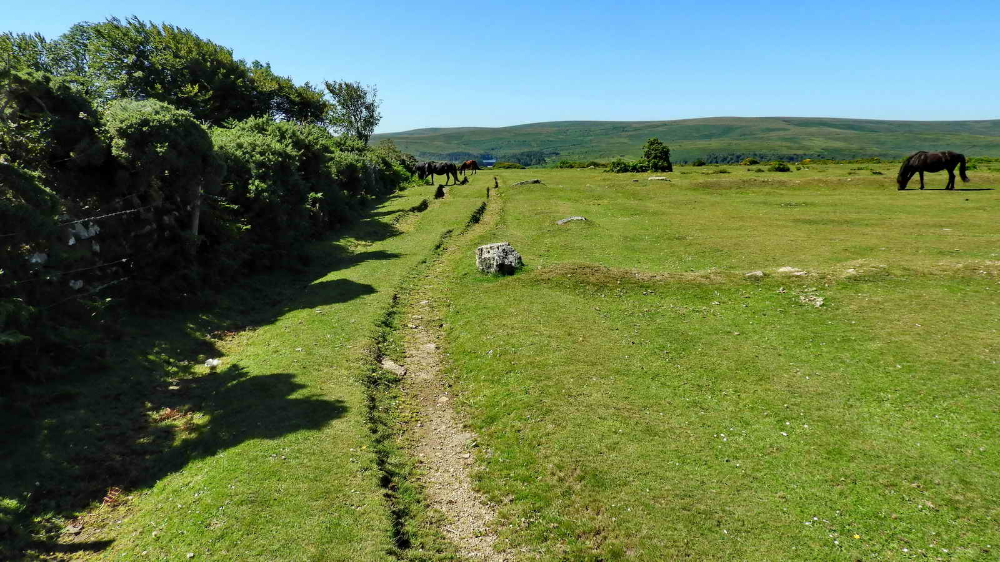

{}

{}

## Introduction
This walk talks you out and back along Dr Blackall's Drive to Aish Tor. The views to the West are nice and there's a little history along the way.

The walk is mostly on a stone track. Although dry and firm, some of the stones are loose so care is needed. There's a gradual descent on the way out, and a corresponding climb on the return.

## Surrounded by Tors

Bel Tor, on the other side of the hedge, has a Logan Stone, Rock Basins and a Triangulation Pillar. Sadly it is on private land and we cannot visit.

## Dr Blackall

Dr Thomas Blackwell MD FRCP (1814 - 4th May 1899, aged 85) trained at St George's Hospital, London, and had a practice in Mayfair. 

He was the youngest son of Dr John Blackall (1771-1860), the sixth son of Rev. Theophilus Blackall, who was a Prebendary (Honorary Canon) of Exeter Cathedral. John Blackall was an eminent physician who trained at St. Bartholomew's Hospital, London, and then returned to Exeter in 1797, settling in Totnes in 1801. When he died in 1860, Thomas, his only surviving son inherited his estate.

Thomas bought the nearby Spitchwick Manor at Poundsgate in 1867. It seems that he never married but according to Censuses from 1861 onwards, there was always a "Visitor", A Mrs Julia Tindall, and her daughter Caroline. It was Julia who inherited his estate when he died.

In the 1870/1880s, Thomas had the "Drive" constructed for his pleasure and for visiting guests to enjoy carriage rides driving southwards to enjoy the magnificent views down the River Dart valley. 

(This is disputed by Hemery (1987, p.588) who reports that it was cut "a century or so ago" by Gerald Warren and his family for Dr Joseph Blackall, of Spitchwick Manor.)

## Stumble Corner

## Mel Tor

We can leave the track here at Meltor Corner and make a short detour to the right to visit Mel Tor

Mel Tor is perhaps more accurately named "Mil Tor", which is short for "Middle Tor" as it is twixt Sharp Tor and Hockinston Tor. 

There is apparently an abandoned millstone near this tor, although we haven't been able to locate it.

*Rejoin Blackall's drive and continue to the South*

## Slotted Gateposts

Note the inverted "L" slot in the post where timber would have been slid in and dropped forming a solid rail. 

These slots are usually found five to a side, and form the basis of the "5 bar gate" phrase. 

Elsewhere they are called "Slip gates", "Stang Stoops", "Yatsteads", "Hinge and L" or "Stand Pole Gateways" being a common form of simple, but secure,  gate.

There is a good [Wikipedia Article](https://en.wikipedia.org/wiki/Slip_gate) showing some fine examples.

They were prone to damage at the ends of the rails and gradually fell out of use as iron became more available for hinges.

Higher Uppacott is a Grade 1 listed longhouse from the early 14th century and is notable as its shippon has survived unchanged.

It's now owned by the Dartmoor National Park and was restored in 2018 as part of the [Moor than Meets the Eye](https://www.moorthanmeetstheeye.org/projects/dartmoor-through-the-ages/projects/higher-uppacott-a-dartmoor-longhouse) project.

There used to be a custom that involved the rolling of wooden wagon wheels down the hill of Mil Tor to the River Dart on Midsummer Day, but it fell into disuse during WW2. 

The practice was revived for a time in the late 1950s but not for long. The idea was to roll them down the 600-foot hill but the rock-strewn nature of the ground stopped most of them. 

Today, the rusting iron tyres lie around in the wood, some with trees now growing up through them. <cite>Hemery p.589</cite>

## Aish Tor

This is metamorphic bedrock formed approximately 318 to 328 million years ago in the Carboniferous Period. Originally formed as sedimentary rocks in swamps, estuaries and deltas to form slates. Later altered by low-grade metamorphism i.e. heating during geologic processes such as the nearby intrusion of Dartmoor's molten magma (granite). 

This cairn seems to sit on a raised circular hump of ground that might be an earlier cairn or kist, although this is unverified.

This may not be Aish Tor at all - the exact location seems disputed, and certainly indistinct. Not perhaps the most impressive of Dartmoor's Tors.

*We must now retrace our steps back to the car park*

Whilst it is tempting to walk the road back to the start to make this a circular walk, the road is narrow and traffic often heavy. It's surely nicer to retrace our steps and admire the view from a different angle.

You may have noticed this on the way down as it's beside the track. This is part of the ancient Bronze Age Mel Tor farmstead and enclosure, dating back around four thousand years.

[Heritage Gateway MDV6453 - 	Settlement east of Mel Tor](https://www.heritagegateway.org.uk/gateway/Results_Single.aspx?uid=MDV6453&resourceID=104)

## Parking

Bell Tor Car park is free and right off the road. Through the summer there is sometimes an Ice Cream Van there, but no other facilities.

## References

* Mike Brown (2001) Guide to Dartmoor 
* [Legendary Dartmoor - Blackall's Drive](https://www.legendarydartmoor.co.uk/2016/03/31/blackalls_drive/)
* [Wikipedia: John Blackall](https://en.wikipedia.org/wiki/John_Blackall)
