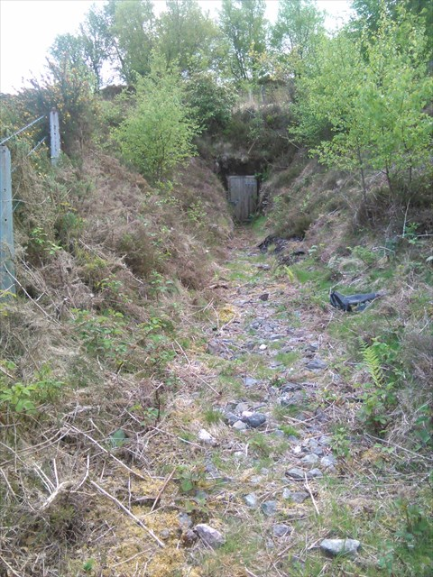
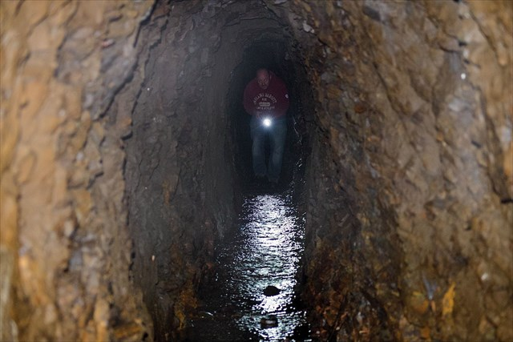

{}

{}

## Introduction

This is one of my favourite walks and is never busy, despite being so close to Haytor Rock. Most people seem to overlook Haytor Down in their eagerness to get into other parts of the moor but there is much to appreciate here, from stunning views over Teignmouth's coastline, to an abandoned quarry, the stover granite tramway and a lovely stretch of ancient woodland.

This walk can be done in either direction, but anti-clockwise is advised, as you can then appreciate the views fully as you face them, walking down the Granite Tramway.

## Geocaching

[Geocaching](https://www.geocaching.com) is a game of finding hidden containers using a GPS or Smart Phone. The containers have a small paper log which you sign to prove you were there, and a website where you log your find. Basic membership is free. If this sounds a lot like Letterboxing, that's because it is based on it, but brought up to date. Many Dartmoor walkers and Letterboxers also geocache as they go hand in hand, and Geocaches are a good way to find interesting places to explore.

There is a series of Geocaches that follow this walk (that's why I know this area, I set these caches and walk this route to maintain them once or twice a year!)  If that sounds interesting, pop over to the [first cache page of the series](https://www.geocaching.com/seek/cache_details.aspx?wp=GC4VD4J)

## Starting the walk

Leave the car park and walk down the road to where the granite tramway crosses it, some 300 meters. Turn left and follow the tramway East.

## Haytor Granite Tramway

*We follow this old tramway for about a mile downhill*

* This tramway was built on the instruction of George Templer (1781-1843), a family that also built the main Haytor Quarries, the Stover Canal and Stover House in the late 18th and early 19th centuries.
* The gauge of this tramway is 4'3" and it's taken from granite cut and shaped at the Haytor quarries.
* There are sets of points further up the tramway where the trams could be steered into different quarries or sidings.
* Granite cut from Haytor or Holwell Quarries was loaded onto strong wooden trucks (See picture below)
* The Tramway runs down from Haytor Rocks to Stover Canal, where the granite would be transferred to sailing barges to take it to Teignmouth docks.
* Around 12 of these trucks were connected together in a "train" with the iron wheels sitting in the flat sections.
* A team of around 18 horses was then connected in single file to one end of the train. If it was loaded and heading downhill, the horses would be fixed to the last truck to provide braking. If they were pulling the trucks back up from Stover, they would be hitched to the front to better pull.
* The tramway is intact for much of its original course, down through Yarner Woods, past Bovey and on to Stover.

This Haytor Tramway wagon is kept at the DNPA Head Office at Parke, Bovey Tracey.

On a clear day, the views along this section look over South Devon towards the gap in the land where the Teign Estuary reaches the sea at Teignmouth.

*When we reach a cross roads with a wooden signpost, leave the Tramway (Templer Way) and turn left, slightly uphill*

## Haytor Down Quarry

Much less known than its larger brothers closer to the Tor. There is some corrugated iron just to the right where a shed or small building once stood.

## Woodland Walk

*We walk gently upwards along this bridlepath for almost a mile, enjoying the many fine and unusual trees*

## The Haytor Down Adits

The sound of running water will alert you to this large collector tank above the path - it always seems to be overflowing even in the driest summer, and runs across the path here.

The water is fed into this tank from a blue alkathene pipe, which continues up the hill over loose waste rock. If you follow it, it actually enters a gated Adit which is always dripping and provides a clearly sufficient flow.

There are actually two adits here, about a hundred meters apart on the same level, both with small fences and gates, and usually padlocked.

These adits don't go far in, and side trials are short. The waste rock outside has a red tinge which indicates iron, so it's likely that's what was being searched for.

The actual adit area is quite overgrown now, but worth a detour if you like adits and don't mind a bit of a scramble through  undergrowth.

The sight of this cable box always seems at odd with the timeless, even primeval nature of these woods.

## Yarner House

You may spot some rooftops downhill as you're walking along. These belong to Yarner House. This is a Grade II Listed Tudor house dating back to the 1600s and has been renovated to a luxurious standard.

* The Yarner House estate is 247 acres.
* It was part of the Manor of Bovey Tracey which William the Conqueror (Norman invader of 1066, also known as William the Bastard) siezed and then granted to Geoffrey de Mowbray, Bishop of Coutances.
* On de Mowbray’s death in 1093, his nephew, Robert Mowbray, Earl of Northumberland, inherited, but later defied the king, which led to the seizure of his estates in 1095.
* Eventually, ownership of the Bovey Tracey estates reverted to the Crown until, in the 16th century, a succession of costly wars left Tudor monarchs strapped for cash.
* Elizabeth I began to sell off Crown properties and, in 1578, the Yarner estate was bought by Gregory Sprint, a canny lawyer with good Court connections, who swiftly resold it at a profit.
* The estate includes Yarner Woods, which is managed by Natural England and has several miles of woodland paths open to the public.
* There are copper mines in Yarner woods which, combined with other mines and quarries contributed to the wealth of the estate.

Today, it is a Hotel that offers Bed & Breakfast.

* [Tripadvisor entry for Yarner House](https://www.tripadvisor.co.uk/Hotel_Review-g551638-d12223468-Reviews-Yarner_House-Bovey_Tracey_Dartmoor_National_Park_Devon_England.html)
* [Countrylife article for Yarner House](https://www.countrylife.co.uk/property/a-magnificent-estate-in-devon-that-offers-the-chance-to-own-over-120-acres-of-dartmoor-national-nature-reserve-227916)

On clear days, the view over this hedge is most pleasing, taking in Bovey Tracey and the hills behind.

*As we approach the road, curve left and join it back up the hill to the parking*

## Parking

This walk starts at the blue parking on this map, but sometimes that can get busy. If so, alternative parking is shown by red stars on the map.

There are toilets and an Information Centre at the nearby Haytor Lower Car Park.

