{}

{}

## Introduction

On the quiet hills of Eastern Dartmoor are the three linked reservoirs of Kennick, Trenchford and Tottiford. Surrounded by woodland they offer some excellent walking and some very good views, along with some excellent history. We'll walk quiet, well-marked paths through ancient woodland, modern plantations passing by a Quaker Burial Ground, abandoned Farm buildings, past one of Dartmoor's lesser known rocks and back to Kennick Reservoir.

This walk is Dog friendly, but be aware of restrictions at Kennick Reservoir and farm animals in adjacent fields. It is entirely within the boundary of Dartmoor National Park.

If walking in winter, sensible footwear is advised as the paths can get muddy for short stretches.

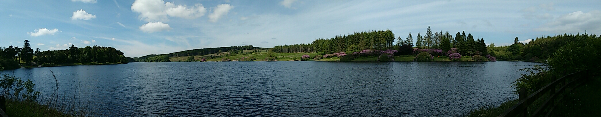

## Kennick Reservoir

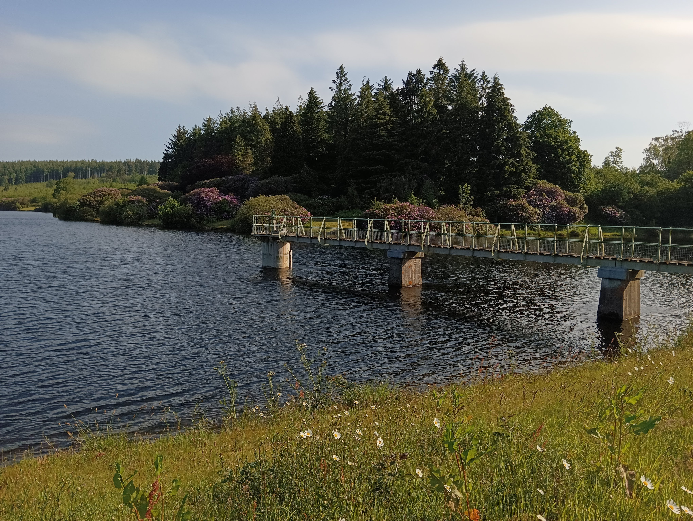

Kennick Reservoir was started in 1881 and completed in 1884 and, together with Trenchford and Tottiford Reservoirs, supplies water to Torbay and other parts of South Devon. Water is piped from Kennick through to the large treatment centre below the bottom dam along with water from the lowest of the three, Trenchford.  Trenchford is also fed by pipe close to its western dam etc which flows all the way from Fernworthy on the high moor. The reservoirs and surrounding areas are managed by South West Lakes Trust which was founded in 2000.

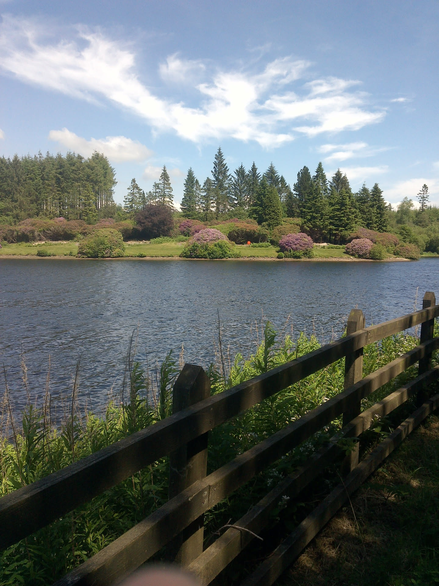

Although fishing is allowed on all three Reservoirs by permit, Kennick is very much considered the primary fishing area, being well stocked with Brown and Rainbow Trout. The footpath immediately surrounding the lake is restricted to club members.

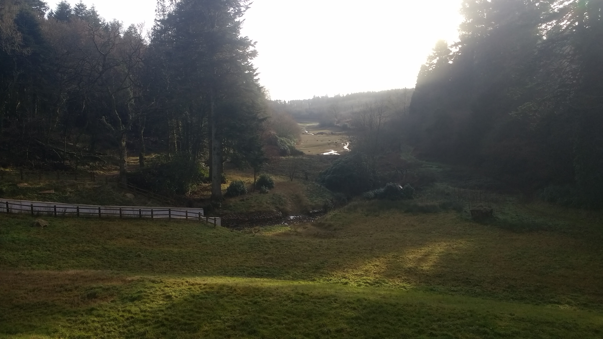

*When you're ready to leave, walk East along the road until it starts to bend, and take the Signed footpath to the left*

* [Kennick Fly Fishers](https://www.kennickflyfishers.co.uk/)
* [South West Lakes Trust](https://www.swlakestrust.org.uk/)
* [Heritage Gateway - Kennick Reservoir](https://www.heritagegateway.org.uk/gateway/Results_Single.aspx?resourceID=104&uid=MDV9347)

## Footpaths

Follow the footpath for around 500 meters, passing another footpath on the right, and a larger forest road. You will come to a small turning area where the larger track turns left.

Turn left here.

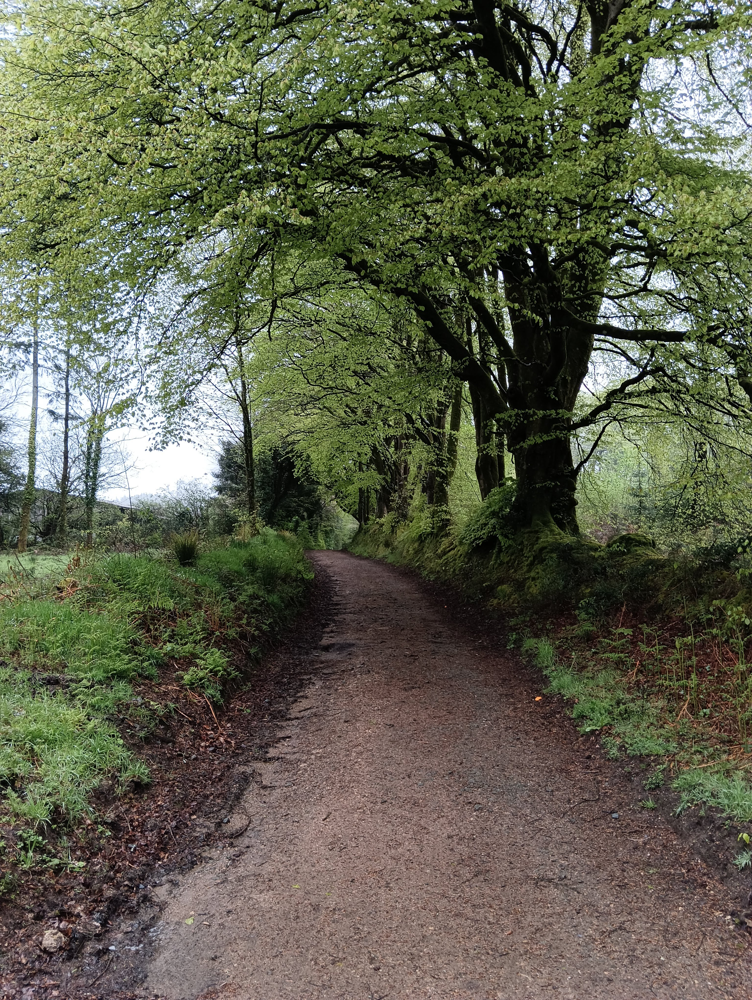

## Quaker Burial Grounds

You'll soon come to a junction. Directly facing you is a stone wall which once held a plaque telling of the nearby Quaker Burial Ground.

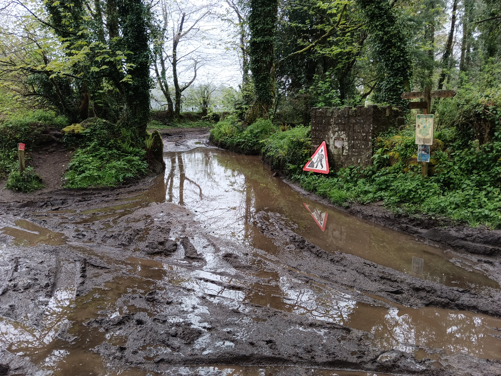

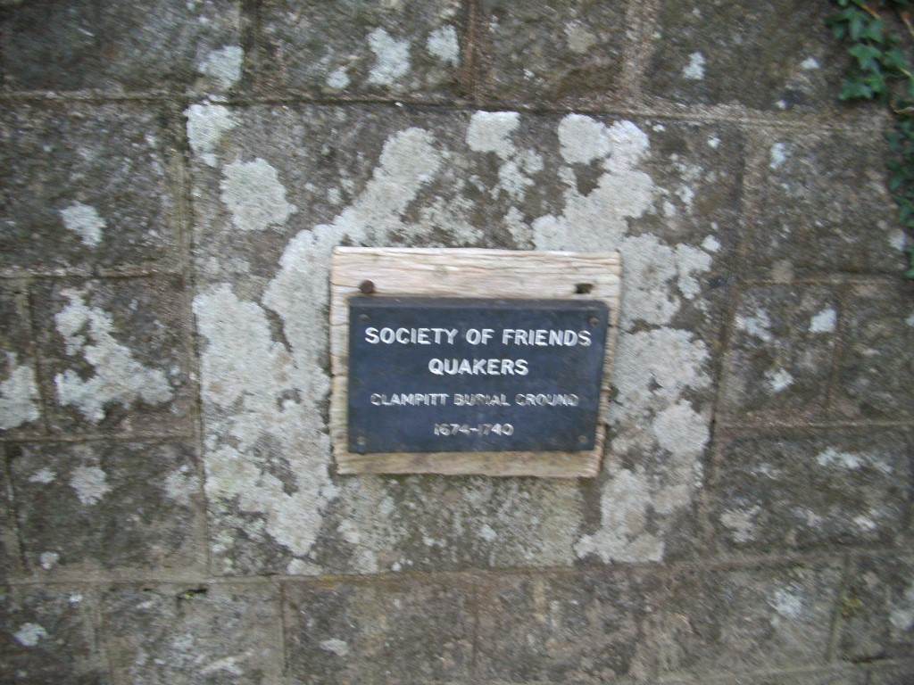

This burial ground dates from 1674 through to 1740, but other than this stone, it's unclear where the burial ground actually is. It's certain that the original Clampitts Farm was owned by Quakers in the late 17th and 18th century before being purchased and demolished for the reservoir.

> Quakers are members of the Religious Society of Friends, a Christian movement that began in England in the mid-1600s. Quakers believe that everyone can experience God directly, without priests, rituals, or formal sacraments. They often call this the “Inner Light” — the idea that there’s something of God in every person.

*Follow the track to the left of the Quaker Stone*

## Abandoned Farmhouse "Clampitts" / Beacon Farm.

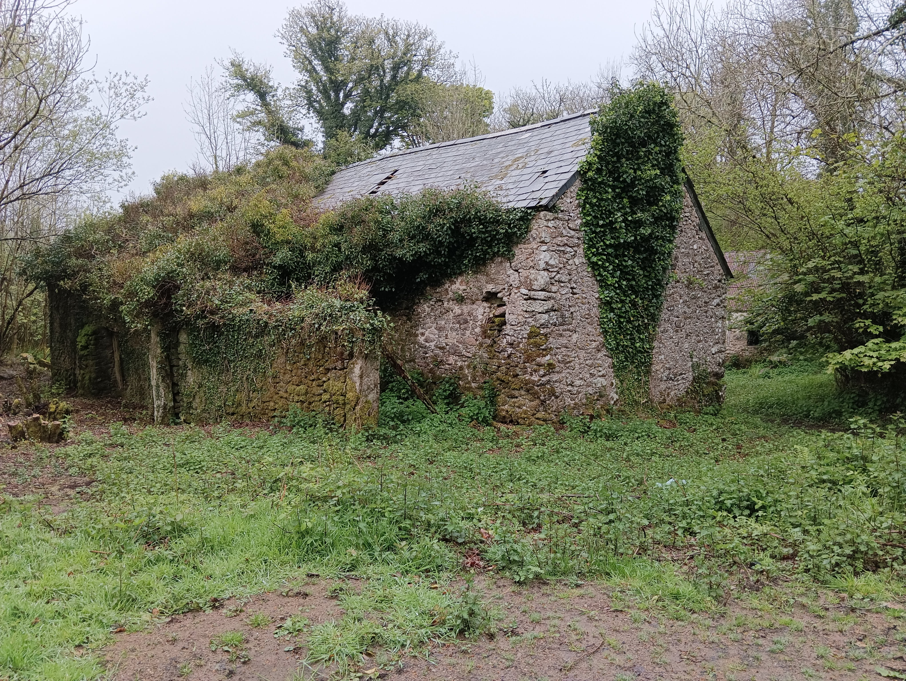

This is marked on the map simply as "Clampitts" and was clearly a set of substantial farm buildings probably once belonging to the nearby Clampitts Farm which was demolished for the reservoir.

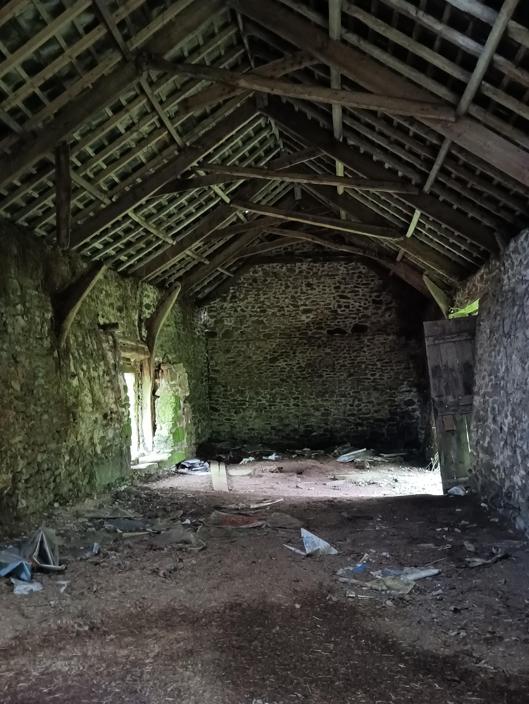

> Clampitt farmstead is thought to date back to the early 13th century, according to documentary evidence. Was occupied by Quakers in the late 17th-mid 18th century and Friends met at the farmhouse. A number were buried in a Quaker burial ground in a nearby field. At the end of the 19th century the farm was purchased with others locally, amid fears of water contamination in Torquay and the farmhouse was demolished. The two remaining buildings (barn and shippon) are marked as 'Beacon Farm'.

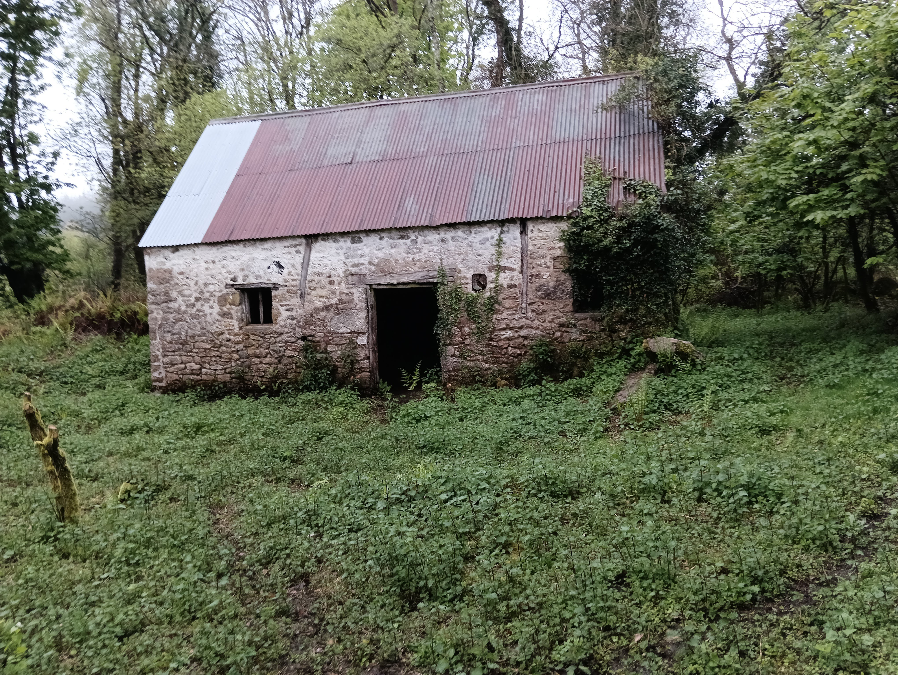

The name "Clampitt" was first recorded in 1219 in relation to a sale of land, which was probably at this location, and possibly founded a surname that lives on to this day. It seems likely that it's derived from the Old English terms "cloeg" and "pytt" meaning "clay" and "hollow". Possibly there was a small deposit of clay here that was particularly useful.

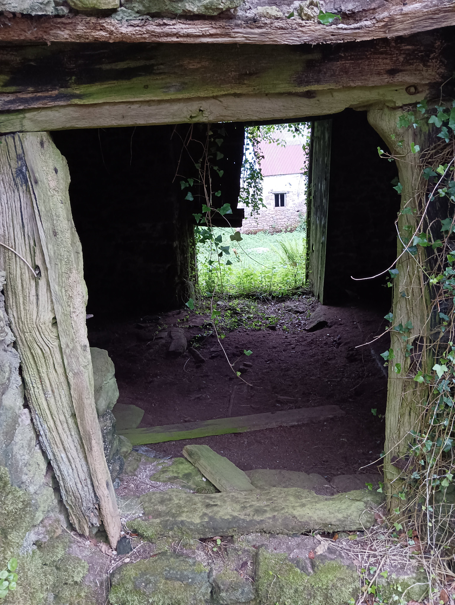

* [Heritage Gateway - Clampitts Farmstead](https://www.heritagegateway.org.uk/Gateway/Results_Single.aspx?uid=MDV77370&resourceID=104)
* [Clampett Family Center](http://www.clampett.org/story/name.html)

*Follow the track past the buildings. You may hear, see and smell pigs to the left - they always make me smile*

*After a short walk, there will be a small junction. Bear left, don't cross the ford immediate in front of the junction*

## Potato Well and Ford

There is a delightful area with some nice mature Beech Trees and a trickling ford where our path crosses a small un-named stream.

Some 20 meters before the ford, immediately above the track, there is an unusual feature. I've not been able to find anything about this feature and it's possible it's unrecorded.

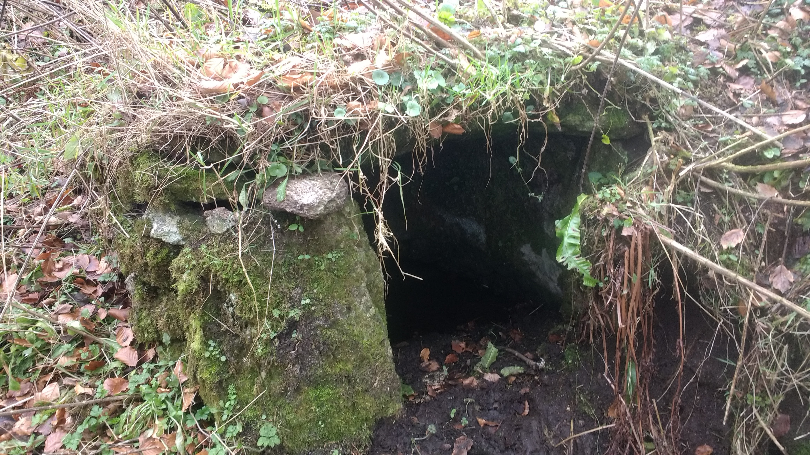

The unusual name came from me - my first impression was that it was a small "Potato Cave" - somewhere to store root vegetables for the winter. But on a closer inspection it appears to be a "Springhead Well". A small stone-lined cavity filled with water that seeps naturally in. There is evidence of a wooden door here, with iron hinge pins. Unfortunately, when I last walked this, forestry equipment had damaged it considerably.

## Laployd Plantation

Once safely across the stream, bear left along the path below the fence and through the hedge into a large area of recently planted conifers.

Walk through this nice-smelling area, which once provided a nice view of the Kennick Reservoir to our left, but now has grown a little too high to show this.

Some 300 meters after the ford, there is a wide and steep track leading up to our right. Turn up here and take your time, it's deceptively tiring!

*(If you come to a road, you've missed the turning!)*

About 500 meters up this track you'll meet a T-junction. Turn right here, and know that the only real hill of our walk is now behind you!

Follow the path down and you'll soon emerge into a felled area which has a nice view. (Provided the trees haven't grown up too far yet)

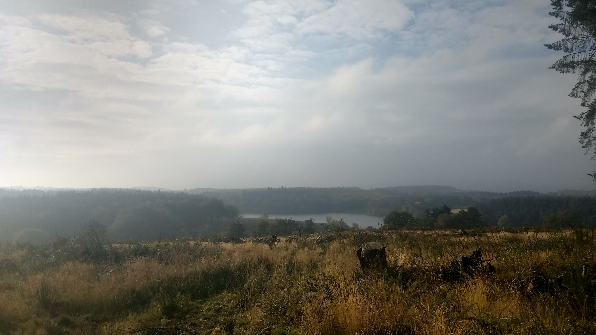

## Hollowpark Rock

Following the path down, it soon turns sharply left and you will immediately be greeted by Hollowpark Rock

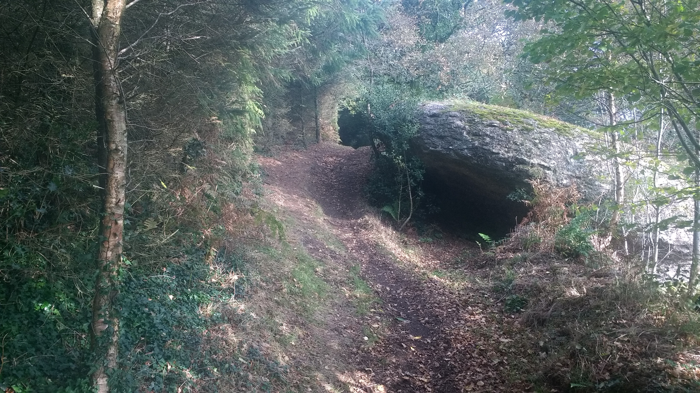

This attractive rock is a minor tor, and thanks to a recent campaign by Max Piper has been added to the Ordnance Survey maps.

It sits on the border between Christow and Bridford parishes and it looks like it would have once been a well known and recognisable feature, but there seems to be little lore associated with it.

Given its unusual shape and that you can shelter underneath it in heavy rain (as I have done!) it's easy to imagine all sorts of historic and legendary activities once held here, but sadly I can find out nothing unusual about its history. For now I shall continue to imagine it as a meeting place for Piskies.

* [BBC Report on Hollowpark Rock returning to the maps](https://www.bbc.co.uk/news/uk-england-devon-61310180)
* [Tors of Dartmoor - Hollowpark Rock](https://www.torsofdartmoor.co.uk/tor-page.php?tor=hollowpark-rock)

## Clampitts Plantation and Farm

Follow the pleasant path past Hollowpark Rock and along the lower edge of Beacon Plantation, turning right at the next two footpath junctions into an ancient hollow way.

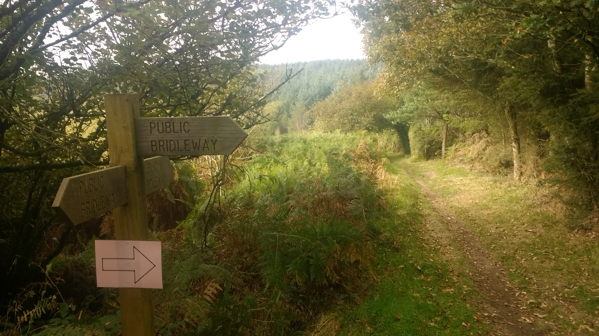

You'll come to another small ford, the same un-named river as we forded earlier, and hop across. Sometimes this is a little muddy, but you'll soon be in some mature conifer woodland. In the summer, it's common to see several Wood Ant nests through here, and it's always pleasant to pause and watch the industrial insects. On very hot day they will re-arrange the structure as you observe to ensure it's cool enough, opening vent holes into the inside. On cold days they're much less active, and these holes will be closed up. They sometimes even put darker objects on the surface to absorb more warmth - such clever creatures.

You'll soon pass by Clampitts Farm on your right, which is a modern building built around 1890 to replace the original Farmhouse which was demolished for the reservoir.

You'll emerge onto a harder track. Turn right here back to the Quaker Burial Ground stone.

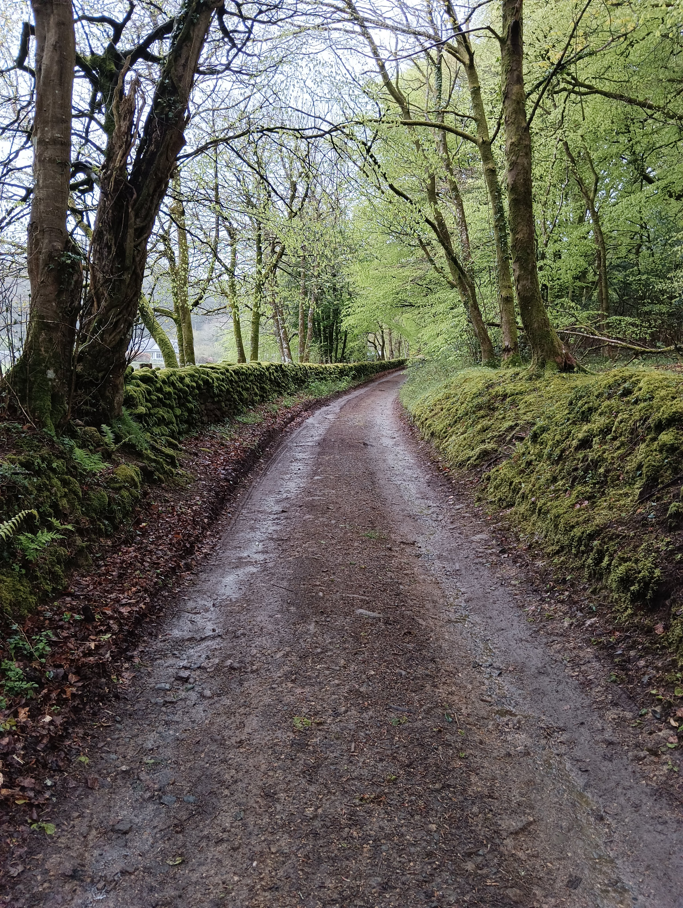

From the Quaker Stone, turn left back under the magnificent Beech Trees and turn right towards Kennick Dam.

You can either follow the same footpath back to the dam that you started on, or for a little variety turn left and walk along the roads. These are usually very quiet and have wide verges.

## Parking

There is on-road parking at several places at Kennick Reservoir Dam, and along the road to the East.

For a slightly shorter walk, you can also park roadside at (What Three Words `///chromatic.tablets.loudness` )

## References


