{}

{}

## Introduction

This is a pleasant walk along very quiet and seldom walked footpaths through ancient woodlands and back over farmland and a quiet country lane. There are some up and down stretches, although none are very long and generally the woodland path largely follows the gradient. For me, this is a lovely walk in the autumn especially as the colours of the trees change. It's also relatively sheltered from extreme weather for much of its distance and one that can be enjoyed year-round. As a Tolkien reader, parts of this walk always remind me somewhat of Mirkwood, only without the spiders! This is not a walk full of stunning panoramic views unless you make a short detour and climb [Shaptor Rock](#shaptor-rock)

There are some remains of mines and equipment through the woods, including shafts and adits, historic drystone walls, and some minor tors buried in the woods. There's a duck pond and some ancient farm paths to be walked on the return. There is plenty of wildlife if you're quiet, with all kinds of woodland birds, squirrels, fox and deer to be seen.  The path can be muddy in places and sensible footwear is a must. Sometimes the footpaths through the farmyard can get overgrown in the summer and, having experienced a very thorny walk in shorts, I would also recommend stout trousers!

This cannot be called an accessible walk by any stretch of the imagination and reasonable fitness is required as there are a few obstacles along the way - such as steps cut through fallen trees and small wooden bridges but these are seldom and it's not that tricky.

## Little John's Walk

{}
*Leaving the car park, take the wide path downhill marked Little John's Walk for around 350m until you see a gateway onto the path to your right. Go through this gate and follow the path generally northwards*
{}

The first stretch of this route is legally a byway, so you may be surprised to meet off-road cars and motorbikes using it, but generally it's very quiet and peaceful. The beeches lining the wall are particularly striking in spring and autumn, and deer can often be seen through the trees.

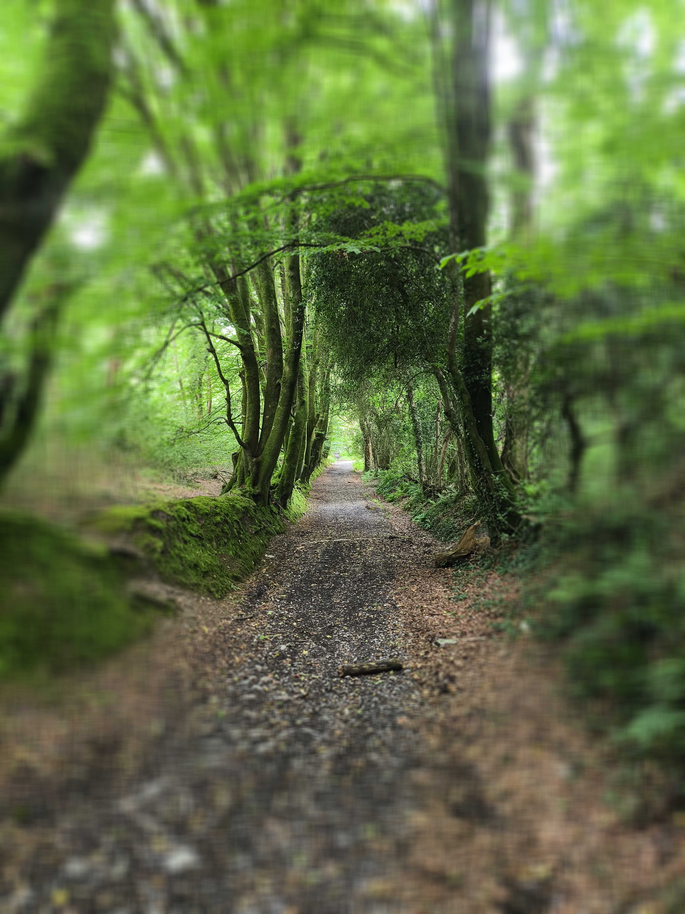

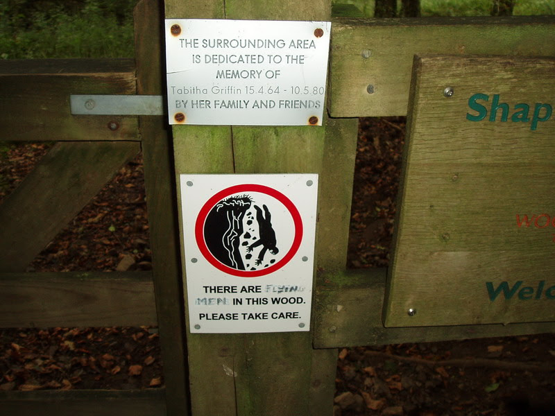

### Who was Little John?

This ancient road was named after John Cann, a Royalist during the Civil War in the 1640s during the Seige of Exeter. He was reputed to have stolen a large amount of silver (said to be 35,000 coins) before going on the run. Local word was that he hid in the nearby John Cann Rocks from pursuers. He was eventually tracked down and captured, and after being sentenced in Exeter, was executed for his crime. The silver was never found...

## Furzeleigh Plantation and Bearacleave Wood

As we walk down Little John's Walk, on our left is Furzeleigh Plantation which then turns into Bearacleave Wood, both owned and managed by the National Trust.

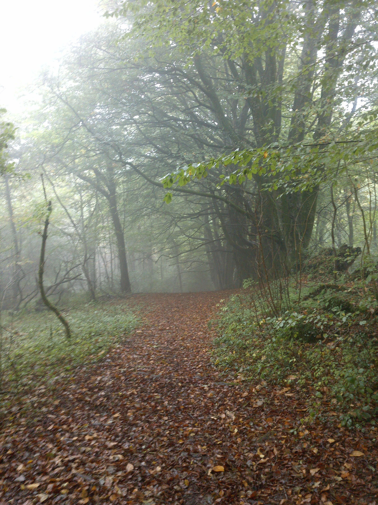

Although we don't go through either on our walk, it's worth mentioning as we do pass by and you may want to explore it as well. There are some notably impressive Beech trees throughout Bearacleave and on its edges, especially along the nearby road down to Bovey Tracey, which are very colourful in both spring and autumn. The woods contain some small ruins and old walls, with some evidence of mining as there is in Shaptor Woods - and the fairly impressive but largely hidden Bearacleave North Tor, which is sometimes used for Bouldering, as are some of the rocks through Shaptor.

* [Tors of Dartmoor - Bearacleave North Tor](https://www.torsofdartmoor.co.uk/tor-page.php?tor=bearacleave-north-tor)

## John Cann's Rocks

Again, although our walk turns off right before we reach them, John Cann's rocks are worth a mention and perhaps a small detour further down the lane to the circled area on the map.

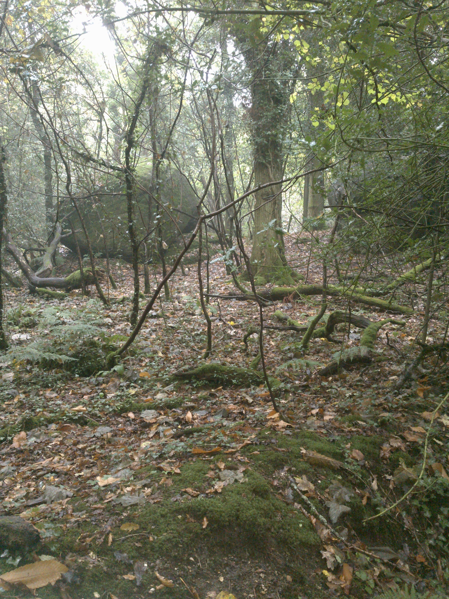

The rocks are a loose collection of large granite outcrops linked to John Cann above. The land around Bovey Tracey has a rich Civil War history, reflected in many of the street names - especially at Heathfield where there is a memorial on the common ground. There was another memorial to "The Forgotten Soldier" just west of the town, which was recently moved to make way for more housing.

## Shaptor Woods

Shaptor Woods are ancient upland oak woodlands totalling around 200 acres.

{}
*After entering the gate off Little John's Walk and entering Woodland Trust's property, we follow the path for a mile or so (1.5 to 2 kilometres). The path is occasionally signed and marked. It can be indistinct at times, but generally follows the gradient with some ups and downs and is not too hard to follow. There are some muddy sections and duck boards are provided over the worst. There are also a few remembrance posts placed by supporters of the Woodland Trust along the way. There are some climbs up and down, wooden duckboards that can be slippery and even steps cut into fallen trees.*
{}

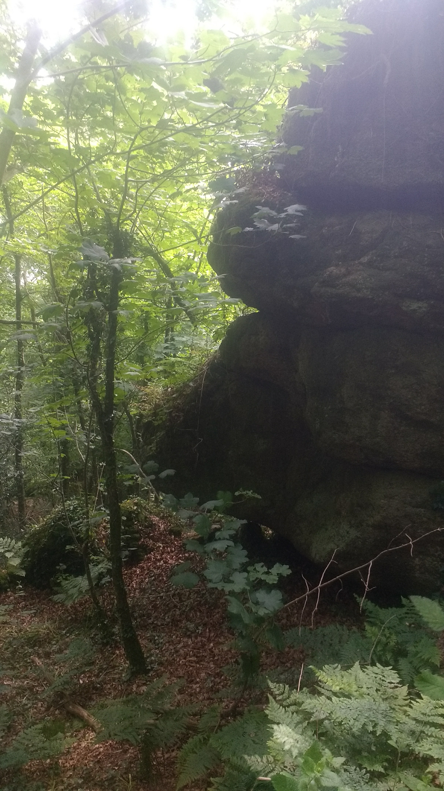

As you walk through these woods, keep an eye open for a few notable things and facts:

* Streams. Several of these emerge from small drainage adits from earlier workings. In this area, they're often overgrown with vegetation, and can be too small to explore, or may be grilled over. At one point, below the path, you can see a small concrete building which seems to be a collection reservoir used to capture water to feed for Stonelands, the large private house below.
* Mineshafts. There are a several fenced-off mineshafts, and possibly some holes or collapsed stopes less well guarded. As with all historical mining areas, if you leave the path, be very careful and don't let dogs or children run too far.

* Tors and rocks. This is a rocky area, the scale of which is hard to estimate given how thickly wooded parts are, but there are many large rocks and tors all along this route, and even some small caves in one section. It's apparently a popular site for bouldering, although I've not personally seen anyone climbing them during my walks here.

* Trees. Shaptor is an ancient upland oak woodland and a temperate rainforest. These oaks are fairly low growing and some are quite gnarled and twisted, although not to the extent of Wistmans' Wood. There is also a rich variety of other native trees - Birch, Beech, Holly, Ash, Sweet and Horse Chestnut and much more.

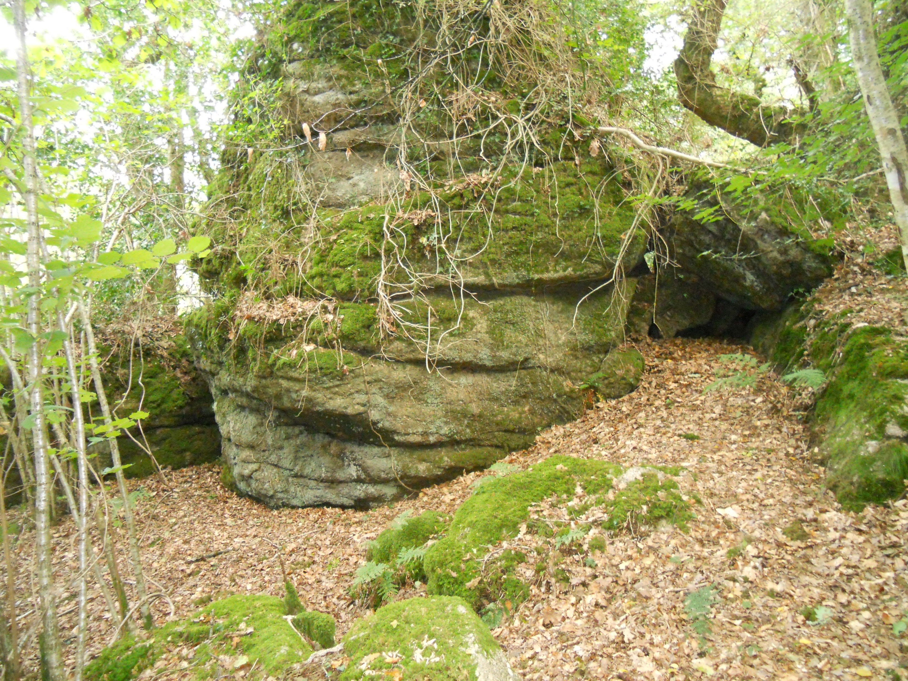

* Plants. Shaptor is an important site for lichens, mosses, ferns and woodland floor plants and contains several rare species.

- [Woodland Trust: Visiting Shaptor Woods](https://www.woodlandtrust.org.uk/visiting-woods/woods/shaptor-woods/)

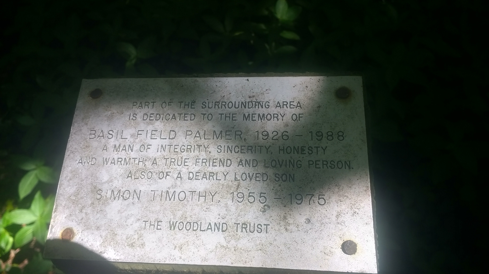

## Hawkmoor Footpath Junction

Eventually you'll come to a path turning off to the right, uphill at around 50.61364,-3.68666 [(w3w ///flick.kickbacks.defensive)](https://what3words.com/flick.kickbacks.defensive) just before a low stone wall with a wooden signpost. We turn right here in front of the wall and continue up a short distance and through another stone wall before following this path to the right onto Shaptor Down.

Hawkmoor Hospital was a tuberculosis sanitorium just a short way along the other path, which passes closely above the site. Originally built in 1914, it treated TB in the days before antibiotics and was chosen for the locally clean and fresh air, away from the pollution of coal-heated towns and cities which were thought to make the condition worse. There was a special stop called Hawkmoor Halt on the now closed Moretonhampstead and South Devon Railway where patients would be collected by horse and cart, and from the 1950s, by a motor van.

Patients would recover for months or even years in long south-facing wards with large windows, or lie outside even on cold days, wrapped in blankets. Exposure to clean and fresh air was thought to be the best treatment at the time, although being away from the large and contagious populations in the cities was probably of equal benefit.

Hawkmoor changed from pulminary to care for mental disability patients in the 1973 and was finally closed to patients in 1987. It has since been redeveloped as an collection of private homes called Hawkmoor Parke. There are two terraces of houses immediately below the site which once housed the nursing staff.

- [Wikipedia - Hawkmoor Hospital](https://en.wikipedia.org/wiki/Hawkmoor_Hospital)

## Shaptor Mine

Near the above junction was the site of Shaptor Mine [(w3w ///tenders.absorb.rezoning)](https://what3words.com/tenders.absorb.rezoning)

Shaptor Mine was one of many in the local area, and its workings may have linked into Plumley Mine's underground. The evidence seems to point Shaptor's workings as being of several trials comprising test shafts and adits with some more concerted working along two veins. Certainly the workings here were not as extensive as those at the nearby Great Rock mine, nor those at Kelly, Plumley or Wray Cleave workings further to the north, although all produced micaceous haematite in various amounts.

Heritage Gateway notes "up to nine shafts" in this area, and that four "air shafts" were recorded on the 1905 Ordnance Survey map. By 1930, these markings had been removed.

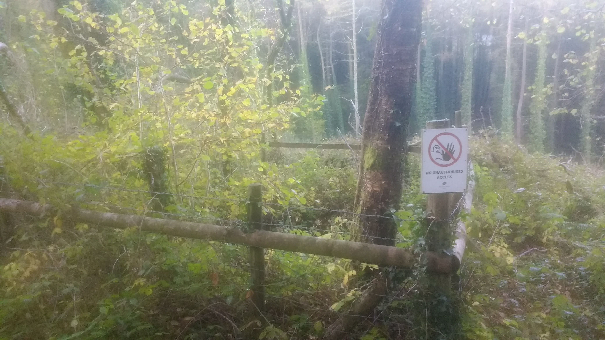

As well as the adits and mineshafts already mentioned, I once went wandering off the path towards the southern edge looking for a lost dog and encountered a large concrete water reservoir and the remains of an old steam boiler or compressor on what was clearly once a working platform. Sadly, despite two other attempts, I've not been able to find this again and get an exact location.

- [Heritage Gateway - Mine Shafts for Shaptor Mine](https://www.heritagegateway.org.uk/Gateway/Results_Single.aspx?uid=MDV61758&resourceID=104)

## Shaptor Down

Our path now runs above a drystone wall at the bottom of the Shaptor Down enclosure. This was once an open area used for grazing, but is now being left to naturalise and extend the Shaptor Woods temperate rainforest. The trees here are mostly younger and more light comes through and is noticeably different in atmosphere.

Just above the path is a memorial plaque to one of the founding members of the Woodland Trust.

> SHAPTOR DOWN AND ROCKS
> dedicated in 1983 to the memory of
>
> H. G. Hurrell, M.A., M.B.E., J.P.
> 1901–1981
>
> Founder Trustee of the Woodland Trust
> Founder Member of Devon Bird Watching
> and Preservation Society
> Founder Member of Devon Trust for Nature Conservation
> Dartmoor National Park Committee
> England Committee Nature Conservancy Council
>
> A distinguished naturalist, held in high
> esteem by all who knew him
>
> The Woodland Trust

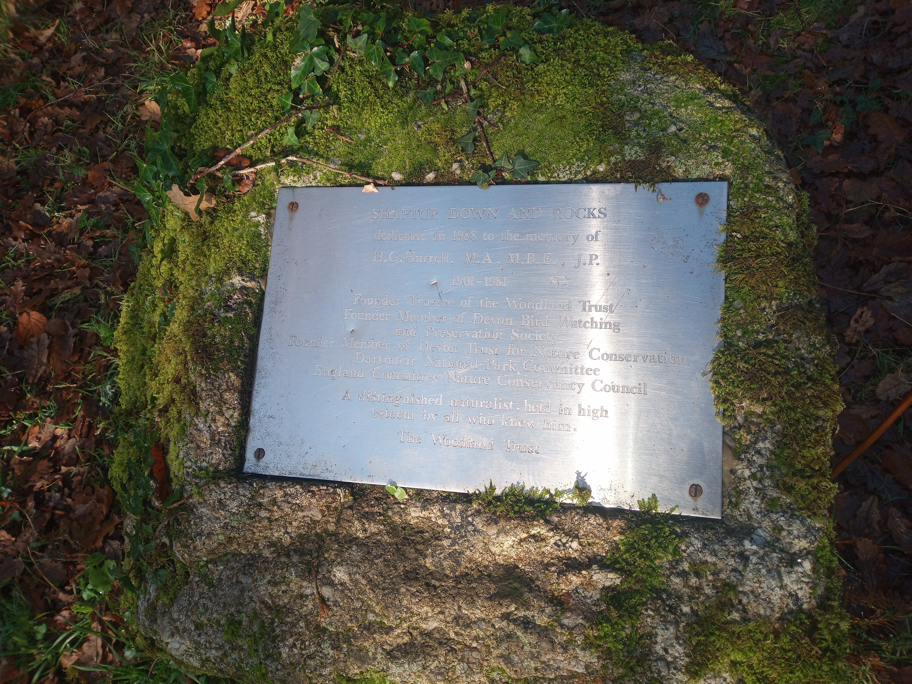

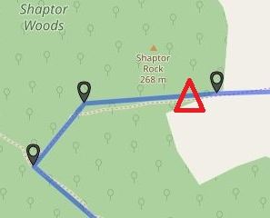

## Shaptor Rock

If you leave the paths at the above memorial and head upwards, you'll soon encounter the largest of this walk's nearby tors, Shaptor Rock. This is a worthy detour if you've some energy and are craving a view after so long in the woods, as it emerges from the canopy providing a good reveal.

- [Tors of Dartmoor - Shaptor Rock](https://www.torsofdartmoor.co.uk/tor-page.php?tor=shaptor-rock)

{}
*Leaving the memorial, follow the path eastwards to Shaptor Farm. There is a section here which can be overgrown in summer.*
{}

## Shaptor Farm

Our path emerges onto the driveway serving Shaptor Farm. This has a farmhouse, cottage, large barn and outbuilds - and when sold for £300,000 2017 included 29 acres of adjacent farmland.

We head across the driveway and follow the bridlepath to the southeast, passing a delightful duck pond.

- [Onthemarket.com - Shaptor Farm](https://www.onthemarket.com/details/16175050/)

## Higher and Lower Bowden

The bridlepath follows a Devon-banked track and passes through a shallow ford and gate.

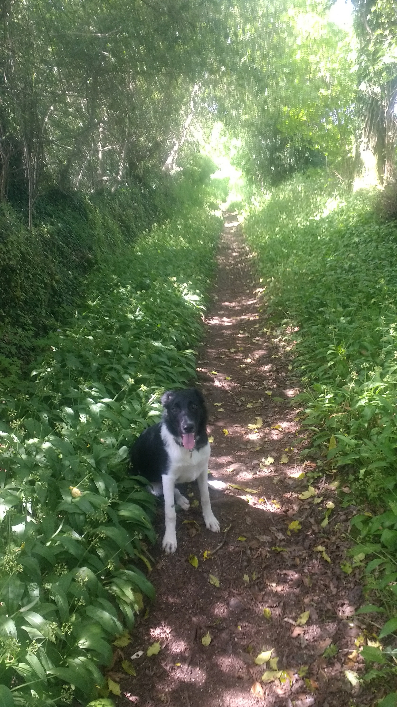

{}
*After the gate, we walk up through a sloping field, which is often grazed with horses, past an old fenced manege and through the wall onto the road. When on the road, turn right and follow it back to the car park. The road is fairly quiet, but beware the odd car or tractor.*
{}

## Parking

There is free, off-street parking for half a dozen cars at the top of Little John's Walk at Furzeleigh, where we begin our walk.

## References


